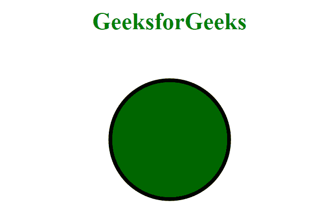

# 如何改变 SVG 颜色？

> 原文:[https://www.geeksforgeeks.org/how-to-change-svg-color/](https://www.geeksforgeeks.org/how-to-change-svg-color/)

**什么是 SVG 元素？**
SVG 代表可缩放矢量图形是二维图形的矢量图像格式，可用于创建动画，SVG 元素是定义新坐标系的容器。SVG 文档由 XML 格式定义。

**SVG 文档的意义:**在当今世界，正是 SVG 让浏览器动画变得更加轻松和便捷。它用于制作 2D 动画和图形。一个 SVG 文档可以用来在一个 HTML 文档中创建 2D 游戏。它有不同的方法来绘制线条、形状，如圆形、矩形和路径等。它独立于分辨率，还支持文档中的事件处理。

**语法:**

```html
<svg></svg>
```

**示例 1:** 在本例中，我们将使用 SVG 元素绘制一个矩形并对其进行着色。

```html
<!DOCTYPE html>
<html>

<head>
    <meta charset="utf-8">
    <meta http-equiv="X-UA-Compatible"
        content="IE=edge">

    <meta name="viewport" content=
        "width=device-width, initial-scale=1">

    <title>
        How to change SVG color?
    </title>
</head>

<body style="text-align: center;">

    <h1 style="color: green;">
        GeeksforGeeks
    </h1>

    <div>
        <svg>
            <rect height="300" width="500"
                style="fill:#060">
        </svg>
    </div>
</body>

</html>
```

**输出:**


**示例 2:** 在本例中，我们将使用 SVG 元素绘制一个矩形并对其进行着色。

```html
<!DOCTYPE html>
<html>

<head>
    <meta charset="utf-8">
    <meta http-equiv="X-UA-Compatible" 
        content="IE=edge">

    <meta name="viewport" content=
        "width=device-width, initial-scale=1">

    <title>
        How to change SVG color?
    </title>
</head>

<body style="text-align: center;">

    <h1 style="color: green;">
        GeeksforGeeks
    </h1>

    <div>
        <svg height="1000" width="500">
            <circle cx="250" cy="120" r="80"
                stroke="#000" stroke-width="5" 
                style="fill:#060">
        </svg>
    </div>
</body>

</html>
```

**输出:**
