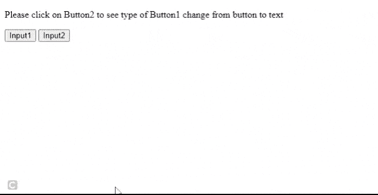

# 如何更改<input>类型？

> 原文:[https://www.geeksforgeeks.org/how-to-change-the-input-type/](https://www.geeksforgeeks.org/how-to-change-the-input-type/)

本文的目的是改变 HTML [<输入>](https://www.geeksforgeeks.org/html-input-type-attribute/) 的类型。 [Javascript](https://www.geeksforgeeks.org/javascript-tutorial/) 提供[文档。选项来更改输入字段的类型。](https://www.geeksforgeeks.org/html-dom-getelementbyid-method/)

**语法:**

*   选定的输入类型将变为文本。

    ```htmlhtml
    document.getElementById("id_of_tag_to_be_changed").type="text"; 
    ```

*   选定的输入类型将变为按钮。

    ```htmlhtml
    document.getElementById("id_of_tag_to_be_changed").type="button";
    ```

*   选定的输入类型将更改为日期。

    ```htmlhtml
    document.getElementById("id_of_tag_to_be_changed").type="date"; 
    ```

**示例:**

## 超文本标记语言

```htmlhtml
<!DOCTYPE html>
<html>
  <body>
    <p>
      Please click on Button2 to see the type 
      of Button1 change from button to text
    </p>

    <input
      id="inputfield1"
      type="button"
      value="Input1"
      onclick="alert('I am Input1 click on Input2 to see me change my type')"/>
    <input
      id="inputfield2"
      type="button"
      value="Input2"
      onclick="typeChanger()"/>
  </body>
  <script>
    function typeChanger() {
      alert("The type of Input1 will now change from button to text");
      document.getElementById("inputfield1").type = "text";
    }
  </script>
</html>
```

**输出:**



文本输入

**注意:** 一些旧浏览器不允许动态改变输入字段的类型。