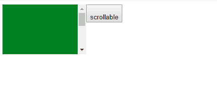
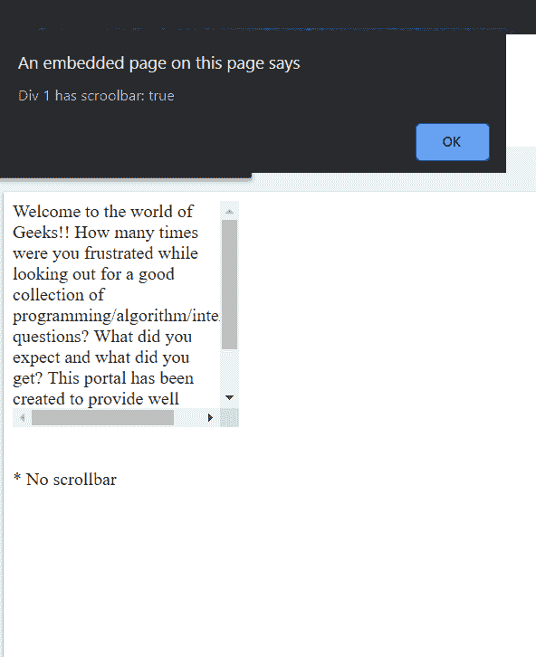
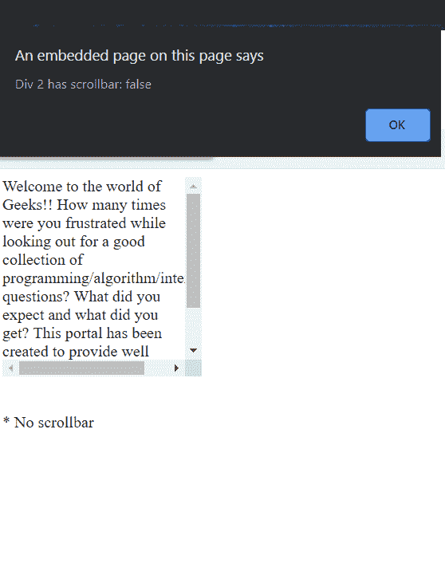

# 如何检查滚动条是否可见？

> 原文:[https://www . geesforgeks . org/如何检查滚动条是否可见/](https://www.geeksforgeeks.org/how-to-check-if-a-scrollbar-is-visible/)

滚动条是一个小部件，其中放置了一些内容，用户可以在预定的方向上滚动这些内容。为了检查滚动条是否可见，我们可以使用自己的自定义函数。
**示例 1:** 这个示例显示了一个简单的代码片段，可以用来检查水平或垂直滚动条是否可见。

## 超文本标记语言

```
<!DOCTYPE html>
<html>

<head>
    <script src=
"https://ajax.googleapis.com/ajax/libs/jquery/3.4.1/jquery.min.js">
</script>
    <!--styling our elements-->
    <style>
        #geek {
            background-color: green;
            overflow: auto;
            float: left;
        }

        #inner {
            width: 150px;
            height: 250px;
        }
    </style>
    <script>
        function isScrollable(el) {

            /*The scrollTop() method sets or returns the
            vertical scrollbar position for the selected elements*/
            var y1 = el.scrollTop;
            el.scrollTop += 1;
            var y2 = el.scrollTop;
            el.scrollTop -= 1;
            var y3 = el.scrollTop;
            el.scrollTop = y1;

            /*The scrollLeft() method returns the horizontal
            scrollbar position for the selected elements.*/
            var x1 = el.scrollLeft;
            el.scrollLeft += 1;
            var x2 = el.scrollLeft;
            el.scrollLeft -= 1;
            var x3 = el.scrollLeft;
            el.scrollLeft = x1;

            //returns true or false accordingly
            return {
                horizontallyScrollable: x1 !== x2 || x2 !== x3,
                verticallyScrollable: y1 !== y2 || y2 !== y3
            }
        }

        function check(id) {
            /*the data is JSON type, convert it to string and then
            check the element with given id for scrollbar*/
            alert(JSON.stringify(isScrollable(document.getElementById(id))));

        }
    </script>
</head>

<body>
    <div id="geek" style="height: 100px;">
        <div id="inner"></div>
    </div>

    <!--check the element with id 'geek'
        for scrollbar using our custom function-->
    <button onclick="check('geek')">
        <br>scrollable</button>
</body>

</html>
```

**输出:**




**例 2:**

## 超文本标记语言

```
<!DOCTYPE html>
<html>

<head>
    <script src="https://ajax.googleapis.com/ajax/libs/jquery/3.4.1/jquery.min.js">
  </script>
    <script>
        $(function() {
            alert('Div 1 has scrollbar: ' + $('#geek1').hasScrollBar());
            alert('Div 2 has scrollbar: ' + $('#geek2').hasScrollBar());
        });

        (function($) {
            $.fn.hasScrollBar = function() {
                return this.get(0).scrollHeight > this.height();
                /*The element will display a scrollbar
                 if the scroll height is greater than the client height*/
            }
        })(jQuery);
    </script>
</head>

<body>
    <div id="geek1"
         style="width: 100px;
                height:100px;
                overflow:auto;"
         class="my_class">

        Welcome to the world of Geeks!! How many times were you
      frustrated while looking out for a good collection of
      programming/algorithm/interview questions? What did you
      expect and what did you get? This portal has been created
      to provide well written, well thought and well explained
      solutions for selected questions.
        <br/>
        <br/>
    </div>

    <br>
    <br>

    <div id="geek2"
         style="width: 300px;
                height:300px;
                overflow:auto;"
         class="my_class">
        * No scrollbar
    </div>
</body>

</html>
```

**输出:**



