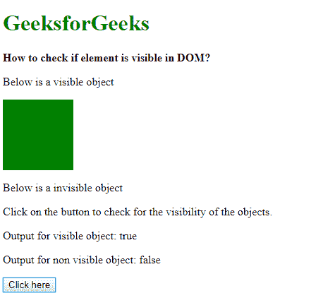

# 如何检查一个元素在 DOM 中是否可见？

> 原文:[https://www . geeksforgeeks . org/如何检查元素在 dom 中是否可见/](https://www.geeksforgeeks.org/how-to-check-if-an-element-is-visible-in-dom/)

**方法 1:检查元素的高度、宽度和边框:**通过检查元素边框的高度、宽度和尺寸，可以检查元素是否可见。
**offset thight**属性用于获取元素的高度，包括垂直填充和边框(如果有)。它将返回一个以像素为单位的整数。
类似地，**偏移**属性用于获取元素的宽度，包括水平填充和边框(如果有)。它将返回一个宽度为像素的整数。

**getClientRects()** 用于获取元素的边框集合。它返回一个 DOMRect 对象列表。此列表的 length 属性可用于验证列表是否有任何矩形对象。如果返回的长度为 0，则表示没有找到矩形对象。

所有这三个结果结合在一起测试元素是否可见。如果它返回真值，那么对象是可见的，而假值表示对象是不可见的。

**示例:**

```
<!DOCTYPE html>
<html>

<head>
    <title>
        How to check if an element
        is visible in DOM?
    </title>

    <style>
        .visible {
            height: 100px;
            width: 100px;
            background-color: green;
        }

        .invisible {
            height: 100px;
            width: 100px;
            background-color: green;
            display: none;
        }
    </style>
</head>

<body>
    <h1 style="color: green">
        GeeksforGeeks
    </h1>

    <b>
        How to check if element
        is visible in DOM?
    </b>

    <p>
        Below is a visible object
    </p>

    <div class="visible"></div>

    <p>
        Below is a invisible
        object
    </p>

    <div class="invisible"></div>

    <p>
        Click on the button to check for the
        visibility of the objects.
    </p>

    <p>Output for visible object: 
        <span class="outputVisible"></span>
    </p>

    <p>
        Output for non visible object: 
        <span class="outputInvisible"></span>
    </p>

    <button onclick="checkVisibility()">
        Click here
    </button>

    <script type="text/javascript">
        function isElementVisible(element) {
            if (element.offsetWidth || 
               element.offsetHeight || 
               element.getClientRects().length)
                return true;
            else
                return false;
        }

        function checkVisibility() {
            visibleObject = 
            document.querySelector(".visible");

            invisibleObject = 
            document.querySelector(".invisible");

            document.querySelector(".outputVisible").textContent
                    = isElementVisible(visibleObject);

            document.querySelector(".outputInvisible").textContent
                        = isElementVisible(invisibleObject);
        }
    </script>
</body>

</html>
```

**输出:**

*   **点击按钮前:**
    
*   **点击按钮后:**
    

**方法 2:使用 getComputedStyle()方法:**使用 **getComputedStyle()** 方法返回一个包含元素所有 CSS 属性的对象。现在可以检查这些属性中的每一个所需的属性。
display 属性用于指定元素的显示行为。此属性的“none”值对页面完全隐藏了元素。使用返回的样式对象中的“无”值检查该属性。真返回值表示对象不可见，假值表示对象可见。

**示例:**

```
<!DOCTYPE html>
<html>

<head>
    <title>
        How to check if element
        is visible in DOM?
    </title>

    <style>
        .visible {
            height: 100px;
            width: 100px;
            background-color: green;
        }

        .invisible {
            height: 100px;
            width: 100px;
            background-color: green;
            display: none;
        }
    </style>
</head>

<body>
    <h1 style="color: green">
        GeeksforGeeks
    </h1>

    <b>
        How to check if element
        is visible in DOM?
    </b>

    <p>Below is a visible object</p>
    <div class="visible"></div>

    <p>Below is a invisible object</p>
    <div class="invisible"></div>

    <p>
        Click on the button to check for the
        visibility of the objects.
    </p>

    <p>
        Output for visible object: 
        <span class="outputVisible"></span>
    </p>

    <p>
        Output for non visible object: 
        <span class="outputInvisible"></span>
    </p>

    <button onclick="checkVisibility()">
        Click here
    </button>

    <script type="text/javascript">
        function isElementVisible(element) {
            let style = window.getComputedStyle(element);

            if (style.display == 'none') 
                return false;
            else
                return true;
        }

        function checkVisibility() {
            visibleObject = 
                document.querySelector(".visible");

            invisibleObject = 
                document.querySelector(".invisible");

            document.querySelector(".outputVisible").textContent
                    = isElementVisible(visibleObject);

            document.querySelector(".outputInvisible").textContent
                    = isElementVisible(invisibleObject);
        }
    </script>
</body>

</html>
```

**输出:**

*   **点击按钮前:**
    
*   **点击按钮后:**
    