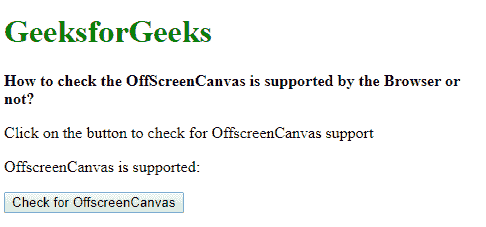
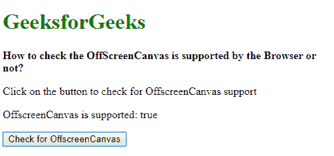

# 如何检查浏览器是否支持屏幕外画布？

> 原文:[https://www . geesforgeks . org/如何检查浏览器是否支持屏幕外画布/](https://www.geeksforgeeks.org/how-to-check-the-offscreencanvas-is-supported-by-the-browser-or-not/)

屏幕外画布是一个提供屏幕外渲染画布的界面。并非所有浏览器都支持此功能。可以使用两种方法检查对屏幕外画布的支持:

**方法 1:检查屏幕外画布是否存在:**type of 运算符用于返回操作数类型的字符串。如果浏览器支持 OffscreenCanvas 对象，可以使用此运算符对其进行测试。如果对象不存在，此运算符返回“undefined”。
将“屏幕外画布”对象与“未定义”字符串进行比较，看看它是否存在。如果定义了对象，此语句将返回 true。这意味着浏览器支持屏幕外画布。

**语法:**

```html
if (typeof OffscreenCanvas !== "undefined") {
    isSupported = true;
} else {
    isSupported = false;
}
```

**示例:**

```html
<!DOCTYPE html>
<html>

<head>
    <title>
        How to check the OffScreenCanvas
        is supported by the Browser or not?
    </title>
</head>

<body>
    <h1 style="color: green">
        GeeksforGeeks
    </h1>

    <b>
        How to check the OffScreenCanvas is
        supported by the Browser or not?
    </b>

    <p>
        Click on the button to check
        for OffscreenCanvas support
    </p>

    <p>
        OffscreenCanvas is supported: 
        <span class="output"></span>
    </p>

    <button onclick="checkOffscreenCanvas()">
        Check for OffscreenCanvas
    </button>

    <script type="text/javascript">
        function checkOffscreenCanvas() {
            if (typeof OffscreenCanvas !== "undefined") {
                isSupported = true;
            } else {
                isSupported = false;
            }
            document.querySelector(".output").textContent
                        = isSupported;
        }
    </script>
</body>

</html>
```

**输出:**

*   **点击按钮前:**
    
*   **点击按钮后:**
    

**方法 2:检查是 transferControlToOffscreen 方法是一个函数:**transfer controltooffscreen 用于将画布的控制转移到一个 OffscreenCanvas 对象。
该功能用于屏幕外画布的初始化。如果它是通过将 typeof 运算符与严格相等(===)运算符一起使用并检查字符串“function”来定义的，则可以对它进行测试。如果定义了函数，则该语句返回 true，这意味着浏览器支持屏幕外画布。

**语法:**

```html
let canvasObj = document.createElement("canvas");
if (typeof canvasObj.transferControlToOffscreen === "function") {
    isSupported = true;
} else {
    isSupported = false;
}
```

**示例:**

```html
<!DOCTYPE html>
<html>

<head>
    <title>
        How to check the OffScreenCanvas
        is supported by the Browser or not?
    </title>
</head>

<body>
    <h1 style="color: green">
        GeeksforGeeks
    </h1>

    <b>
        How to check the OffScreenCanvas is
        supported by the Browser or not?
    </b>

    <p>
        Click on the button to check for 
        OffscreenCanvas support
    </p>

    <p>
        OffscreenCanvas is supported: 
        <span class="output"></span>
    </p>

    <button onclick="checkOffscreenCanvas()">
        Check for OffscreenCanvas
    </button>

    <script type="text/javascript">
        function checkOffscreenCanvas() {
            let canvasObj = document.createElement("canvas");
                if (typeof canvasObj.transferControlToOffscreen
                                === "function") {
                    isSupported = true;
                } else {
                    isSupported = false;
                }
            document.querySelector('.output').textContent
                        = isSupported;
        }
    </script>
</body>

</html>
```

**输出:**

*   **点击按钮前:**
    
*   **点击按钮后:**
    