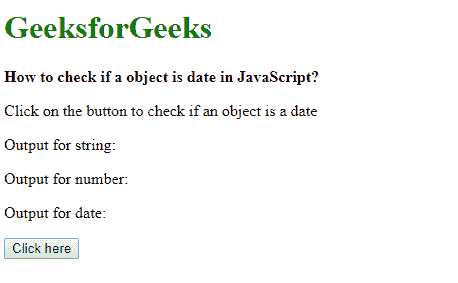
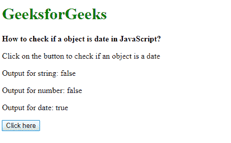

# 如何检查一个对象是否是日期？

> 原文:[https://www . geesforgeks . org/如何检查对象是否是日期/](https://www.geeksforgeeks.org/how-to-check-whether-an-object-is-a-date/)

**方法 1:使用 instanceof 运算符:**instance of 运算符检查构造函数的 prototype 属性是否出现在对象的原型链中的任何位置。在这种情况下，它用于检查对象是否是日期对象的实例。真值意味着它确实与指定的对象匹配。
日期对象中日期的有效性可以用！isNan()函数。如果日期不是无效的，则返回 true。

**语法:**

```html
object instanceof Date
```

**示例:**

```html
<!DOCTYPE html>
<html>

<head>
    <title>
        How to check an object is
        date in JavaScript?
    </title>
</head>

<body>
    <h1 style="color: green">
        GeeksforGeeks
    </h1>

    <b>
        How to check if a object is
        date in JavaScript?
    </b>

    <p>
        Click on the button to check
        if an object is a date
    </p>

    <p>
        Output for string: 
        <span class="outputString"></span>
    </p>

    <p>
        Output for number: 
        <span class="outputNumber"></span>
    </p>

    <p>
        Output for date: 
        <span class="outputDate"></span>
    </p>

    <button onclick="checkDate()">
        Click here
    </button>

    <script type="text/javascript">

        function checkDate() {
            let str = new String('This is a string');
            let num = new Number(25);
            let date = new Date('13-January-19');

            ans = (str instanceof Date) && !isNaN(str);
            document.querySelector('.outputString').textContent = ans;

            ans = (num instanceof Date) && !isNaN(num);
            document.querySelector('.outputNumber').textContent = ans;

            ans = (date instanceof Date) && !isNaN(date);
            document.querySelector('.outputDate').textContent = ans;
        }
    </script>
</body>
</html>                    
```

**输出:**

*   **点击按钮前:**
    
*   **点击按钮后:**
    

**方法 2:使用 Object.prototype.toString.call()方法:**object . prototype . tostring . call()方法用于以格式为“[object Type]”的字符串返回对象的内部类属性。在创建任何对象的过程中，都会在内部分配此属性。可以通过将日期对象与字符串“[对象日期]”进行比较来检查该属性。真值意味着它确实与指定的对象匹配。
日期对象中日期的有效性可以用！isNan()函数。如果日期不是无效的，则返回 true。

**语法:**

```html
Object.prototype.toString.call(object)
```

**示例:**

```html
<!DOCTYPE html>
<html>

<head>
    <title>
        How to check if a object
        is date in JavaScript?
    </title>
</head>

<body>
    <h1 style="color: green">
        GeeksforGeeks
    </h1>

    <b>
        How to check if a object
        is date in JavaScript?
    </b>

    <p>
        Click on the button to check
        if an object is a date
    </p>

    <p>
        Output for string: 
        <span class="outputString"></span>
    </p>

    <p>
        Output for number: 
        <span class="outputNumber"></span>
    </p>

    <p>
        Output for date: 
        <span class="outputDate"></span>
    </p>

    <button onclick="checkDate()">
        Click here
    </button>

    <script type="text/javascript">

        function checkDate() {
            let str = new String('This is a string');
            let num = new Number(25);
            let date = new Date('13-January-19');

            ans = Object.prototype.toString.call(str)
                    === '[object Date]' && !isNaN(str);
            document.querySelector('.outputString').textContent
                    = ans;

            ans = Object.prototype.toString.call(num)
                    === '[object Date]' && !isNaN(num);
            document.querySelector('.outputNumber').textContent
                    = ans;

            ans = Object.prototype.toString.call(date)
                    === '[object Date]' && !isNaN(date);
            document.querySelector('.outputDate').textContent
                    = ans;
        }
    </script>
</body>

</html>                    
```

**输出:**

*   **点击按钮前:**
    
*   **点击按钮后:**
    