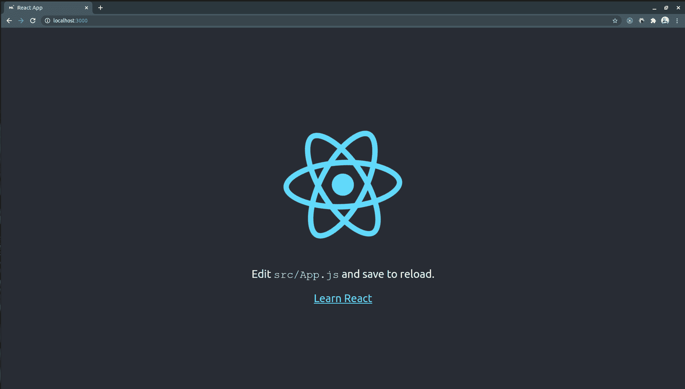

# 如何使用物料 UI 检查哪个页签是活动的？

> 原文:[https://www . geesforgeks . org/how-to-check-哪个选项卡是活动的-使用材料-ui/](https://www.geeksforgeeks.org/how-to-check-which-tab-is-active-using-material-ui/)

材料界面是最流行的反应界面库之一。材质-用户界面组件独立工作。他们是独立的，只会注入他们需要展示的风格。他们不依赖任何全局样式表，比如 [normalize.css](https://necolas.github.io/normalize.css/) 。材料用户界面组件的一些例子是对话框、标签、文本字段、菜单、芯片、卡片、步进器、纸张。要在 React 中使用 Material-UI，我们需要在项目中手动安装它。

**先决条件:**

*   反应的基本知识
*   任何代码编辑器(崇高的文本编辑器，VS 代码，等等。)

**解决方案路线图**

*   创建示例项目
*   将材料用户界面安装到项目中
*   实现选项卡示例
*   应用最终解决方案

**进场:**

**A)创建一个示例项目:**

*   通过在您的终端中运行以下命令

    ```
    npx create-react-app react-material-ui

    ```

    ，创建一个样本反应项目

*   上面的命令将在命令运行的路径中创建一个 React 应用程序样板，并确保您始终使用生成器或构建工具的最新版本，而不必在每次使用时都进行升级。
*   通过键入以下命令

    ```
    cd react-material-ui/

    ```

    进入项目文件夹

*   使用命令

    ```
    npm start

    ```

    运行项目

*   您应该能够在浏览器中看到以下内容



**B)将材料界面安装到项目中:**

*   在你的终端中使用下面的命令安装材料界面。你也可以使用 VS 代码的终端。

    ```
    npm install @material-ui/core

    ```

*   现在在你项目的 *src* 文件夹中寻找 *App.js* 。如果我们走在正确的道路上，删除所有不必要的代码并添加一些代码。

    ## 爪哇描述语言

    ```
    import './App.css';
    import TabsExample from './TabsExample';

    function App() {
      return (
        <div className="App">
         <h4>
            Example to Check which Tab is 
            active Using Material-UI
          </h4>
        </div>
      );
    }

    export default App;
    ```

*   保存更改后，您会发现浏览器正在更新。现在一切都准备好写我们的例子了。


**C)实现选项卡示例:**

*   是时候让你的代码编辑器。在您的 ***src*** 文件夹中创建一个名为 ***的文件，并将以下代码粘贴到其中。

    ## java 描述语言

    ```
    import React from 'react';
    import Tabs from '@material-ui/core/Tabs';
    import Tab from '@material-ui/core/Tab';

    export default class TabsExample extends React.Component {

      constructor(props) {
        super(props);
        this.state = {
          value: 'None',
        };
      }

      render() {
        return (
          <div>
          <Tabs
            value={this.state.value}
            indicatorColor="primary"
            textColor="primary"
            centered="true">

            <Tab label="Tab A" value="Tab A" />
            <Tab label="Tab B" value="Tab B" />
            </Tabs>
          </div>
        );
      }
    }
    ```*** 

*   将您新创建的上述组件导入到您的 *App.js* 文件中。您的 ***App.js*** 文件应该是这样的

    ## java 描述语言

    ```
    import './App.css';
    import TabsExample from './TabsExample';

    function App() {
      return (
        <div className="App">
         <h4>
           Example to Check which Tab is 
           active Using Material-UI
         </h4>
         <TabsExample/>
        </div>
      );
    }

    export default App;
    ```

*   屏幕会是这样的:

现在是该做实际事情的时候了。让我们看看解决方案的方法

**D)施加最终溶液:**

*   The idea is to use the **onChange** Callback which is fired automatically when a *Tab* value changes

    ***语法:***

    ```
    function(event: object, value: any) => void

    ```

    哪里，

    ```
    event: The event source of the callback
    value: The index of the child (number)
    ```

*   现在用下面的代码更新 App.js 文件:

    ## java 描述语言

    ```
    import React from 'react';
    import Tabs from '@material-ui/core/Tabs';
    import Tab from '@material-ui/core/Tab';

    const styles = {
      headline: {
        fontSize: 24,
        paddingTop: 16,
        marginBottom: 12,
        fontWeight: 400,
        color: 'green',
      },
    };

    export default class TabsExample extends React.Component {

      constructor(props) {
        super(props);
        this.state = {
          value: 'None',
        };
      }
      handleChange = (_, value) => {
        this.setState({
          value,
        });
      };

      render() {
        return (
          <div>
          <Tabs
            value={this.state.value}
            onChange={this.handleChange}
            indicatorColor="primary"
            textColor="primary"
            centered="true">

            <Tab label="Tab A" value="Tab A" />
            <Tab label="Tab B" value="Tab B" />
            </Tabs>
            <br></br>
            <p style={styles.headline}>
              Currently Active Tab: {this.state.value}
            </p>
          </div>
        );
      }
    }
    ```

**输出:**

