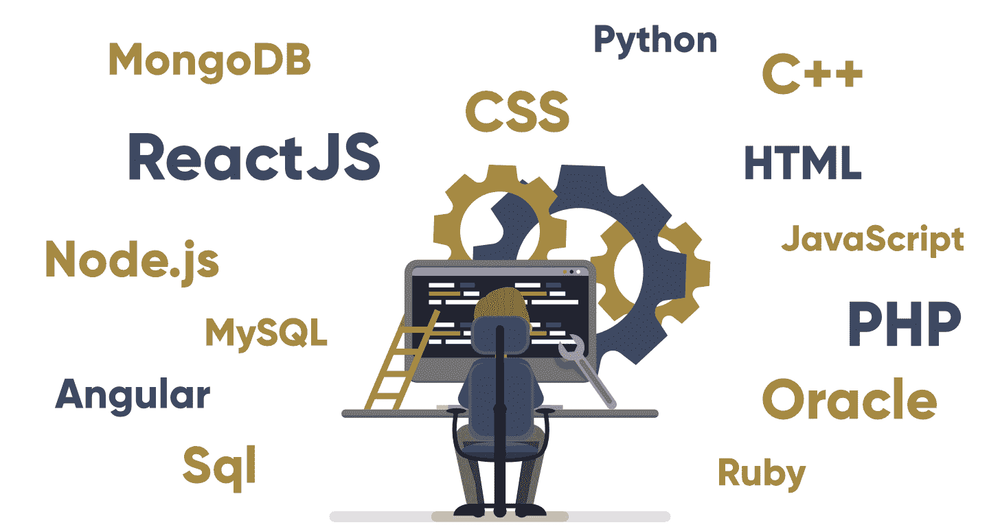

# 如何选择 Web 应用开发的技术栈？

> 原文:[https://www . geeksforgeeks . org/如何选择网络应用开发技术堆栈/](https://www.geeksforgeeks.org/how-to-choose-a-technology-stack-for-web-application-development/)

世界已经变成了一个移动优先的时代，但是即使在今天，没有一个应用能像基于网络的应用那样有效。除此之外，执行与移动应用程序相同功能的渐进式网络应用程序也很流行。因此，很明显，网络应用将会长期存在。使这些网络应用程序值得投资的是使用高端可扩展技术进行开发，或者更简单地说，使用顶级质量的技术堆栈。

难怪公司会花大量时间选择合适的技术堆栈来开发 web 应用程序。正是这种技术堆栈决定了应用程序的整体功能、界面和潜在特性。

此外，选择最合适的技术堆栈可以利用您的应用程序的市场覆盖面，并循环走向成功。同样，使用糟糕的技术堆栈可能会导致整个项目失败。因此，您看到了对您即将用于项目的 web 开发堆栈进行深入审查是多么重要。

尽管到目前为止，我可能已经让您相信了 web 开发堆栈的重要性，并在做出选择时坚持市场标准，但您可能仍然对这到底是什么样的技术堆栈感到困惑？

**Web 开发栈**
说到开发 Web 应用，不仅仅是集成一个想法，给它一个视觉外观。这远远超出了非技术人员的想象。

Web 开发有两个面，一个是前端开发，另一个是后端。或者简单地说，客户端和服务器端。客户端由用户查看，是前端，而服务器端有一个数据库应用程序，一个将客户端请求连接到数据库和服务器本身的应用程序。

因此，当需要开发一个应用程序时，开发人员需要在两端都有相当多的知识，以及在部署每个应用程序时要使用的技术。

**对于客户端:**常用的客户端技术包括

*   **HTML & CSS:** HTML 代表超文本标记语言。它用于使用标记语言设计网页的前端部分。HTML 是超文本和标记语言的结合。超文本定义了网页之间的链接。标记语言用于在定义网页结构的标签中定义文本文档。
    层叠样式表，被亲切地称为 CSS，是一种简单设计的语言，旨在简化网页呈现的过程。CSS 允许您将样式应用于网页。更重要的是，CSS 使您能够独立于组成每个网页的 HTML 来完成这项工作。
*   **JavaScript &框架:** JavaScript 是一种著名的脚本语言，用于在网站上创造魔力，使网站与用户互动。它被用来增强运行酷游戏和网络软件的网站的功能。JavaScript 有很多框架，比如 AngularJS、ReactJS、JQuery 等等。

**对于服务器端:**常用的服务器端技术包括

*   **编程语言:**
    *   **Ruby:** Ruby 是一种动态的、反思的、面向对象的、通用的编程语言。Ruby 是由松本幸弘开发的纯面向对象语言。Ruby 中的所有东西都是一个对象，除了块，但是也有它的替代物，即 procs 和 lambda。
    *   **Python:** Python 是一种编程语言，可以让你快速工作，更高效地集成系统。像 Django、Flask 这样的 python 框架太多了。塔架等。
    *   **C++:** 是一种通用编程语言，如今广泛用于竞技编程。它也被用作后端语言。
    *   **PHP** : PHP 是一种专门为 web 开发设计的服务器端脚本语言。因为，PHP 代码是在服务器端执行的，所以它被称为服务器端脚本语言。在我看来，laravel 框架是 PHP 最好的框架。
    *   **Java:** Java 是目前最流行、应用最广泛的编程语言和平台之一。它是高度可扩展的。Java 组件很容易获得。
    *   **Scala:** Scala 是一种通用、高级、多范式的编程语言。它是一种纯面向对象的编程语言，也支持函数式编程方法。
*   **数据库:**
    *   **Oracle:** Oracle 数据库是作为一个单元处理的数据集合。该数据库的目的是存储和检索与查询相关的信息。它是一个数据库服务器，用于管理信息。
    *   **SQL:** 结构化查询语言是一种标准的数据库语言，用于创建、维护和检索关系数据库。
    *   **PostgreSQL:** 它是一个功能强大的开源对象关系数据库系统，经过 30 多年的积极开发，在可靠性、特性健壮性和性能方面赢得了很高的声誉。
    *   **MongoDB:** MongoDB，最流行的 NoSQL 数据库，是一个开源的面向文档的数据库。术语“NoSQL”的意思是“非关系的”。这意味着 MongoDB 不是基于类似表的关系数据库结构，而是提供了一种完全不同的数据存储和检索机制。
*   **服务器:**
    *   **Nginx:** 它是一个 HTTP 和反向代理服务器、一个邮件代理服务器和一个通用的 TCP/UDP 代理服务器。
    *   **Apache:** 它为通过 MapReduce 进行处理提供了一个高级抽象。它提供了一种高级脚本语言，称为猪拉丁语，用于开发数据分析代码。首先，为了处理存储在 HDFS 的数据，程序员将使用猪拉丁语言编写脚本。

**选择 web 技术栈的小技巧**那么，现在你知道什么是 web 开发，为什么需要它，有哪些可用的 web 开发栈。接下来是什么！？光知道是不够的，你需要对如何为你的 web 应用选择合适的 web 开发栈有一个清晰的认识。

*   **定义您的项目需求:**在选择技术堆栈时，项目规模和相应的复杂性是一些最重要的方面。对于较小的项目，您可以使用 Node.js 或 python。中型项目有更大的需求，因此您需要扩展您的堆栈，选择符合项目需求的技术。同样，对于更大的项目，您有必要分析每个方面，然后部署正确的技术。
*   **开发时间:**如果您希望在尽可能短的时间内开发项目，选择易于集成的现成解决方案或框架将减少上市时间。形成 MEAN 堆栈的技术组合是最理想的堆栈之一，因为它通过第三方集成减少了总体开发时间，从而加快了整个过程。
*   **可扩展性:**对于需要升级的项目，添加具有未来范围的技术变得势在必行。无论是向上扩展还是横向扩展，技术的选择决定了可扩展性的潜力。
*   **开发成本:**在开发项目的同时，还需要考虑你的团队、他们的技能以及你的专业领域。选择一个您的开发人员没有经验的堆栈，将注定需要雇佣第三方开发人员。这在你的口袋里可能很贵。因此，在你对 web 开发栈做出决定之前，和你的团队坐在一起，知道他们认为什么是合适的，然后最终做出一个合理的决定。

**著名项目的技术堆栈:**
我们不建议简单地复制一个项目的技术堆栈，但是对一些著名项目的开发堆栈有一个想法可能会帮助你确定你的想法。用他们成功的技术堆栈来运行一些最好的应用程序。

**社交媒体网络–脸书或 Instagram:**

| 程序设计语言 | 数据库ˌ资料库 | 结构 | 用户界面库 |
| 服务器端编程语言（Professional Hypertext Preprocessor 的缩写） | MongoDB | PHPFox(消歧义) | 瑜珈 |
|  | 卡桑德拉 | 铁轨上的红宝石 | 继电器 |
|  | 关系型数据库 | 龙卷风 | 反应 |
|  | 一种数据库系统 | 离散的犹太人 | 流量 |
|  | 马里亚 DB |  |  |
|  | 巴什 |  |  |

**协作工具–配置单元或可宽延时间:**

| 程序设计语言 | 数据库ˌ资料库 | 结构 | 网络服务器 |
| 目标-C | 关系型数据库 | CakePHP | Apache HTTP 服务器 |
| Java Script 语言 | MongoDB | 拉维尔 | 亚马逊 AWS |
| 服务器端编程语言（Professional Hypertext Preprocessor 的缩写） |  | machap |  |
|  |  | 电子 |  |

**结论:**有调查显示，Ruby on rails 是网络开发投资的最佳技术之一，也是收入最高的工作。然而，这并不意味着你有责任去做同样的事情。考虑到上述所有技术，您可以构建一个优秀的 web 应用程序。记住，你需要找到的不是最好的，而是最合适的，一个能有效满足你需求的。

[详情什么是全栈开发？](https://www.geeksforgeeks.org/what-is-full-stack-development/)