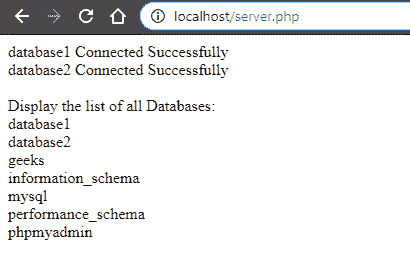

# 如何在一个网页上连接多个 MySQL 数据库？

> 原文:[https://www . geesforgeks . org/如何在单个网页上连接多个 mysql 数据库/](https://www.geeksforgeeks.org/how-to-connect-multiple-mysql-databases-on-a-single-webpage/)

本文解释了如何将多个 MySQL 数据库连接到一个网页中。从多个数据库中访问数据非常有用。

有两种方法可以将多个 MySQL 数据库连接到一个网页中，它们是:

*   使用 MySQL(MySQL 的改进版本)
*   使用 PDO (PHP 数据对象)

**语法:**

*   **MySQL 程序语法:**

> $ link = MySQL _ connect(" host _ name "、" user_name "、" password "、" database _ name ")；

*   **MySQL 面向对象语法:**

> $ link = new MySQL(" host _ name "、" user_name "、" password "、" database _ name ")；

*   **PDO (PHP 数据对象)语法:**

> $pdo =新 PDO(“MySQL:host = host _ name；dbname = database _ name " " user _ name " " password ")；

**程序:**这个程序使用 MySQLi 在一个网页上连接多个数据库。

## 服务器端编程语言（Professional Hypertext Preprocessor 的缩写）

```html
<?php
// PHP program to connect multiple MySQL database
// into single webpage

// Connection of first database
// Database name => database1
// Default username of localhost => root
// Default password of localhost is '' (none)
$link1 = mysqli_connect("localhost", "root", "", "database1");

// Check for connection
if($link1 == true) {
    echo "database1 Connected Successfully";
}
else {
    die("ERROR: Could not connect " . mysqli_connect_error());
}

echo "<br>";

// Connection of first database
// Database name => database1
$link2 = mysqli_connect("localhost", "root", "", "database2");

// Check for connection
if($link2 == true) {
    echo "database2 Connected Successfully";
}
else {
    die("ERROR: Could not connect " . mysqli_connect_error());
}

echo "<br><br>Display the list of all Databases:<br>";

// Connection of databases
$link = mysqli_connect('localhost', 'root', '');

// Display the list of all database name
$res = mysqli_query($link, "SHOW DATABASES");

while( $row = mysqli_fetch_assoc($res) ) {
    echo $row['Database'] . "<br>";
}

?>
```

**输出:**

