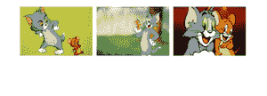

# 如何创建包含多个固定大小图像的 div？

> 原文:[https://www . geeksforgeeks . org/如何创建包含多个固定大小图像的分区/](https://www.geeksforgeeks.org/how-to-create-a-div-that-contains-multiple-fixed-size-images/)

**什么是< div >标签？**T3】

一个

标签可以定义为两个 HTML 代码块的分割线。它被用作 HTML 元素的容器，然后可以用 CSS 或 Javascript 进行样式化。类或 id 属性可用于轻松设置标签中元素的样式。

请阅读本文更多关于

标签:[https://www.geeksforgeeks.org/div-tag-html/](https://www.geeksforgeeks.org/div-tag-html/)

**如何使用< div >标签的示例:**

## 超文本标记语言

```html
<!DOCTYPE html>
<html>

<head>
    <style>
        .firstDiv {
            border: 5px outset black;
            background-color: green;
            text-align: center;
        }
    </style>
</head>

<body>
    <div class="firstDiv">
        <h2>Hello Geek!</h2>

        <p>How was your day like?</p>
    </div>
</body>

</html>
```

**输出:**


**创建一个包含多个固定大小图像的<分区【T3:**

**进场:**

*   首先，创建上例中提到的标签，并将多个图像插入到一个公共的标签中，这样所有的图像都有一个单独的标签和一个类名。
*   以下示例显示了如何制作包含多个固定大小图像的标签:

## 超文本标记语言

```html
<!DOCTYPE html>
<html>

<head>
    <style>
        .images {
            display: flex;
            flex-wrap: wrap;
            margin: 0 50px;
            padding: 30px;
        }

        .photo {
            max-width: 31.333%;
            padding: 0 10px;
            height: 240px;
        }

        .photo img {
            width: 100%;
            height: 100%;
        }
    </style>
</head>

<body>
    <div class="images">
        <div class="photo">
            
        </div>

        <div class="photo">
            
        </div>

        <div class="photo">
            
        </div>
    </div>
</body>

</html>
```

**说明:**在上面的代码中，我们创建了一个“images”的主容器< div >类，用于存储所有的图像，每个图像都有自己的“photo”容器< div >类，以后可以用来给图像添加特殊的 CSS 属性。

## **输出:**



显示的图像包含在 class =“images”的

标签中