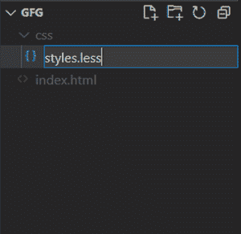

# 如何创建 LESS 文件，如何编译？

> 原文:[https://www . geesforgeks . org/如何创建一个少文件和如何编译它/](https://www.geeksforgeeks.org/how-to-create-a-less-file-and-how-to-compile-it/)

**LESS** (代表 Leaner 样式表)是 CSS 向后兼容的语言扩展。CSS 本身非常适合定义样式并将其应用于各种 HTML 元素，但是它有一些限制。

**CSS 的限制:**

*   编写 CSS 代码会变得很累，尤其是在大型项目中。
*   由于缺少类似编程的特性，如定义变量、嵌套选择器、表达式和函数，维护 CSS 代码很困难。

有几个 CSS 预处理程序试图通过支持许多特性来解决这些缺点。LESS 就是其中之一。它增加了变量、混合、操作和函数。它们有助于使代码更清晰，更容易维护。

**创建和存储一个 LESS 文件:**

**第一步:**转到你的项目文件夹，创建一个名为*的子文件夹，然后在里面创建一个名为*的文件。**



**第二步:**将新创建的文件添加以下代码并保存:

## 无样式

```
@green-color: #25C75C;
@light-color: #ebebeb;
@background-dark: #2b2b2b;

body { 
    font-family: 'Lucida Sans', Verdana, sans-serif;
    margin: 25px;
    background: @background-dark;
    color: @light-color;
}

h1 {
    color: @green-color;
}

a { 
    color: @green-color;
    text-decoration: none;
    &:hover { 
        text-decoration: underline;
    }
}
```

**编译 LESS 文件**

**第一步:**移动到终端中的项目目录，写下以下命令:

```
npm install less
```

**步骤 2:** 您可以使用以下命令检查编译器是否已安装:

```
lessc -v
```


**第三步:**移至 *css* 子文件夹(或存储较少文件的文件夹)

```
cd css
```

**第 4 步:**写下以下命令:

```
lessc styles.less styles.css
```

将创建一个名为*style . CSS*的新文件，内容如下:

## styles.css

```
body {
  font-family: 'Lucida Sans', Verdana, sans-serif;
  margin: 25px;
  background: #2b2b2b;
  color: #ebebeb;
}
h1 {
  color: #25C75C;
}
a {
  color: #25C75C;
  text-decoration: none;
}
a:hover {
  text-decoration: underline;
}
```

**第五步:**现在，你可以把这个 CSS 文件链接到你的 HTML 文件了。

## gfg.html 格式

```
<!DOCTYPE html>
<html>

<head>
    <link rel="stylesheet" 
        href="./css/styles.css">
</head>

<body>
    <h1>Welcome to GeeksforGeeks</h1>

    <p>
        <a class="link" href=
            "https://www.geeksforgeeks.org/">
            This Link
        </a> will take you to
        the homepage of geeksforgeeks.
    </p>
</body>

</html>
```

**输出:**

