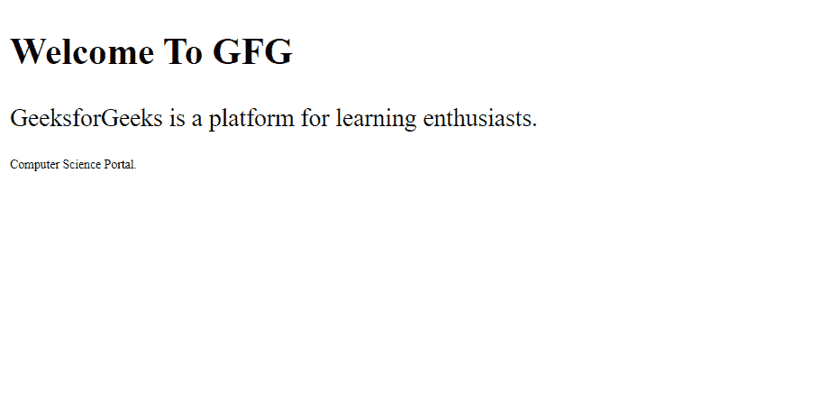

# 如何在 LESS 中创建循环结构？

> 原文:[https://www . geesforgeks . org/如何创建无循环结构/](https://www.geeksforgeeks.org/how-to-create-a-loop-structure-in-less/)

循环是一种允许我们多次使用特定语句的编程方法。较少的循环为我们提供了同样的便利。在 LESS 中，使用递归混合以及保护表达式和模式匹配来创建循环。我们必须按照下面的步骤在 LESS 中创建一个循环。

*   **对 mixin 的主调用:**需要对 mixin 的主调用才能开始迭代。就像在其他编程语言中一样，我们初始化循环变量的值来启动循环，类似地，这个主调用在 LESS 中充当初始值设定项。
*   **带保护表达式的 Mixin:**保护作为循环中的一个条件。它会告知循环何时必须终止。
*   **使 mixin 递归:**mixin 内需要一条语句使其递归。就像其他编程语言一样，参数在传递给函数进行下一次迭代时可以增加或减少。
*   **需要重复的语句:**然后是需要重复的语句。这些语句是在循环结构中编写的。

让我们看一个 LESS 中循环的例子。

**示例:**我们将用循环编写我们的 LESS 代码。

## 无文件

```html
.temp (@var) when (@var > 0) {
  .st-@{var} {
    font-size : (10px * @var);
  }
  .temp(@var - 1);
}
.temp(3);
```

这个*少的*代码可以通过使用以下命令编译成一个 CSS 代码:

```html
lessc file.less file.css
```

**CSS 输出:**这将生成如下等价的 CSS 代码:

## file.css

```html
.st-3 {
    font-size: 30px;
}

.st-2 {
    font-size: 20px;
}

.st-1 {
    font-size: 10px;
}
```

现在让我们编写一个 HTML 代码来使用上面的 CSS 文件。

## index.html

```html
<!DOCTYPE html>
<html>

<head>
    <link rel="stylesheet" 
        href="file.css" type="text/css" />
</head>

<body>
    <div>
        <h2 class="st-3">Welcome To GFG</h2>
        <p class="st-2">
            GeeksforGeeks is a platform
            for learning enthusiasts.
        </p>

        <p class="st-1">
            Computer Science Portal.
        </p>
    </div>
</body>

</html>
```

**输出:**

