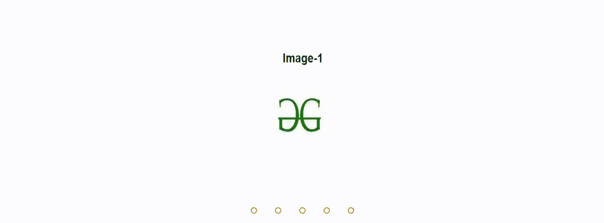

# 如何创建与单选按钮配合使用的图像滑块？

> 原文:[https://www . geeksforgeeks . org/如何创建图像-滑块-使用单选按钮/](https://www.geeksforgeeks.org/how-to-create-an-image-slider-works-with-radio-button/)

滑块是按顺序出现的一系列图像。现在，我们将看到一个使用 HTML & CSS 处理单选按钮的图像滑块，单击单选按钮，图像就会向上滑动。

**进场:**

1.  单选按钮的属性是一个组中只能同时选择一个单选按钮。
2.  我们将使用单选按钮，通过给每个单选按钮一个唯一的 id 来选择我们想要从图像滑块中看到的图像。
3.  接下来，我们将逐一嵌入所有图像，并为单选按钮 id 创建标签，并将应用必要的 CSS 属性来实现所需的输出。

**示例:**

```htmlhtml
<!DOCTYPE html>
<html>

<head>
    <meta charset="utf-8" />

    <title>Image Slider</title>
    <style>

        /* CSS code */
        body {
            margin: 0;
            padding: 0;
            height: 100vh;
            display: flex;
            justify-content: center;
            align-items: center;
        }

        .slider {
            width: 800px;
            height: 500px;
            border-radius: 10px;
            overflow: hidden;
        }

        .imgs_slides {
            width: 500%;
            height: 500px;
            display: flex;
        }

        /* We have to set display: none;
          If not, all of our images would 
          be visible at the same time */
        .imgs_slides input {
            display: none;
        }

        .slide {
            width: 20%;
            transition: 2s;
        }

        .slide img {
            width: 800px;
            height: 500px;
        }

        /* css for slide navigation */
        .navigation {
            position: absolute;
            width: 800px;
            margin-top: -40px;
            display: flex;
            justify-content: center;
        }

        .navigation-btn {
            border: 2px solid #de6a23;
            padding: 5px;
            border-radius: 10px;
            cursor: pointer;
            transition: 1s;
        }

        .navigation-btn:not(:last-child) {
            margin-right: 40px;
        }

        .navigation-btn:hover {
            background: #de6a23;
        }

        /* The checked attribute is used with
        reference to <input type="radio">, 
        when radio button is clicked the 
        class will shift w.r.t  left margin 
        as mentioned which results in image 
        slider */
        #radio1:checked~.first {
            margin-left: 0;
        }

        #radio2:checked~.first {
            margin-left: -20%;
        }

        #radio3:checked~.first {
            margin-left: -40%;
        }

        #radio4:checked~.first {
            margin-left: -60%;
        }

        #radio5:checked~.first {
            margin-left: -80%;
        }
    </style>
    <link rel="stylesheet" type="text/css" 
            href="styles.css" />
</head>

<body>
    <center>

        <!-- Image slider start -->
        <div class="slider">
            <div class="imgs_slides">

                <!-- Radio buttons start -->
                <input type="radio" name="radio-btn" id="radio1" />

                <input type="radio" name="radio-btn" id="radio2" />

                <input type="radio" name="radio-btn" id="radio3" />

                <input type="radio" name="radio-btn" id="radio4" />

                <input type="radio" name="radio-btn" id="radio5" />

                <!-- Radio buttons end -->
                <!-- Embedding  images start -->
                <div class="first slide">
                    
                </div>
                <div class="slide">
                    
                </div>
                <div class="slide">
                    
                </div>
                <div class="slide">
                    
                </div>
                <div class="slide">
                    
                </div>
                <!-- Embedding images end -->
            </div>

            <!-- Navigation start -->
            <div class="navigation">
                <label for="radio1" class="navigation-btn">
                </label>
                <label for="radio2" class="navigation-btn">
                </label>
                <label for="radio3" class="navigation-btn">
                </label>
                <label for="radio4" class="navigation-btn">
                </label>
                <label for="radio5" class="navigation-btn">
                </label>
            </div>
            <!-- Navigation end -->
        </div>
        <!-- Image slider end -->
    </center>
</body>

</html>
```

**输出:**

