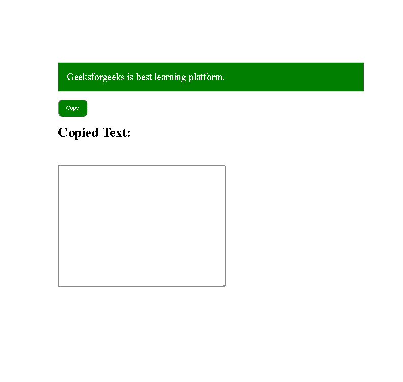
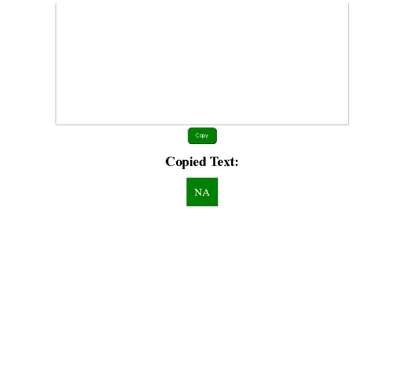

# 如何创建复制到剪贴板按钮？

> 原文:[https://www . geesforgeks . org/如何创建-复制到剪贴板-按钮/](https://www.geeksforgeeks.org/how-to-create-copy-to-clipboard-button/)

在本文中，我们将讨论如何创建剪贴板按钮的副本。

在 web 开发中有多种场景，我们必须为用户提供使用按钮将某些数据复制到剪贴板的功能。无论是代码示例还是用户自己的信息，我们都可以创建一个复制按钮，使用 navigator.clipboard.writeText()函数将数据复制到剪贴板。该函数将作为参数提供给它的数据写入剪贴板。我们可以用它将任何文本复制到剪贴板。

首先，我们选择要复制到剪贴板的文本，无论它是来自 div 还是来自使用 document.getElementById()或任何其他合适函数的输入框。然后，我们将该文本的值存储在一个变量中，并将该变量作为参数传递给 navigator.clipboard.writeText()函数，将其复制到剪贴板。

**语法:**

```html
navigator.clipboard.writeText( <text> )
```

在哪里

**<文本> :** 确定要复制的字符串变量。

**示例 1:** 这里我们在一个 div 中添加了一个复制到剪贴板按钮，其中包含文本，用于将示例文本复制到剪贴板中。

## 超文本标记语言

```html
<!DOCTYPE html>
<html>

<head>
    <style>
        body {
            margin: 100px;
        }

        #textbox {
            width: 40vw;
            height: 30vh;
            position: absolute;
            margin-left: 50px;
            margin-top: 20px;
        }

        button {
            width: 70px;
            height: 40px;
            margin-top: 120px;
            margin-left: 50px;
            background-color: green;
            color: white;
            border-radius: 10px;
            box-shadow: grey;
            position: absolute;
        }

        #sample {
            width: 70vw;
            margin: 50px;
            background-color: green;
            color: white;
            padding: 20px;
            font-size: x-large;
            position: absolute;
        }

        h1 {
            margin-left: 50px;
            margin-top: 160px;
        }
    </style>
</head>

<body>
    <div id="sample">
        Geeksforgeeks is best learning platform.
    </div>
    <br />

    <button onclick="copyText()">Copy</button>
    <br />

    <h1>Copied Text:</h1><br />
    <textarea id="textbox"></textarea>

    <script>
        function copyText() {

            /* Copy text into clipboard */
            navigator.clipboard.writeText
                ("Geeksforgeeks is best learning platform.");
        }
    </script>
</body>

</html>
```

**输出:**



输出

**示例 2:** 这里，我们已经从一个文本区域复制了文本，用户可以在该区域写入自己的文本，然后将其复制到剪贴板，并且该文本也显示在较低的波段上。

## 超文本标记语言

```html
<!DOCTYPE html>
<html>

<head>
    <style>
        #textbox {
            width: 70vw;
            height: 30vh;
        }

        button {
            width: 70px;
            height: 40px;
            background-color: green;
            color: white;
            border-radius: 10px;
            box-shadow: grey;
        }

        #clipboard {
            width: 70vw;
            margin: 50px;
            background-color: green;
            color: white;
            padding: 20px;
            font-size: x-large;
        }
    </style>
</head>

<body>
    <center>
        <textarea id="textbox"></textarea><br />
        <button onclick="copyText()">Copy</button>
        <br />
        <h1>Copied Text:</h1><br />
        <span id="clipboard">NA</span>
    </center>

    <script>
        function copyText() {

            /* Select text area by id*/
            var Text = document.getElementById("textbox");

            /* Select the text inside text area. */
            Text.select();

            /* Copy selected text into clipboard */
            navigator.clipboard.writeText(Text.value);

            /* Set the copied text as text for 
            div with id clipboard */
            document.getElementById("clipboard")
                .innerHTML = Text.value;
        }
    </script>
</body>

</html>
```

**输出:**



输出