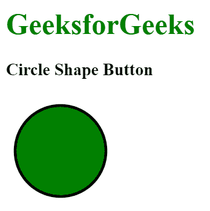
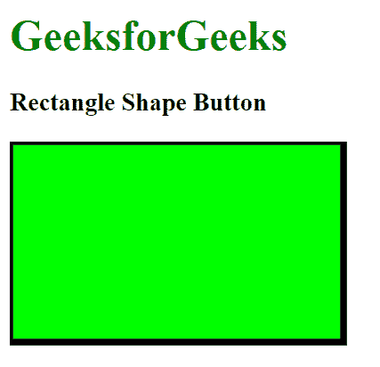
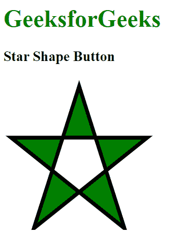
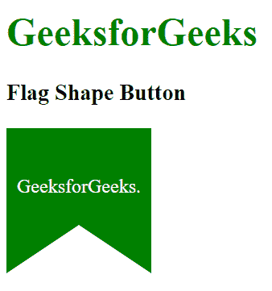

# 如何使用 SVG 创建自定义形状按钮？

> 原文:[https://www . geesforgeks . org/如何使用-svg/](https://www.geeksforgeeks.org/how-to-create-custom-shape-button-using-svg/) 创建自定义形状-按钮

为了设计一个 HTML 按钮的形状，我们可以使用 SVG 元素(可缩放矢量图形)。它基本上以 XML 格式定义了基于矢量的图形。SVG 文件中的每个元素和每个属性都可以被动画化。我们可以使用 SVG 创建任何自定义形状的二维图形。

**示例 1:** 本示例使用 SVG 创建圆形按钮。

```html
<!DOCTYPE html> 
<html> 

<head> 
    <title> 
        Create custom shape button
    </title> 
</head>

<body>
    <h1 style="color:green;">GeeksforGeeks</h1>

    <h3>Circle Shape Button</h3>

    <svg width="500" height="500">
        <a href="#">
            <Circle cx="60"
                    cy="60"
                    r="50"
                    stroke="black"
                    fill="green"
                    stroke-width="3"/>
        </a>
    </svg>
</body>

</html>
```

**输出:**


SVG 元素中还有很多可用的形状，如框、文本、矩形等。

**示例 2:** 本示例使用 SVG 创建一个矩形形状的按钮。

```html
<!DOCTYPE html> 
<html> 

<head> 
    <title> 
        Rectangle Shape Button
    </title> 
</head>

<body>
    <h1 style="color:green;">GeeksforGeeks</h1>

    <h3>Rectangle Shape Button</h3>

    <svg width="300" height="200">
        <a href="#">
            <rect width="250" height="150"
                style="fill:rgb(0, 255, 0);
                stroke-width:5;stroke:rgb(0, 0, 0)"
            />
        </a>
    </svg>
</body>

</html>
```

**输出:**


**示例 3:** 本示例使用 SVG 创建星形按钮。

```html
<!DOCTYPE html> 
<html> 

<head> 
    <title> 
        Star Shape Button
    </title> 
</head>

<body>
    <h1 style="color:green;">GeeksforGeeks</h1>

    <h3>Star Shape Button</h3>

    <a href="#">
        <svg width="300" height="200">
            <polygon points="100, 10 40, 198 190,
                            78 10, 78 160, 198"
                            style="fill:green;
                            stroke:black;
                            stroke-width:5;
                            fill-rule:evenodd;"
            />
        </svg>
    </a>
</body>

</html>
```

**输出:**


**示例 4:** 本示例使用 SVG 创建一个标志形状按钮。

```html
<!DOCTYPE html> 
<html> 

<head> 
    <title> 
        Flag Shape Button
    </title> 
</head>

<body>
    <h1 style="color:green;">GeeksforGeeks</h1>

    <h3>Flag Shape Button</h3>

    <svg width="240" height="240">

        <a href="#">
            <path d="M   0   0
                    L 120   0
                    L 120 120
                    L  60  80
                    L   0 120
                    Z"
                fill="green"/>

            <text x="60"
                y="50"
                fill="#FFFFFF"
                text-anchor="middle"
                alignment-baseline="middle">
                GeeksforGeeks.
            </text>
        </a>
    </svg>
</body>

</html>
```

**输出:**
