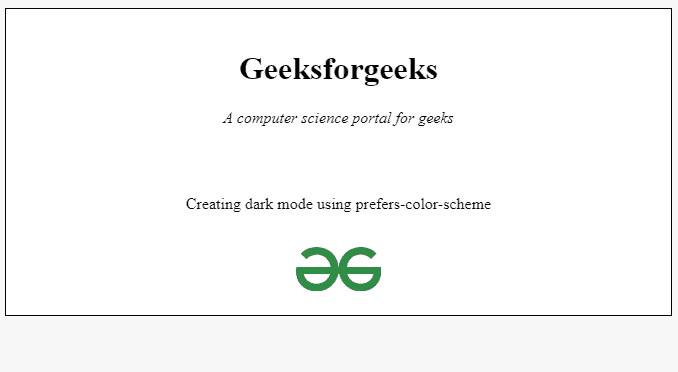
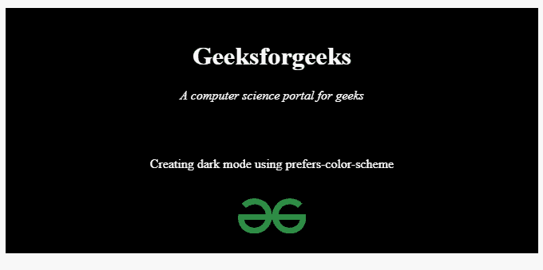

# 如何使用首选配色方案媒体查询创建深色模式？

> 原文:[https://www . geesforgeks . org/how-create-dark-mode-使用-prefere-color-scheme-media-query/](https://www.geeksforgeeks.org/how-to-create-dark-mode-using-prefer-color-scheme-media-query/)

在本文中，我们使用*首选配色方案*媒体查询来创建暗模式界面。

*首选配色方案*是一个新的媒体查询，用于检测您系统的当前主题，并根据您的系统偏好提供有助于创建网页主题的功能。如果您的手机(或任何设备)当前处于黑暗模式，则此媒体查询将检测到它，您可以使用自己选择的自定义 CSS。

**语法:**

```html
@media (prefer-color-scheme : your_color_scheme)
{
     ...
}
```

在 *your_color_scheme* 处，可以使用*深色*或*浅色* 选项。*暗*表示用户已经通知系统他们更喜欢具有暗主题的界面，而*亮*表示用户已经通知系统他们更喜欢具有*亮*主题的界面，或者还没有表达出活动的偏好。

```html
@media (prefer-color-scheme : dark) { ... } 

@media (prefer-color-scheme : light) { ... }
```

**示例:**我们已经使用 HTML 和 CSS 创建了一个虚拟网页，我们希望在黑暗模式下创建它。

## 超文本标记语言

```html
<!DOCTYPE html>
<html>
  <head>
    <title>Creating dark mode</title>
    <style>
      .main {
        border: 1px solid black;
        padding: 20px;
      }
    </style>
  </head>
  <body>
    <center>
      <div class="main">
        <h1>Geeksforgeeks</h1>
        <p><i>A computer science portal for geeks</i></p>
        <br /><br />
        <p>Creating dark mode using prefers-color-scheme</p>
        <br />
        
      </div>
    </center>
  </body>
</html>
```

**输出:**



**创建黑暗模式 UI:** 现在创建一个*偏好配色*媒体查询，并将其设置为*黑暗*。如果系统使用深色模式，我们将所有黑色文本创建为白色，所有白色背景创建为黑色。

## 超文本标记语言

```html
<!DOCTYPE html>
<html>
  <head>
    <title>Creating dark mode</title>
    <style>
      .main {
        border: 1px solid black;
        padding: 20px;
      }

      @media (prefers-color-scheme: dark) {
        h1,
        p,
        div {
          color: white;
        }
        div {
          background-color: black;
        }
      }

      @media (prefers-color-scheme: light) {
        h1,
        p,
        div {
          color: black;
        }
        div {
          background-color: white;
        }
      }
    </style>
  </head>
  <body>
    <center>
      <div class="main">
        <h1>Geeksforgeeks</h1>
        <p><i>A computer science portal for geeks</i></p>
        <br /><br />
        <p>Creating dark mode using prefers-color-scheme</p>
        <br />
        
      </div>
    </center>
  </body>
</html>
```

**输出:**



**使用 JavaScript 检测系统的当前模式:**有时候我们需要检测主题的当前模式。例如，如果我们想使用两个单独的图像为亮模式和暗模式，那么你需要检测当前的主题模式。要检测模式，我们使用[匹配媒体()](https://www.geeksforgeeks.org/html-window-matchmedia-method/)方法。此方法采用一个字符串(要搜索的媒体查询)并返回该媒体查询的结果。

**示例:**在下面的代码片段中，我们正在搜索*偏好配色*媒体查询的结果。

## java 描述语言

```html
<script>
  const a = window.matchMedia("(prefers-color-scheme: dark)");
  console.log(a.matches);
</script>
```

**输出:**

*   如果系统主题是暗的，它将返回:

```html
true
```

*   如果系统主题是浅色的，它会返回:

```html
false
```