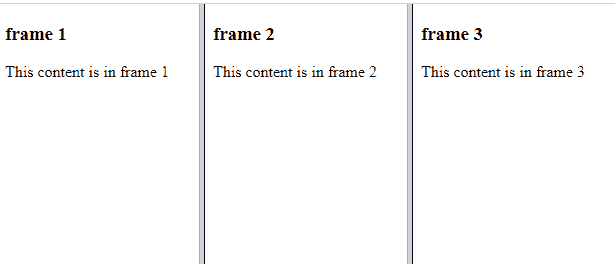
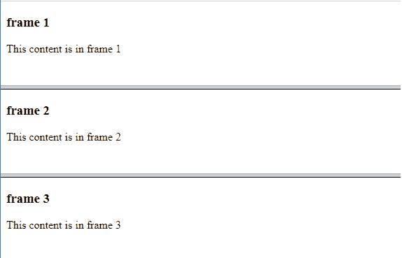

# 如何创建框架？

> 原文:[https://www.geeksforgeeks.org/how-to-create-frames/](https://www.geeksforgeeks.org/how-to-create-frames/)

任务是使用 [HTML](https://www.geeksforgeeks.org/html-tutorials/) 创建[帧](https://www.geeksforgeeks.org/html-frame-tag/)。HTML 是**H**yper**T**ext**M**arkup**L**语言，是创建网页的标准标记语言。它描述网页的形状，并包括一系列元素。

HTML 中的框架用于将您的浏览器窗口分成多个部分，其中每个阶段都可以加载单独的 HTML 报告，浏览器窗口中的一组框架被称为[框架集](https://www.geeksforgeeks.org/html-frameset-tag/)。

由于以下原因，不建议在网页上使用框架。

*   较小的小工具不能频繁地处理框架，因为它们的显示并不总是足以被分割。
*   由于屏幕分辨率不同，您的页面将在不同的计算机上显示不同的内容。
*   有时浏览器的*后退*按钮并没有像用户希望的那样工作。
*   很少有浏览器不支持框架。

让我们看看如何使用 HTML 创建一个框架。

您可以使用 [<框架集>](https://www.geeksforgeeks.org/html-frameset-tag/) 标签来使用框架，而不是使用标签。<框架集>标签用于定义如何将窗口分成框架。水平框架由[行](https://www.geeksforgeeks.org/html-frameset-rows-attribute/)属性定义，垂直框架由[列](https://www.geeksforgeeks.org/html-frameset-cols-attribute/)属性定义。

**进场:**

*   首先，创建三个独立的文件。例如–*frame1.html、frame2.html 和 frame3.html*。
*   在下一步中，创建*index.html*文件或主文件，在包含所有上述 HTML 框架后运行程序。
*   下面所有的 HTML 文件都在两个例子中使用。

## frame1.html

```htmlhtml
<!DOCTYPE html>
<html>
    <body>     
        <h3>frame 1</h3>
        <p> This content is in frame 1 </p>
    </body>
</html>
```

## frame2.html

```htmlhtml
<!DOCTYPE html>
<html>
    <body>     
        <h3>frame 2</h3>
        <p> This content is in frame 2 </p>
    </body>
</html>
```

## frame3.html

```htmlhtml
<!DOCTYPE html>
<html>
    <body>     
        <h3>frame 3</h3>
        <p> This content is in frame 3</p>
    </body>
</html>
```

**示例 1:** 以下示例演示了带有 cols 属性的 HTML [<框架集>。下面的代码使用上述所有文件，即“frame1.html”、“frame2.html”和“frame3.html”作为框架。](https://www.geeksforgeeks.org/html-frameset-cols-attribute/)

## index.html

```htmlhtml
<!DOCTYPE html> 
<html>

<body>
  <frameset cols="*,*,*">
    <frame src="frame1.html"> 
    <frame src="frame2.html">
    <frame src="frame3.html">
  </frameset> 
</body>

</html>
```

**输出:**



列框架

**示例 2:** 在以下示例中，只需将 *<框架集>* 标签中的*列*更改为 [*行*。示例之前给出了“frame1.html”、“frame2.html”、“frame3.html”的代码。](https://www.geeksforgeeks.org/html-frameset-rows-attribute/)

## index.html

```htmlhtml
<!DOCTYPE html> 
<html>

<body>
  <frameset rows="*,*,*">
    <frame src="frame1.html"> 
    <frame src="frame2.html">
    <frame src="frame3.html">
  </frameset> 
</body>

</html>
```

**输出:**



行框架集