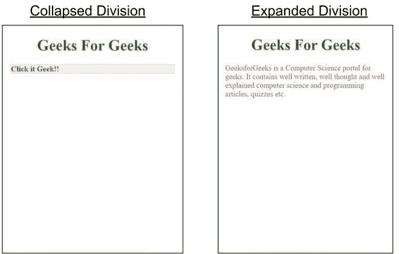

# 如何使用谷歌 AMP-AMP 手风琴创建隐藏标题？

> 原文:[https://www . geesforgeks . org/how-create-hidden-header-use-Google-amp-amp-accordion/](https://www.geeksforgeeks.org/how-to-create-hidden-header-using-google-amp-amp-accordion/)


**简介:**有时候我们有很多内容要展示，为了让网站看起来漂亮又简短，我们会使用可折叠的文本框。可折叠文本框是标题和内容的组合，通常只有标题是可见的，但是当它被点击时，内容就会显示出来。

**设置:**

*   您必须在标题中导入 amp-accordion 组件才能使用此标签。

```htmlhtml
<script async custom-element="amp-accordion"
       src="https://cdn.ampproject.org/v0/amp-accordion-0.1.js">
</script>
```

*   要实现隐藏标题样式，请使用下面提到的代码:

```htmlhtml
<amp-accordion class="sample hidden-header"
  disable-session-states>
  <!-- Content -->
</amp-accordion>
```

**示例:**

```htmlhtml
<!doctype html>
<html 
<head>
  <meta charset="utf-8">
  <title>GeeksForGeeks | amp-accordion</title>
  <script async src=
     "https://cdn.ampproject.org/v0.js">
  </script>
  <!--
 Import the `amp-accordion` component in the header.
  -->
  <script async custom-element="amp-accordion" 
          src=
"https://cdn.ampproject.org/v0/amp-accordion-0.1.js">
  </script>
  <link rel="canonical" href=
"https://amp.dev/documentation/examples/components/amp-accordion/index.html">
  <meta name="viewport" 
        content="width=device-width, 
                 minimum-scale=1, 
                 initial-scale=1">
  <style amp-boilerplate>
  body {
    -webkit-animation:-amp-start 8s steps(1, end) 0s 1 normal both;
    -moz-animation:-amp-start 8s steps(1, end) 0s 1 normal both;
    -ms-animation:-amp-start 8s steps(1, end) 0s 1 normal both;
    animation:-amp-start 8s steps(1, end) 0s 1 normal both
  }
  @-webkit-keyframes -amp-start{
    from{
      visibility:hidden
    }
    to{
      visibility:visible
    }
  }@-moz-keyframes -amp-start{
    from{
      visibility:hidden
    }
    to{
      visibility:visible
    }
  }
  @-ms-keyframes -amp-start{
    from{
      visibility:hidden
    }
    to{
      visibility:visible
    }
  }
  @-o-keyframes -amp-start{
    from{
      visibility:hidden
    }
    to{
      visibility:visible
    }
  }
  @keyframes -amp-start{
    from{
      visibility:hidden
    }
    to{
      visibility:visible
    }
  }
</style>
<noscript>
  <style amp-boilerplate>
    body{
      -webkit-animation:none;
      -moz-animation:none;
      -ms-animation:none;
      animation:none
    }
  </style>
</noscript>
  <style amp-custom>
    amp-accordion section[expanded] .show-more {
      display: none;
    }

    amp-accordion.hidden-header section[expanded] h4 {
      border: none;
    }

    /* these styles are not required for the samples to work */
    :root {
      --space-2: 1rem;
      /* 16px */
    }

    amp-accordion.sample {
      margin: var(--space-2);
    }

    h1, h4{
      color: forestgreen;
    }
    section {
      color: crimson;
    }
</style>
<meta name="robots" content="noindex, nofollow">
</head>
<body>
  <center><h1>
    Geeks For Geeks
  </h1></center>
  <amp-accordion class="sample hidden-header"
    disable-session-states>
    <section>
      <h4><span class="show-more">Click it Geek!!</span></h4>
      <p>GeeksforGeeks is a Computer Science portal for geeks. 
It contains well written, well thought and well explained 
computer science and programming articles, quizzes etc.</p>
    </section>
  </amp-accordion>
</body>
</html>
```

**输出:**
