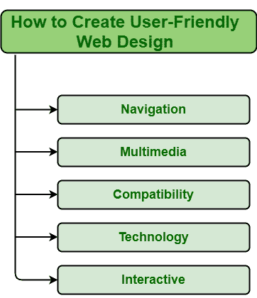

# 如何打造用户友好的网页设计？

> 原文:[https://www . geesforgeks . org/如何创建-用户友好-网页设计/](https://www.geeksforgeeks.org/how-to-create-user-friendly-web-design/)

用户是任何网站成功的关键，因此永远不应该被忽视。网页设计中的用户友好简单地说就是设计一个网站，使用户可以轻松地在任何设备上访问他们想要的信息，而没有任何困难。它只是确保网站的每个用户都必须有一个轻松、毫不费力和有效的体验。制作用户友好的网站通常被认为是实现业务目标的第一步。网站的可用性应该始终是改善网站和增加成功机会的优先事项。简单地说，网站或网页设计应该始终考虑最终用户。有许多方法可以创建和改进用户友好的网站。其中一些如下:

**1。导航:**导航简单来说就是在网页周围移动。它使整个过程变得容易和顺利，并使用户很容易获得信息。因此，在进行网页设计时，人们应该记住它应该清晰、易于理解，并且应该易于客户或用户使用。整个站点都应该有简单的路由。这反过来将提高功能和性能。

**2。多媒体:**在网站中加入多媒体，不仅可以改善网站的整体外观，即视觉方面，还可以吸引更多的用户，为用户提供更多的好处。包括多媒体在内的网站是交互式的，有助于轻松获取更多信息。因此，在网页设计时，人们应该记住它应该是有效的，应该是有成效的，能够发展更高级的思维技能。添加多媒体使网站独特，图形细节丰富。它可以是音频、视频、文本、图像、动画等。

**3。兼容性:**在 web 体验方面，用户体验是最优先考虑的。兼容性在创造良好的用户体验中起着至关重要的作用，并对业务的成功起着巨大的作用。因此，在网页设计时，你应该记住它在不同的浏览器上会有不同的显示，所以你必须相应地计划和适应。这使得用户可以通过手机、平板电脑等各种设备访问网站。使用互联网。

**4。技术:**随着世界的不断发展，新技术也在日益演进，为企业带来了提升业绩、取得成功的新机遇。它使网站看起来更加专业、新鲜和动态。没有网络技术，一个网站就不能被认为是好的，也不会有一个好的用户界面。因此，网站的技术实现非常重要，以使其用户友好。

**5。互动:**允许用户评论并给出他们对体验的意见以及定制他们的体验是非常重要的。因此，在网页设计时，应该包括评论框、民意测验、电子邮件表格、要求评分、纳入测验等。所有这些都将增加交互和用户体验。