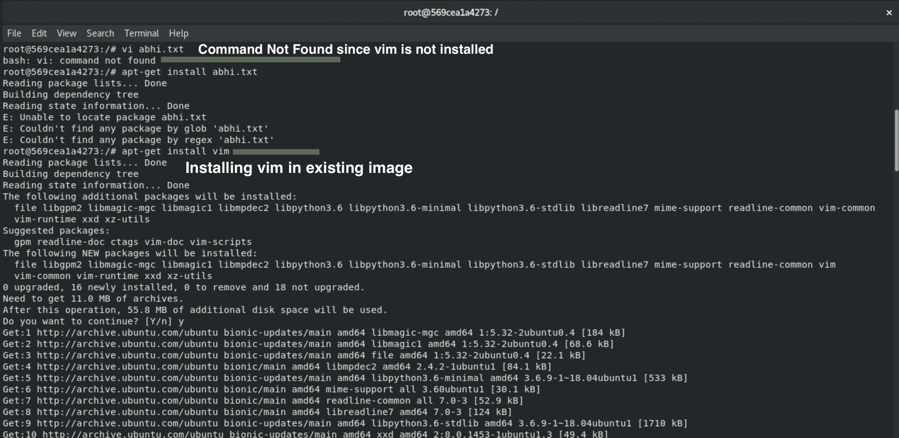
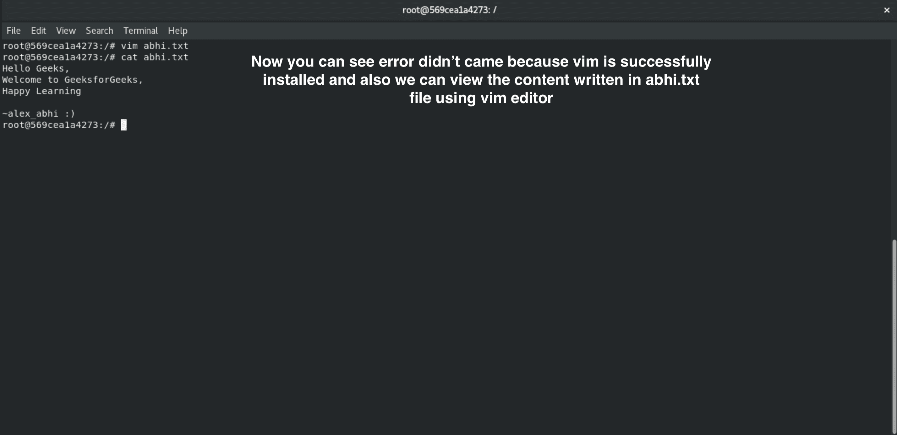
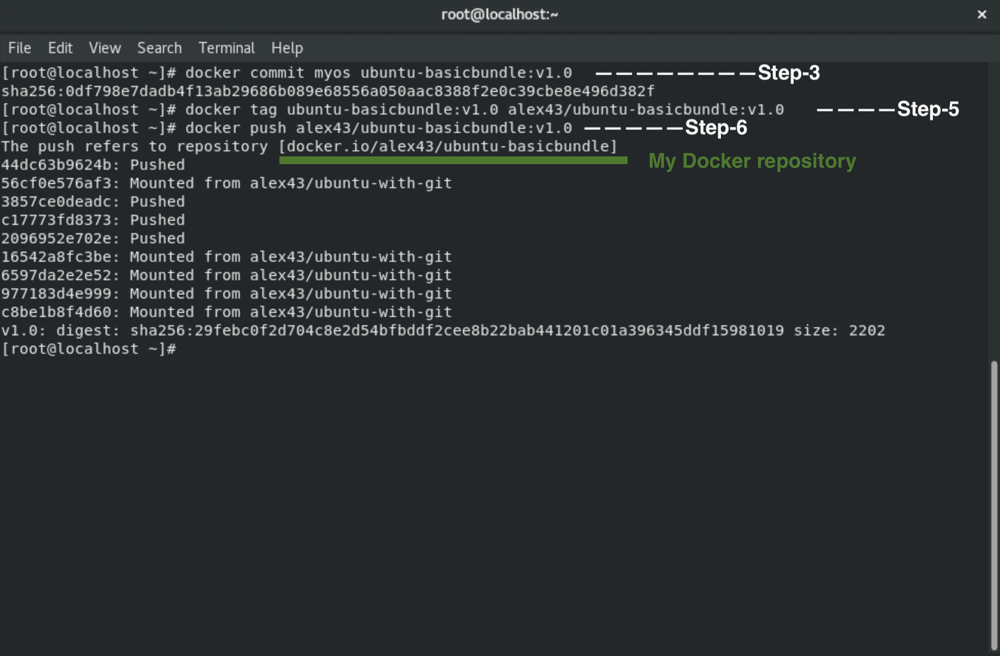

# 如何创建自己的码头工人定制形象？

> 原文:[https://www . geesforgeks . org/如何创建自己的 docker-customized-image/](https://www.geeksforgeeks.org/how-to-create-your-own-docker-customised-image/)

**Docker** 是一个开源的容器管理服务，也是 **DevOps** 最流行的工具之一，该工具在部署团队中很受欢迎。Docker 主要用于基于敏捷的项目，这些项目需要持续交付软件。Docker 开源项目的创始人、首席技术官和首席架构师是**索洛曼·海克斯**。它于 2013 年由 **Dotcloud** 推出，自此是全球领先的软件容器平台。关于使用 docker 的容器化及其内部架构的更多细节[请点击此处](https://www.geeksforgeeks.org/containerization-using-docker/)。

在本文中，我们将看到如何创建自己定制的 Docker 映像，以及如何将其推送到 **docker hub** 配置文件。将您的图像推送到 docker hub 配置文件是一个很好的做法，因为您不必再次创建它，您可以在系统中和云中提取这些图像，并将所有工作保存在其中。

创建 docker 映像并不是一项乏味的任务。我们可以用很少的命令轻松创建 docker 映像。根据您想要创建图像的目的，有两种创建 docker 图像的方法。第一种方法是使用**提交命令**，另一种方法是使用**文件**概念。要阅读更多关于 docker ie 组件、docker 图像和 Docker 文件[的详细信息，请点击此处](https://www.geeksforgeeks.org/containerization-using-docker/)。

现在让我们开始使用 **commit** 命令创建我们自己的定制 docker 映像。在使用我们自己的 docker 映像之前，我们应该首先在操作系统中设置和配置 docker。要了解更多关于如何设置码头工人，你可以参考[这篇文章](https://www.geeksforgeeks.org/how-to-install-and-configure-docker-in-ubuntu/)。成功安装之后，让我们学习一些将要使用的 docker 命令。

### 需要命令

第一个命令是**拉**命令。根据您的互联网连接，此命令将在几秒钟内下载/拉出完整的操作系统。语法是这样的，**码头工人拉图像 _ 名称**。这里我拉的是 alex43/ubuntu-with-git:v1.0，这是我自己定制的图片。

```html
docker pull alex43/ubuntu-with-git:v1.0
```

第二个命令是**运行**命令，我们将使用它来运行拉取的图像。这个命令将启动我的图像，我们将获得该图像的交互式外壳/终端。语法是这样的，**-它**为一个交互终端，**-名称**为我的图片提供参考名称，然后我的**图片名称**。

```html
docker run -it --name myos alex43/ubuntu-with-git:v1.0
```

第三个命令，也是创建我们自己形象最重要的命令是 **commit** 命令。通过使用这个命令，我们可以简单地用我们想要的现有映像包创建我们自己的映像。语法类似于，**docker commit name of _ running gimage your _ own _ name:tag**。

```html
docker commit myos ubuntu-basicbundle:v1.0
```

第四个命令是**标记**命令。通过使用这个命令，我们需要用语法**用户名/图像名称:标签**来重命名我们的图像。在执行此命令之前，您需要在 docker 集线器上创建一个帐户，并且您必须给出与您在 Docker 集线器配置文件中给出的用户名相同的用户名。

```html
docker tag alex43/ubuntu-with-git:v1.0 alex43/ubuntu-basicbundle:v1.0
```

第五个命令是**登录**命令。通过使用这个命令，我们将通过我们的终端登录到 docker hub 帐户，并且需要将我们的 docker 映像上传到 docker hub 配置文件。

```html
docker login --username alex43 --password your_passwd
```

第五个命令是**推**命令。通过使用这个命令，我们可以将自己创建的 docker 映像上传到 docker hub 配置文件，并且可以通过拖动它在从本地系统到云的任何地方使用它。

```html
docker push alex43/ubuntu-basicbundle:v1.0
```

这就是我们将在本教程中使用的几个带有该概念的命令，我将上传一个新的图像，以便你们可以更好地理解它。

### 我自己的形象

现在我们将从现有的**Alex 43/Ubuntu-wit-git:v 1.0**图像创建我们自己的图像，我们将根据我们的需求对其进行定制，然后上传。

**第一步:**第一步是拉出图像，如我在上面的命令中所示。使用命令将图像拉入系统。
docker pull alex43/Ubuntu-wit-git:v 1.0

**第二步:**启动该映像，这样我们就可以根据自己的需要对其进行定制。在下面的图片中，你可以看到在第一张图片中我们没有 vim 编辑器，所以它给出了未找到的命令错误。然后我用 **apt-get install vim** 命令在我们的系统中安装了 vim。



在下图中，您可以看到，当我用 vim editor 打开 abhi.txt 时，安装了 vim editor 后，它没有出现任何错误，我可以在其中编写内容。您也可以使用我们在 Alex 43/Ubuntu-wit-git:v 1.0 图像中已经有的 **cat** 命令来查看内容。



所以这只是你需要理解和应用自己概念的一步。您可以创建许多更有用的 docker 映像来解决一些行业用例，例如使用 docker 映像启动 WordPress 博客网站、创建自己的 MySQL 数据库映像等。这是你需要根据自己的需要去理解和应用的基本概念。

**第三步:**按 **ctrl+p+q** 从图像中出来，提交修改后的图像，正如我在上面的命令中解释的那样。
**第 4 步:**在 docker hub 创建一个帐户，并使用如上所述的正确语法更改图像的名称。
**步骤 5:** 使用如上所述的**码头工人登录**命令，从终端登录码头工人中心配置文件。
**第 6 步:**最终任务是使用 push 命令将图像上传到 docker hub 配置文件，如上所述。

对于步骤 3、步骤 5 和步骤 6，您可以看到下图。根据图像的大小和系统的互联网速度，推送图像可能需要一些时间。在图像中，您可以看到我已经使用了上面解释的命令，并且它成功地将我的图像上传到了我的 docker hub 配置文件中。



因此，通过这种方式，我们可以创建自己的 docker 映像，只需使用很少的命令就可以将其推送到 docker hub。