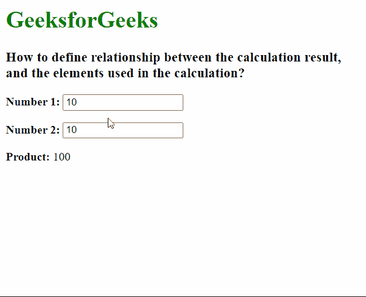

# 如何定义结果与计算中使用的元素之间的关系？

> 原文:[https://www . geeksforgeeks . org/如何定义计算中使用的结果和元素之间的关系/](https://www.geeksforgeeks.org/how-to-define-relationship-between-the-result-and-the-elements-used-in-the-calculation/)

在本文中，我们将学习如何定义元素和计算结果之间的关系。HTML 中的 **<输出>** 元素是一个容器元素，可以用来显示结果计算的输出。站点可以在这个元素中注入结果。我们将使用这个标签来指定结果。

输出元素的**表单**属性用于将用于计算的元素与输出相关联。该属性的值必须是同一文档中<表单>的 id。当未指定该属性时，它假定使用祖先<形式>元素来代替。属性的**用于表示对输出有贡献的元素的 id。**

下面的例子演示了

<output>元素的使用。</output>

**示例:**

## 超文本标记语言

```html
<html>
  <body>
    <h1 style="color: green">GeeksforGeeks</h1>
    <h3>
      How to define relationship between the 
      calculation result, and the
      elements used in the calculation?
    </h3>

    <!-- The oninput attribute of <form> is used
       to specify the output that would be calculated -->
    <form oninput="val.value = parseInt(num1.value) * parseInt(num2.value)">
      <!-- Input of the numbers to be multiplied -->

      <p><b>Number 1:</b> 
          <input type="number" id="num1" value="10" />
      </p>

      <p><b>Number 2:</b> 
          <input type="number" id="num2" value="10" />
      </p>

      <!--Show the result in the <output> element -->

      <p>
        <b>Product:</b>
        <output name="val" for="num1 num2"> 100 </output>
      </p>
    </form>
  </body>
</html>
```

**输出:**

