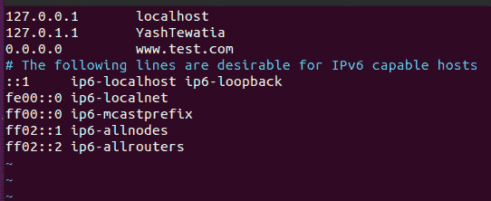
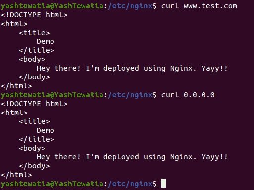

# 如何在远程服务器(基于 Ubuntu)上使用 Nginx 部署 web 应用程序–第 2 集

> 原文:[https://www . geeksforgeeks . org/如何部署网络应用程序-使用远程服务器上的 nginx-基于 ubuntu 的 set-2/](https://www.geeksforgeeks.org/how-to-deploy-web-applications-using-nginx-on-remote-server-ubuntu-based-set-2/)

在[上一篇文章](https://www.geeksforgeeks.org/what-is-nginx-web-server-and-how-to-install-it/)中，我们了解了 Nginx 以及如何利用它的优势，并将其安装在我们的设备或远程服务器上。在本文中，我们将看到如何使用 Nginx 部署存储在远程服务器中的 web 应用程序。

我们需要遵循给定的步骤，以便使用 Nginx 部署网络应用程序。

**第一步:**打开终端，使用*光盘*命令，更改存储 web 应用程序的目录。

```html
# Example: Suppose test is a web application 
# folder stored in downloads, I'll open terminal 
# in home screen 
cd  ../Downloads/test/

# Check the contents once here
ls
```


**第 2 步:**在你的发行版中安装 Curl、OpenSSH-server 和 vim 编辑器，使用以下命令轻松设置。但在此之前，我会解释它们是什么以及为什么需要使用它们。

**Curl:** 用于从网络服务器传输数据的 CLI 工具。

**OpenSSH-server:**OpenSSH-server 是用于远程联网计算机之间的远程控制和数据传输的工具集合。

**Vim-editor:** 是一个编辑器，用于在 ubuntu 中创建和修改文本文件。

```html
# Commands to install all the above-required libraries in terminal 
sudo apt-get install curl
sudo apt-get install openssh-server
sudo apt-get install vim
```

现在我们已经完成了先决条件部分。

**第 3 步:**现在在这一步我们将把我们的 web 应用程序文件夹复制到这个绝对路径 */var/www*

```html
# change directory to parent folder where 
# you have stored the web application folder
sudo cp -r test /var/www
```

**步骤 4:** 现在我们将域名指向我们将托管此应用程序的服务器。即我们需要将您的服务器的 IP 地址添加到 DNS 设置中。假设你的服务器 IP 地址是 0.0.0.0，你的域名是 www.test.com，那么你的域名应该指向你的服务器 IP 地址。

为此，我们还需要在服务器中做一些设置，我们需要创建一个文件，我们将使用 vim

首先，将您的目录更改为 var/www/然后使用 vim 命令:

```html
# Change your directory 
cd var/www

# Vim command for new file
sudo vi /etc/hosts
```

现在，您将看到一个内容类似的文件，如图所示


你需要在这里添加你的 IP 地址在开始和你的域名之后，你可以使用下面的图片作为参考。



**步骤 5:** 与在远程服务器上一样，我们需要将我们的 web 应用程序文件夹添加到该服务器。为此，我们需要更改 web 应用程序文件夹的权限。(web 应用程序的文件夹名称可能会有所不同)

```html
# Change directory to /var/www/test
cd /var/www/test

# Change permission for your folder
sudo chmod -R 777 *

# Secure copy your files to web server
# (Your IP address of server will be different)
# (eg: scp -r * root@x.x.x.x:var/www/FOLDER_NAME)
scp -r * 0.0.0.0:/var/www/test
```

所以我们的文件被安全地复制到了服务器上。

**第 6 步:**现在，我们将配置我们的 Nginx 服务器来服务我们的网站，让我们，首先，看到 Nginx 文件夹

```html
# Change directory 
cd /etc/nginx

# See Contents of it 
ls
```

在这里，我们应该对 2 个目录感兴趣，网站可用和网站启用。

**站点-可用:**它包含所有静态文件的所有可能的单独配置文件。

**站点启用:**它包含 Nginx 将读取和运行的配置文件的链接。

因此，我们需要在站点中创建一个配置文件，并在站点中为 Nginx 启用一个符号链接。

首先，我们将创建一个新文件，并向其中添加以下内容。

```html
# Command to create and open a new file 
sudo vim sites-available/test

# Now add the following contents to it
server {
listen 80 default_server;
listen [::] default_server;
root /var/www/test;
index index.html;
location / {
try_files $url $url/ =404;
}
}
```

这里我们已经为 default_server 打开了 socket 80 和您的应用程序端口，我们已经告诉了 nginx 我们的 web 应用程序文件在哪里。我们的索引页面的位置，如果你得到一些错误的网址，然后通过 404 错误。

**步骤 7:** 现在让我们将该文件添加到 Nginx 中的站点启用文件夹中

```html
# Command to add file to sites-enabled folder
sudo ln -s /etc/nginx/sites-available/test /etc/nginx/sites-enabled/test
```

太神奇了！现在我们有一个主要问题，就像前面我们让我们的 Nginx 服务器运行一样，我们配置为在我们的 web 应用程序中打开端口 80，Nginx 也在尝试使用端口 80 打开它的默认页面。因此，我们需要将默认文件移动到其他地方，以避免冲突。

```html
# I generally move it to home directory 
sudo mv /etc/nginx/sites-enabled/default /home/yashtewatia/default

# Restart Nginx service
sudo systemctl restart nginx
```

所以我们重启了 nginx 服务器！现在，您可以转到您的 IP 地址在浏览器中查看内容，也可以在终端中使用 curl 命令，

```html
curl www.test.com
# or we can give the IP address here of our server
curl 0.0.0.0
```



因此，我们已经使用 Nginx 服务器部署了我们的网络文件。