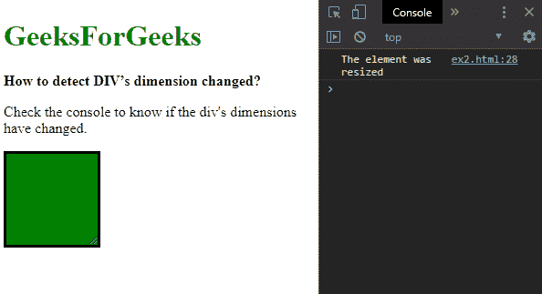
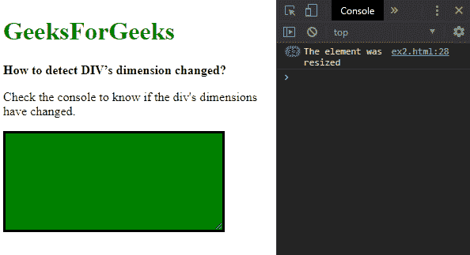
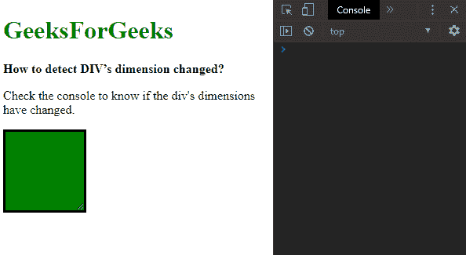
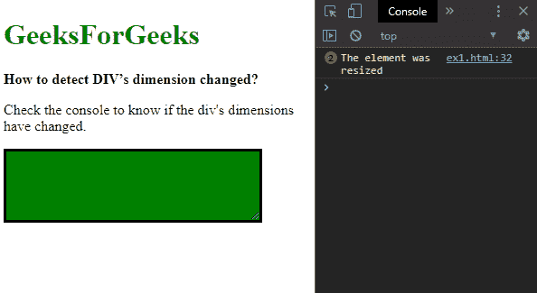

# 如何检测 DIV 维度的变化？

> 原文:[https://www . geeksforgeeks . org/如何检测 divs 维度中的变化/](https://www.geeksforgeeks.org/how-to-detect-the-change-in-divs-dimension/)

div 维度的变化可以通过两种方法来检测:

**方法 1:使用调整观察者界面**
检查变化**调整观察者**界面用于报告元素尺寸的变化。
首先使用 jQuery 选择要跟踪的元素。ResizeObserver 对象是用回调函数创建的，该函数定义了当检测到维度变化时应该执行什么操作。
该对象的**观察()方法**用于要跟踪的元素。这将检查任何更改，并在检测到任何维度更改时执行回调函数。

**语法:**

```
let resizeObserver = new ResizeObserver(() => {
    console.log("The element was resized");
});

resizeObserver.observe(elem);
```

**示例:**

```
<!DOCTYPE html>
<html>

<head>
    <title>
        How to detect DIV’s dimension changed?
    </title>
    <style>
        #box {
            resize: both;
            border: solid;
            background-color: green;
            height: 100px;
            width: 100px;
            overflow: auto;
        }
    </style>
</head>

<body>
    <h1 style="color: green">
      GeeksForGeeks
    </h1>
    <b>
      How to detect DIV’s dimension changed?
    </b>
    <p>Check the console to know if the div's dimensions have changed.
    </p>
    <div id="box"></div>
    <script src="https://code.jquery.com/jquery-3.3.1.min.js">
    </script>

    <script>
        elem = $("#box")[0];

        let resizeObserver = new ResizeObserver(() => {
            console.log("The element was resized");
        });

        resizeObserver.observe(elem);
    </script>
</body>

</html>
```

**输出:**

*   **调整元素大小前:**
    
*   **调整元素大小后:**
    

**方法 2:每 500 毫秒检查一次尺寸变化**
该方法包括每 500 毫秒检查要跟踪的元素的尺寸。将尺寸的值与旧迭代的值进行比较，以检查是否有任何差异。

使用 jQuery 中的**高度()**和**宽度()**方法找出要跟踪的元素的高度和宽度。这些尺寸将用作元素的最后跟踪基线尺寸，并存储在变量中。

创建了一个新的函数，在这个函数中可以找到元素的高度和宽度。这将是新的维度，将与以前的维度进行比较。使用 if 语句，将新的高度和宽度与之前找到的基线进行比较。如果尺寸不匹配，则表示尺寸已经改变。这里将执行尺寸变化时需要采取的措施。
找到的新维度将被分配给旧维度作为基线，以便可以用它们检查下一次迭代。
使用**设置间隔()**函数，每 500 毫秒循环一次创建的函数。这将持续检查高度和宽度的变化，并在出现差异时执行给定的功能。
这种方法比前一种方法慢得多，减少每次检查之间的时间会进一步降低性能。

**语法:**

```
let lastHeight = $("#box").height();
let lastWidth = $("#box").width();

function checkHeightChange() {
    newHeight = $("#box").height();
    newWidth = $("#box").width();

    if (lastHeight != newHeight || lastWidth != newWidth) {
        console.log("The element was resized");

        // assign the new dimensions
        lastHeight = newHeight;
        lastWidth = newWidth;
     }
 }

setInterval(checkHeightChange, 500);
```

**示例:**

```
<!DOCTYPE html>
<html>

<head>
    <title>
        How to detect DIV’s dimension changed?
    </title>
    <style>
        #box {
            resize: both;
            border: solid;
            background-color: green;
            height: 100px;
            width: 100px;
            overflow: auto;
        }
    </style>
</head>

<body>
    <h1 style="color: green">
      GeeksForGeeks
    </h1>
    <b>
      How to detect DIV’s dimension changed?
    </b>
    <p>Check the console to know if the div's dimensions have changed.
    </p>
    <div id="box"></div>
    <script src="https://code.jquery.com/jquery-3.3.1.min.js">
    </script>

    <script type="text/javascript">
        let lastHeight = $("#box").height();
        let lastWidth = $("#box").width();

        function checkHeightChange() {
            newHeight = $("#box").height();
            newWidth = $("#box").width();

            if (lastHeight != newHeight ||
                lastWidth != newWidth) {
                console.log("The element was resized");

                // assign the new dimensions
                lastHeight = newHeight;
                lastWidth = newWidth;
            }
        }

        setInterval(checkHeightChange, 500);
    </script>
</body>

</html>
```

**输出:**

*   **调整元素大小前:**
    
*   **调整元素大小后:**
    