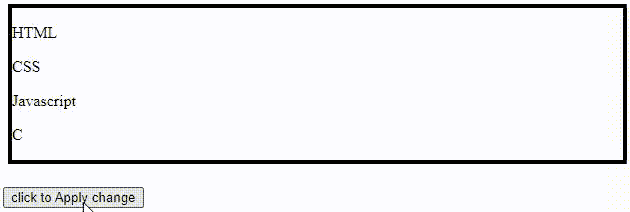

# 如何获取 div 内部特定类的元素？

> 原文:[https://www . geeksforgeeks . org/如何获取 a-div/](https://www.geeksforgeeks.org/how-to-get-elements-of-specific-class-inside-a-div/) 中特定类的元素

在本文中，我们将找到如何在 HTML [*div*](https://www.geeksforgeeks.org/div-tag-html/) 标签中获取特定*类*的所有元素。

为此，我们将使用[HTML DOM query selectorall()](https://www.geeksforgeeks.org/html-dom-queryselectorall-method/)方法。这个方法返回文档中与指定的 CSS 选择器匹配的所有元素。使用此方法的语法如下。

**语法:**

```htmlhtml
document.querySelectorAll(CSS-selectors)
```

**示例:**CSS 选择器可以是类、id 或任何 HTML 标签。让我们学习如何使用这个方法来选择 HTML i div 标签中特定类的元素。

## 超文本标记语言

```htmlhtml
<!DOCTYPE html>
<html>
  <head>
    <style>
      #tag {
        border: 4px solid black;
        margin: 5px;
      }
    </style>
  </head>
  <body>
    <div id="tag">
      <p class="example1">HTML</p>

      <p class="example1">CSS</p>

      <p class="example1">Javascript</p>

      <p class="example2">C</p>
    </div>
    <br />

    <button onclick="changecolor()">
      click to Apply change
    </button>
    <script>
      function changecolor() {
        var x = document.getElementById("tag")
                .querySelectorAll(".example1");
        for (i = 0; i < x.length; i++) {
          x[i].style.backgroundColor = "blue";
        }
      }
    </script>
  </body>
</html>
```

**输出:**点击“点击应用变更”按钮后，我们得到如下输出。我们可以看到，通过使用 [getElementById()](https://www.geeksforgeeks.org/html-dom-getelementbyid-method/) 选择一个 *div* ，然后使用*querySelectorAll()*选择其在 *div* 内的所有元素，我们可以对其所有元素应用更改。

