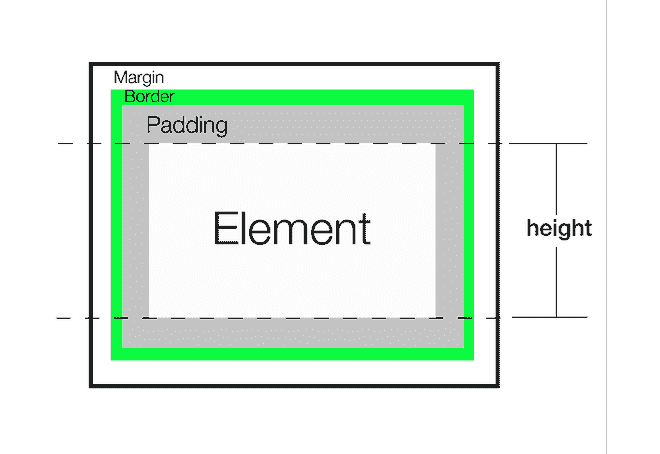
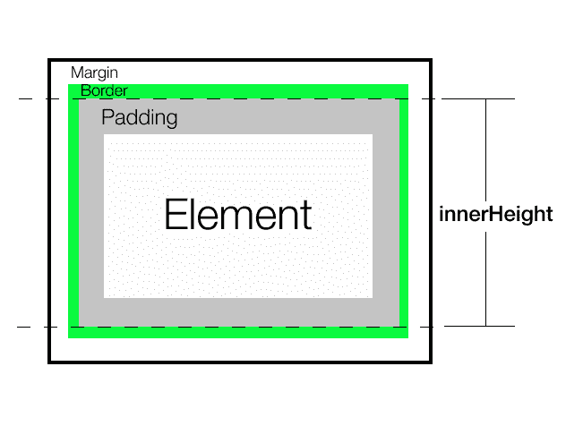

# 如何获取一个元素的渲染高度？

> 原文:[https://www . geeksforgeeks . org/如何获得元素的渲染高度/](https://www.geeksforgeeks.org/how-to-get-the-rendered-height-of-an-element/)

要获取元素的高度，在 JavaScript 中有五种常见的方法。让我们看看它们之间的区别以及何时应该使用它们。只有最后一种方法给出了正确的渲染高度，而不是布局高度。

*   样式.高度
*   jQuery( height、innerHeight、outerheight)
*   clientHeight、offsetHeight、scrollHeight
*   getComputedStyle
*   getBoundingClientRect().height

渲染高度是在对元素应用所有样式和变换后，元素最终获得的高度。例如，一个元素的高度为 100px，然后得到一个*变换:比例(0.5)* 。其渲染高度为 50px(转换后)，布局高度为 100px。

**style.height** 我们可以在任何选定的元素上使用 *style.height* ，它将返回其高度。不包括*填充*、*边框*或*边距*。它总是返回高度以及具体的单位。

**注意:**只有当我们在 HTML 中使用*样式*属性将高度显式设置为*内嵌*时才有效。

**语法:**

```htmlhtml
let height = document.getElementById("someId").style.height;
```

**示例:**

## 超文本标记语言

```htmlhtml
<!DOCTYPE html>
<html>

<head>
    <meta charset="UTF-8" />
    <style>
        div {
            border: 1px solid black;
            text-align: center;
            margin-bottom: 16px;
            color: green;
        }

        #div1 {
            height: 100px;
        }
    </style>
</head>

<body>
    <div id="div1">
        <h1>
            style.height without 
            inline style
        </h1>
    </div>

    <div id="div2" style="height: 100px;">
        <h1>style.height with inline style</h1>
    </div>
    <button onclick="alertHeight()">
        Get Height
    </button>

    <script>
        function alertHeight() {
            alert(document.getElementById
                ("div1").style.height);

            alert(document.getElementById
                ("div2").style.height);
        }
    </script>
</body>

</html>
```

**输出:**
为“div1”返回空字符串，为“div2”返回“100px”

*   **为“div 1”:**
*   **为“div 2”:**

**结论:**它只返回*内联*样式属性中指定的任何高度。它不考虑任何转换，比如缩放。不可靠，<u>不宜用</u>因为*直列*款式不理想。

**jQuery(height，innerHeight，outer height)**
**height()**它返回元素的当前高度。不包括*填充*、*边框*或*边距*。它总是返回一个无单位的像素值。

**注意:****高度()**将始终返回内容高度，而不考虑 CSS *大小框*属性的值。

**语法:**

```htmlhtml
let height = $("#div1").height();
```



**例 2:**

## 超文本标记语言

```htmlhtml
<!DOCTYPE html>
<html>

<head>
    <meta charset="UTF-8" />

    <style>
        div {
            border: 1px solid black;
            text-align: center;
            margin-bottom: 16px;
            color: green;
        }

        #div1 {
            height: 100px;
        }
    </style>

    <script src=
"https://code.jquery.com/jquery-3.5.0.js">
    </script>
</head>

<body>
    <div id="div1">
        <h1>$(".class").height</h1>
    </div>
    <button onclick="alertHeight()">
        Get Height
    </button>

    <script>
        function alertHeight() {
            alert($("#div1").height());
        }
    </script>
</body>

</html>
```

**输出:**
返回无单位像素值 100。

**输出:**


**innerHeight()** 返回元素的当前高度，包括*顶部*和*底部*填充，但不包括*边框。*总是返回无单位像素值。

**语法:**

```htmlhtml
 let height = $("#div1").innerHeight();
```



**例 3:**

## 超文本标记语言

```htmlhtml
<!DOCTYPE html>
<html>

<head>
    <meta charset="UTF-8" />

    <style>
        div {
            border: 1px solid black;
            text-align: center;
            margin-bottom: 16px;
            color: green;
        }

        #div1 {
            height: 100px;
            padding: 10px;
            margin: 5px;
        }
    </style>

    <script src=
"https://code.jquery.com/jquery-3.5.0.js">
    </script>
</head>

<body>
    <div id="div1">
        <h1>$(".class").innerHeight</h1>
    </div>
    <button onclick="alertHeight()">
        Get Height
    </button>

    <script>
        function alertHeight() {
            alert($("#div1").innerHeight());
        }
    </script>
</body>

</html>
```