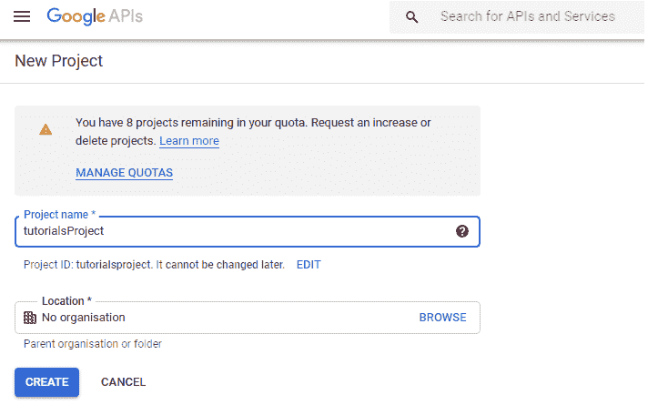
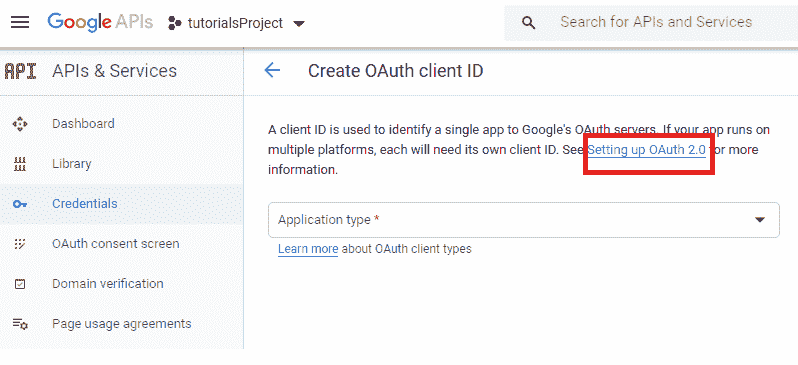
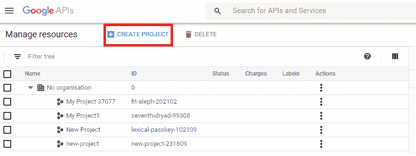
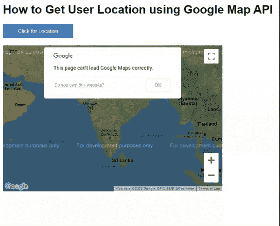
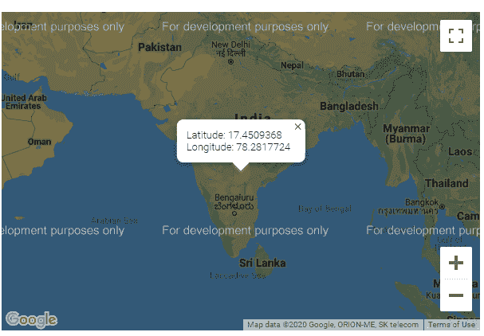

# 如何使用 GoogleMapAPI 获取用户位置？

> 原文:[https://www . geeksforgeeks . org/如何使用谷歌地图获取用户位置/](https://www.geeksforgeeks.org/how-to-get-user-location-using-googlemapapi/)

谷歌地图 JavaScript 应用编程接口有助于在您自己的网页内容中创建和自定义地图。该应用编程接口提供各种类型的地图，如卫星地图、道路地图等，通过使用其服务和库更改样式、地图图层、
事件和控件，可以根据程序员的应用需求轻松定制这些地图。要在项目中显示地图，请使用**谷歌地图应用编程接口**。

**注意:**要修改或使用上述功能，用户必须获得自己的 API KEY。

**步骤:**

1.  按照开发人员控制台中的步骤创建您自己的应用编程接口密钥，以访问所有谷歌地图应用编程接口。将其保存在记事本中，以备将来编码之用。
2.  **参考图片:**为此创建新项目。



*   设置 OAuth 客户端标识..

    
    

    **地图加载:**

    它应该包含在代码的头部，利用上面创建的 API_KEY。

    **示例:**在下面的示例中，使用了 Javascript 来实现 Google map API，使用了 HTML 来设计网页，使用了 PHP 来进行所有的错误报告和 API KEYS 的访问。因此，当前位置/地点的纬度和经度用箭头标记显示在地图对象上。

    ```html
    <?php
    // Replace with your own API KEY
    define("API_KEY", "YOUR API KEY") 
    ?>

    <!DOCTYPE html>
    <html>

    <!-- Demo Styles -->
    <style>
        html,
        body {
            margin: 0;
            padding: 0;
        }

        body {
            background-color: #FFF;
            font-family: Helvetica, Arial,
                "Lucida Grande", sans-serif;
        }

        #mapDivId {
            margin: 25px 10px;
            max-width: 640px;
            min-height: 380;
        }

        #buttonID:disabled {
            background: #6c88d2;
        }

        #buttonID {
            background: #33E6FF;
            border: #4633FF 2px solid;
            border-radius: 2px;
            color: #FFF;
            cursor: pointer;
            display: block;
            font-size: 0.8em;
            padding: 15px 35px;
        }
    </style>

    <body>
        <h2>
            How to Get User Location 
            using Google Map API
        </h2>

        <div id="buttonDivID">
            <button id="buttonID" 
                onClick="getLocation()">
                Click for Location
            </button>
        </div>

        <div id="mapDivId"></div>

        <script src=
    "https://maps.googleapis.com/maps/api/js?key=<?php echo API_KEY; ?>&callback=initMap"
            async defer>
        </script>

    <script type="text/javascript">

            var map;
            function initMap() {

                /* Access of single map object instance*/
                var mapContainer = document
                    .getElementById("mapDivId");

                var coordinates = new 
                    google.maps.LatLng(17.457427, 78.284296);

                var defaultOptions = {
                    center: coordinates,

                    /* Setting the initial resolution */
                    zoom: 4
                }

                map = new google.maps.Map(
                        mapContainer, defaultOptions);
            }// end initMap() function

            function getLocation() {
                document.getElementById(
                    "buttonID").disabled = true;

                document.getElementById(
                    "buttonID").innerHTML = "Executing..";

                if ("geolocation" in navigator) {
                    navigator.geolocation
                    .getCurrentPosition(function (position) {
                        var currentLatitude 
                            = position.coords.latitude;

                        var currentLongitude 
                            = position.coords.longitude;

                        var infoLatLang = "Latitude: " 
                            + currentLatitude +
                            "<br>Longitude: " + 
                            currentLongitude;

                        var infoContent = 
                            new google.maps.InfoWindow
                            ({ map: map, content: infoLatLang });

                        var currentLocation = {
                            lat: currentLatitude,
                            lng: currentLongitude
                        };

                        infoContent.setPosition(
                                currentLocation);

                        document.getElementById("buttonID")
                            .style.display = 'none';
                    });
                }
            }// end function getLocation()
        </script>
    </body>

    </html>
    ```

    **输出:**
    
    