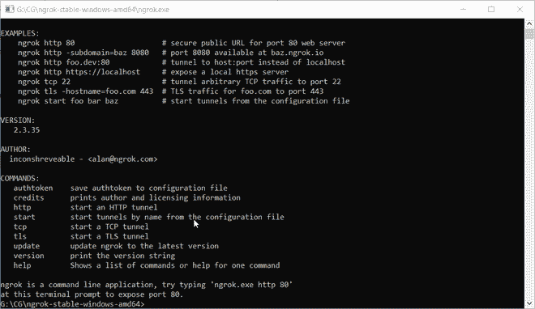
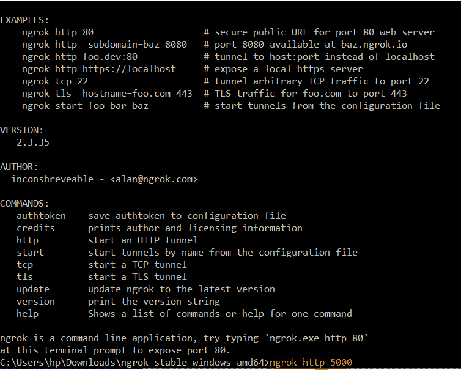
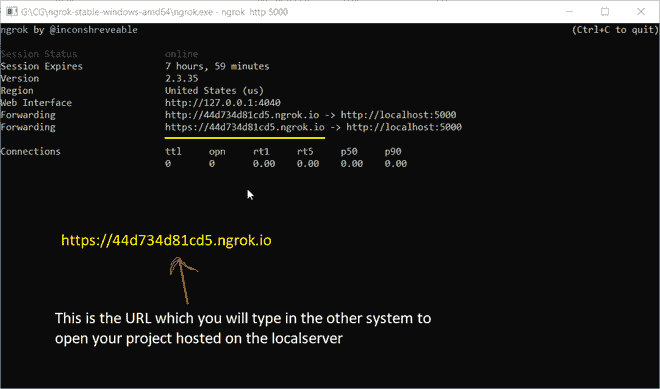
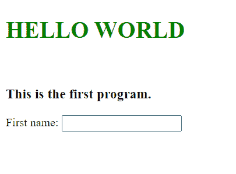

# 如何为多个系统全局托管本地服务器？

> 原文:[https://www . geesforgeks . org/如何为多个系统全局托管本地服务器/](https://www.geeksforgeeks.org/how-to-host-a-local-server-globally-for-more-than-one-system/)

为多个系统托管一个**本地服务器**通常是一个问题。对于专业人士来说，在任何其他服务上托管 **AWS** 都很容易，但是对于那些新来的学生来说，他们正在寻找一种替代**的方法，在互联网上托管一台本地服务器，以便在多台计算机上使用**，答案如下。

当本地服务器托管在任何系统上时，它仅限于指定端口 exp、 **localhost:8080、localhost:5000** 等上的该系统。除非托管在**全球**平台上，否则该本地服务器不能在任何其他系统上使用。学生们发现很难在多个系统上向当局展示这个项目。所以为了解决这个问题，我们将使用一个叫做 **ngrok 的软件。**

**涉及的步骤:**

*   前往[https://ngrok.com/download](https://ngrok.com/download)
*   下载名为 **ngrok 的软件。**
*   提取压缩文件后，打开 ngrok.exe 文件，这样的窗口将被打开。



恩格罗克窗口

*   现在在您的系统上本地托管您指定的项目。
*   就我而言，我正在 5000 端口上运行该项目。
*   下面是以下项目的 HTML 代码。

## 超文本标记语言

```
<!DOCTYPE html>
<html>
    <head>
        <title>First Program</title>
    </head>
    <body>
        <br>
        <br>
        <h1 style="color:green;"> HELLO WORLD</h1>
        <br>
        <h3> This is the first program.</h3>
        <form>
              <label>First name:</label>
              <input type="text" id="fname" name="fname">
              <br><br>
          </form>
        <br>
      </body>
</html>
```

*   现在在 ngrok 窗口中键入以下命令。

```
ngrok http <port-no>
```

*   在我的例子中，命令是: **ngrok http 5000。**



*   现在，您的项目在如下创建的链接上进行全局托管。



现在，本地服务器是全局托管的，可以在多个系统中打开

**输出:**在生成的链接上，可以看到输出。



**注意:**托管的项目会话 8 小时后到期。