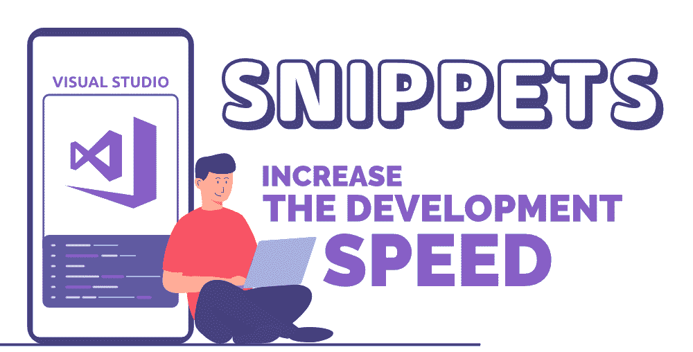
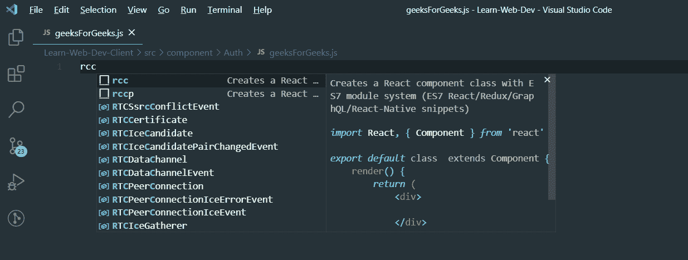
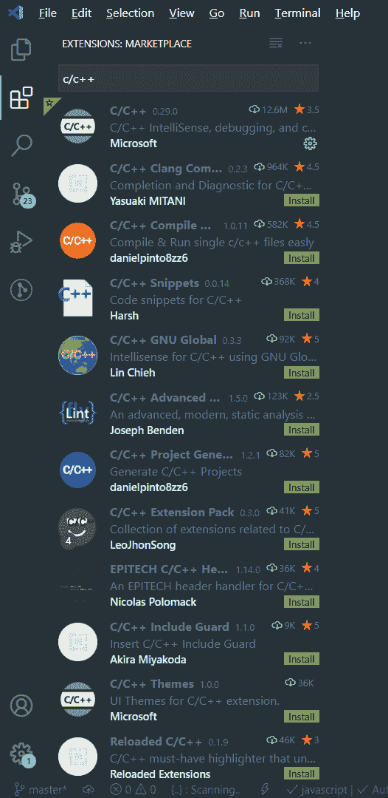
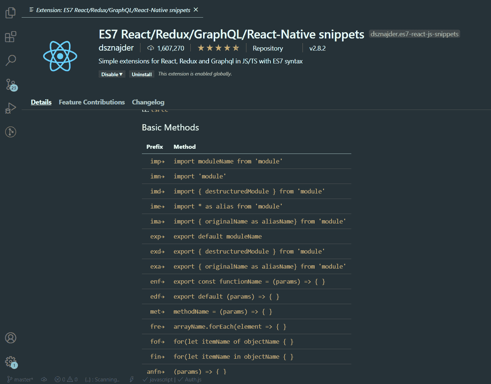
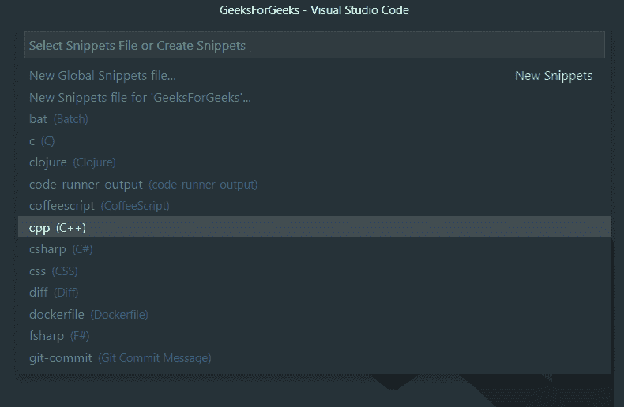
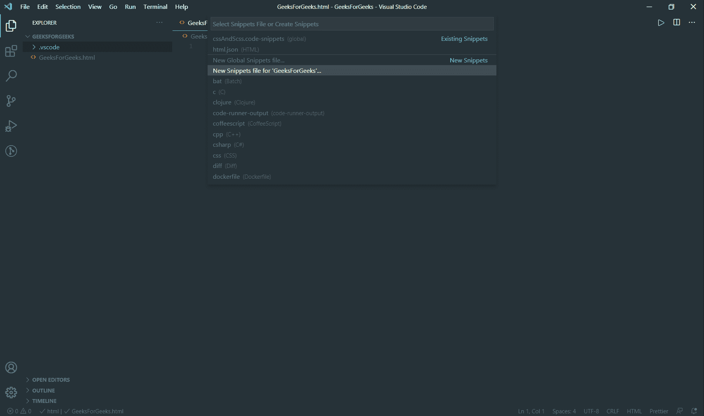
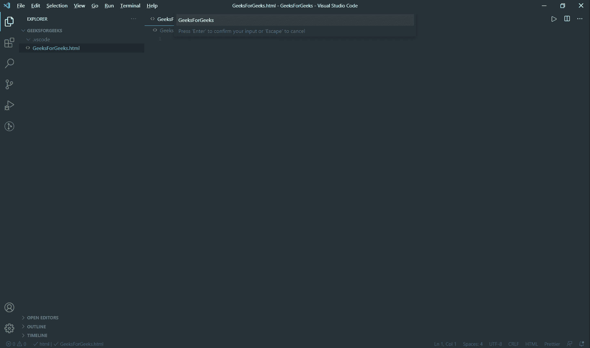
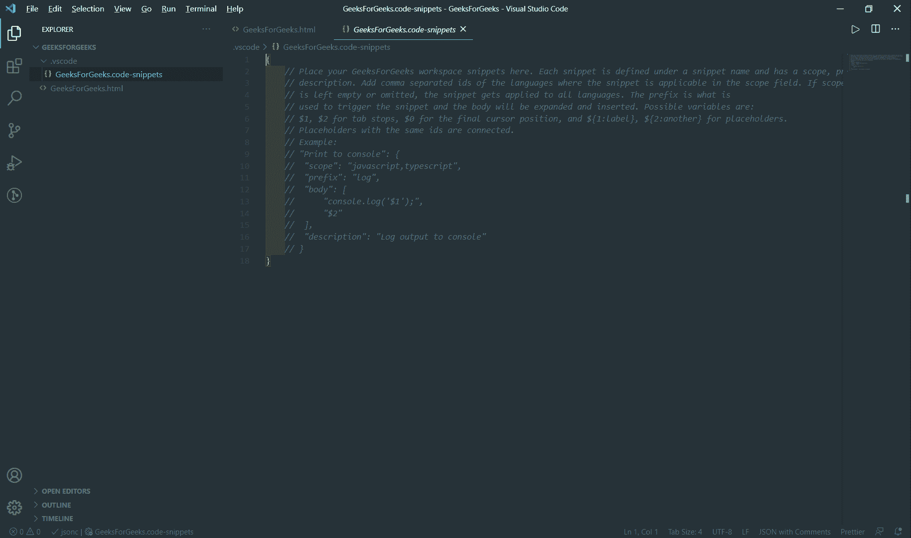
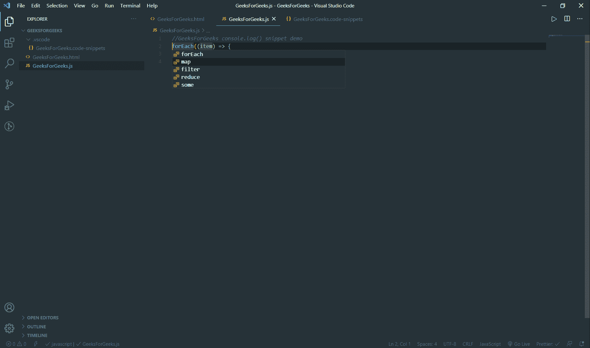

# 如何用 Visual Studio 代码中的代码片段提高开发速度？

> 原文:[https://www . geeksforgeeks . org/如何用 visual studio 中的代码片段提高开发速度/](https://www.geeksforgeeks.org/how-to-increase-the-development-speed-with-snippets-in-visual-studio-code/)

当交付一个项目时，每个公司和开发人员都希望尽快完成它。作为一名开发人员，我们总是寻找一些工具或技巧来提高开发速度和生产力。没有人喜欢花几个小时为一个程序写每一行，或者在多个地方写同一行代码。今天在这个博客中，我们将讨论 Visual Studio 代码中可以帮助您提高开发速度的片段。让我们从什么是代码片段开始…



### **代码片段**

代码段是模板，可用于输入重复的代码模式，如循环、条件语句和程序中其他常用的代码。

**Visual Studio 代码中的代码片段:**在 Visual Studio 代码中，代码片段出现在 IntelliSense 中，并带有如下其他建议:



来自**ES7 React/Redux/GraphQL/React 的片段-原生片段**扩展

让我们讨论 Visual Studio 代码中的不同代码片段…

### 1.扩展的片段

VS 代码扩展市场上有许多包含代码片段的扩展。如果你找到一个你喜欢使用的，安装它，重新启动 VS 代码，新的代码片段扩展将可用。一些在其语言支持中包含代码片段的流行扩展包括:

*   [蟒蛇](https://marketplace.visualstudio.com/items?itemName=ms-python.python)
*   [C/C++](https://marketplace.visualstudio.com/items?itemName=ms-python.python)
*   [C#](https://marketplace.visualstudio.com/items?itemName=ms-dotnettools.csharp)
*   [ES7 反应/Redux/GraphQL/React-原生片段](https://marketplace.visualstudio.com/items?itemName=dsznajder.es7-react-js-snippets)
*   [JavaScript (ES6)代码片段](https://marketplace.visualstudio.com/items?itemName=xabikos.JavaScriptSnippets)

您可以从 VS-Code 中的扩展市场选项卡安装这些扩展和许多其他流行的扩展，这些扩展在其语言支持中包含代码片段。



成功安装扩展后，单击扩展并向下滚动查看可用的代码片段，如下所示



键入前缀以获取 intellisense，然后按 enter 键获取相应的代码片段。

### 2.自定义代码片段

您也可以创建自己的没有任何扩展的片段。要创建或编辑您自己的片段，请转到“文件”>“首选项”下的“用户片段”，然后选择片段应该出现的语言，或者如果片段应该出现在所有语言中，请选择“新建全局片段”文件选项。片段文件是用 JSON 编写的，我们可以根据需要定义无限数量的片段。

要编写自己的自定义代码片段，您必须:

*   确定片段范围并选择相应的文件。
*   使用代码片段语法编写您的自定义代码片段。

### 确定片段范围并选择相应的文件

片段的作用范围是仅建议相关的片段，并且可以通过以下任一方式来确定:

*   语言片段范围
*   项目片段范围

### 1.语言片段范围

所有的片段都被限定在一种、几种或所有语言的范围内。全局)基于它是在**语言**片段文件中定义还是在**全局**片段文件中定义。对于**语言范围的片段**，从列表中选择语言(文件>首选项>用户片段)，对于**全局范围的片段**，选择**新全局片段文件。**



### 2.项目片段范围

您可以有一个全局片段文件(带有文件后缀的 JSON。代码片段)的范围扩展到您的项目。对于项目范围的片段，转到文件>首选项>用户片段，选择**新建片段文件(您的存储库名称)**选项。



在如下所示的输入字段中输入您希望给代码片段文件的名称，然后按 enter 键。



后缀为的 JSON 文件。代码片段将在. vscode 文件夹中的项目根目录下创建，如下所示。



### **使用片段语法编写您的自定义片段**

选择代码段范围后。在代码片段的正文中编写您自己的自定义代码片段。代码段主体可以使用特殊的构造来控制光标和插入的文本。一些受支持的功能及其语法如下:

**1 .制表符〔t1〕**

制表位可用于使编辑器光标在代码段内移动。 **$1** 、 **$2** 用于指定光标位置。该数字代表访问制表位的顺序， **$0** 代表最终光标位置。

**2。占位符**

占位符是具有一些默认值的制表位，如 **${1:SomeText}** 。占位符文本将被插入和选择，以便于更改。占位符也可以嵌套，如**$ { 1:SomeTex $ { 2:SomeTex } }**。

**3。选择**

占位符也可以选择值。语法是用逗号分隔的值(选项)，用管道字符括起来，例如 **${1|choiceOne，choiceTwo，choice etheree | }**。当插入代码片段并选择占位符时，选项将提示用户选择其中一个值。

以下示例显示了相应代码的 JavaScript 代码和 JSON 代码片段文件。

### 例 1:

## java 描述语言

```
console.log()
```

```
//  JSON code snippet file

{

"console log": {

"prefix": "cl",

"body": [

  "console.log($1)"

],

"description": "console log"

  }

}

```

**说明:**上述对象中的**“控制台日志”**属性是该片段的**名称**，**“cl”**是**前缀**。每个片段都有一个名称属性，该属性具有作为对象的值，该对象必须包含一个**前缀**、**主体**和一个**描述**。正文中的 **$1** 表示第一个制表符空间。

**演示:**上面的代码片段导致如下所示的行为。

<video class="wp-video-shortcode" id="video-471739-1" width="640" height="360" preload="metadata" controls=""><source type="video/mp4" src="https://media.geeksforgeeks.org/wp-content/uploads/20200804013821/GeeksForGeeks.js---GeeksForGeeks---Visual-Studio-Code-2020-08-01-15-19-52.mp4?_=1">[https://media.geeksforgeeks.org/wp-content/uploads/20200804013821/GeeksForGeeks.js---GeeksForGeeks---Visual-Studio-Code-2020-08-01-15-19-52.mp4](https://media.geeksforgeeks.org/wp-content/uploads/20200804013821/GeeksForGeeks.js---GeeksForGeeks---Visual-Studio-Code-2020-08-01-15-19-52.mp4)</video>

请注意，当我们键入**“cl”**时，会弹出一个菜单，我在其中选择了**“cl”**选项，然后单击**“输入”**则显示前缀的相应代码。

### 例 2:

## java 描述语言

```
function functionName() {

}
```

```
//  JSON code snippet file

{

"named function": {

"prefix": "nfn",

"body": [

"function ${1:functionName}($2){",

"$3",

"}"

],

"description": "named function"

   }

}

```

**说明:****“命名函数”**是该片段的**名称**，**“nfn”**是该片段的**前缀**。 **${1:functionName}** 表示第一个制表位上的占位符**“function name”**。

### 例 3:



```
//  JSON code snippet file

"Array Method": {

"prefix": "arrmth",

"body": [

  "${1|forEach,map,filter,reduce,some|}((${2:item}) => {",

  "$3",

  "})"

],

"description": "Array Method"

}

```

**说明:****“阵法”**是片段的**名称**，**“arrm th”**是**前缀**。**“$ { 1 | forEach，map，filter，reduce，some | }”**表示第一个制表位，可以选择任何人。**“$ { 2:item }”**表示第二个制表位，具有占位符**“item”**。**“$ 3”**仅表示第三个制表位。

**注意:**也可以使用[片段生成器工具](https://snippet-generator.app/)编写 JSON，只需要输入代码。