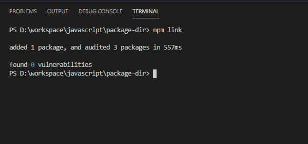
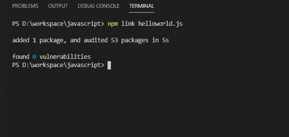
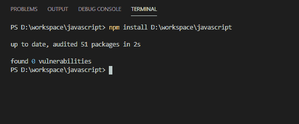

# 如何使用 npm 安装本地模块？

> 原文:[https://www . geesforgeks . org/如何使用 npm 安装本地模块/](https://www.geeksforgeeks.org/how-to-install-a-local-module-using-npm/)

### 导言:

本文展示了如何使用 **npm 安装本地模块。**

本地模块是在 Node.js 应用程序中本地创建的模块，用于创建用户需要的功能。这些本地模块在不同的文件和文件夹中包含应用程序的不同功能。要链接本地模块，首先必须有本地模块目录或包目录。

**npm** (节点包管理器)是 Node.js 的默认包管理器，了解更多 **npm** [在这里](https://www.google.com/url?sa=t&rct=j&q=&esrc=s&source=web&cd=&cad=rja&uact=8&ved=2ahUKEwi8t9_5y6fuAhU_63MBHRT0DykQFjABegQIAhAC&url=https%3A%2F%2Fwww.geeksforgeeks.org%2Fnode-js-npm-node-package-manager%2F&usg=AOvVaw1vu6rcSBd1oBmeqr_L5lCw)。

**我们为什么要使用本地模块？**

我们使用本地模块在使用 Node.js 制作的应用程序中创建用户所需的功能。

**How to install local modules?**
2.  **Using *npm-link***

    **转到本地模块目录**(你要安装的包)输入此命令。

    ```
    npm link
    ```

    

    上述命令的输出

    转到要安装本地模块的项目目录，并输入以下命令。

    ```
    npm link package-name
    ```

    

    上述命令的输出

    **示例:**让 local-dir 是本地目录而 project-dir 是项目目录而 *local_module* 是您要安装的本地模块包，首先转到 local-dir 并键入 ***npm 链接*** 然后转到项目目录并键入 ***npm 链接<local _ module>*****这将把您的本地模块链接到您的项目。**

3.  ****Using *npm install***

    我们需要为 *npm 安装*提供<folder>参数，该参数应该是包所在的本地文件夹，**路径**是包含要安装的包(local_module)的文件夹的位置</folder>

    ```
    npm install /path
    ```

    

    上述代码的输出

    **示例:**让本地模块存储的路径为 C:\ Users \ engineer \ Desktop \ package。现在进入项目目录，输入命令 ***npm 安装 C:\ user \ engineer \ Desktop \ package***

    **注意:**只提供包文件夹名称而不提供包名称，会自动链接到你的项目。** 

****如何卸载安装有 npm 链接的软件包:**
该程序可以使用与删除已安装软件包相同的卸载或 rm 顺序来卸载。唯一需要注意的是，必须全局卸载连接，必须定义全局标志。**

**以下命令可用于删除全局连接的 foo 工具包**

```
npm rm --global foo
```