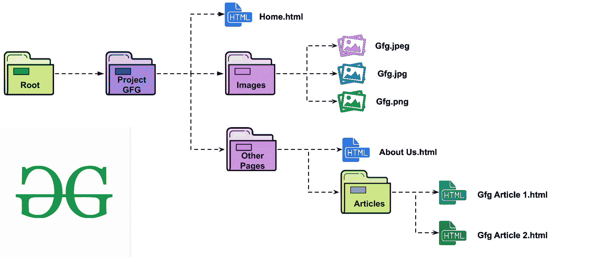

# 如何使用 a-href 标签从文件夹中链接回来？

> 原文:[https://www . geesforgeks . org/如何使用-a-href-tag 链接回文件夹外/](https://www.geeksforgeeks.org/how-to-link-back-out-of-a-folder-using-the-a-href-tag/)

**简介:**

每当我们做一个项目时，它通常分布在不同的文件夹中。这通常是为了提高从事同一项目的不同 web 开发人员的连接性和可读性。例如:



上面的分类只是一个例子，但分类可以更大。因此，如果你必须从主页的图像文件夹中调用一个图像，或者想要从主页中调用文章形式的页面，那么它将是一个直接的 URL ie。”**图片/gfg.jpg** ”或“**其他页面/文章/Gfg Article1.html**”。但是如果你不得不从 Gfg Article1 页面的图像文件夹中调用一个图像，那么一般的网址将不起作用。您必须使用相对文件路径。

**想了解更多相关路径，请关注[文章](https://www.geeksforgeeks.org/html-file-paths/)。**

**例 1:**

它显示当前网页文件所在文件夹上方的文件夹中文件的路径。图像文件存在于名为 images 的文件夹中，当前网页文件存在于子文件夹中，那么代码如下:

```html
<!DOCTYPE html> 
<html> 
    <head> 
        <title>Relative file path</title> 
    </head> 
    <body> 
        <h2>File present in a folder above the current folder</h2> 
         
    </body> 
</html>
```

**输出:**


**例 2:**

它显示位于当前子目录根目录下的文件夹中文件的路径。

```html
<!DOCTYPE html> 
<html> 
    <head> 
        <title>Relative file path</title> 
    </head> 
    <body> 
        <h2>File present in a folder which is located at<br> 
        the root of the current subdirectories</h2> 
         
    </body> 
</html>
```

**输出:**

