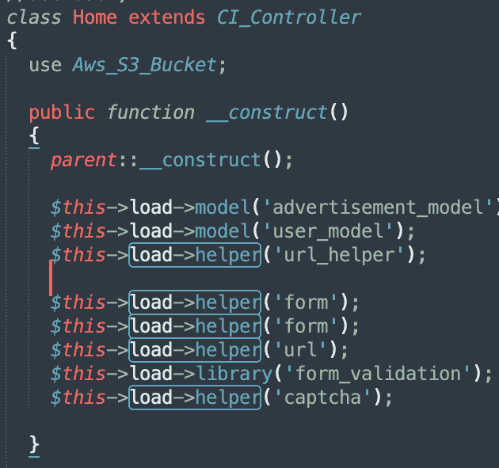
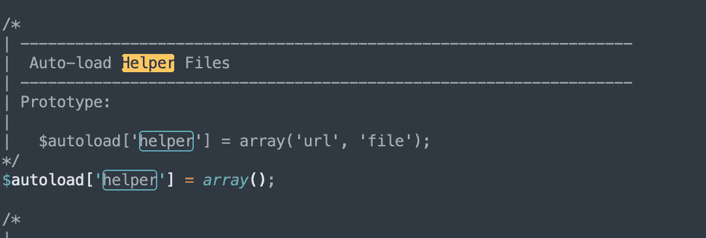

# 如何在 CodeIgniter 框架中加载多个助手文件？

> 原文:[https://www . geesforgeks . org/如何在 codeigniter-framework 中加载多个助手文件/](https://www.geeksforgeeks.org/how-to-load-multiple-helper-files-in-codeigniter-framework/)

助手被认为是在单一特定类别下对齐的函数的集合。CodeIgniter 框架中很容易找到助手。它们主要处理程序功能。它用于减轻要执行的任务。助手可以加载到控制器中，以便于任务操作。助手是在环境中指定的，没有提到。“php”扩展名或“helper”标记名。每个助手都与一个特定的任务相关联，并且独立于其他助手及其相应的操作。

**语法:**

```
$this->load->helper('helper-name');
```

有各种类型的助手，例如，表单助手帮助我们创建各种表单元素。文件助手用于对文件元素执行操作。助手可以包含在所用控制器的构造函数中。它可能是在*autoload.php*文件中指定的某个功能或自动的一部分。由于帮助文件默认情况下不包含在 CodeIgniter 项目中，因此必须加载它们才能授予访问权限。加载文件后，它在环境视图和控制器中变得全局可用。

**方法 1(在控制器文件中调用它们):**为了在 PHP 工作环境中加载多个助手文件，我们可以在数组中将它们指定为组件，其中每个组件对应一个助手名称。

还可以在各自的控制器构造函数中使用单个助手的调用在单独的行中调用助手。

```
$this->load->helper( 'form')
```

## 服务器端编程语言（Professional Hypertext Preprocessor 的缩写）

```
<?php
$this->load->helper(
        array('helper1', 'helper2', 'helper3')
);
?>
```



**方法 2(在自动加载文件中):**在执行系统初始化时，可以在环境中自动加载助手。当指定在*应用程序/配置/自动加载. php* 文件中定义的自动加载数组时，可以通过添加助手将助手添加到环境中。

## 服务器端编程语言（Professional Hypertext Preprocessor 的缩写）

```
<?php
// Specifying the helpers
    $autoload['helper'] = 
      array('helper1','helper2','helper3');
?>
```

下面的代码片段展示了 CodeIgniter 框架中*autoload.php*文件的快照。

