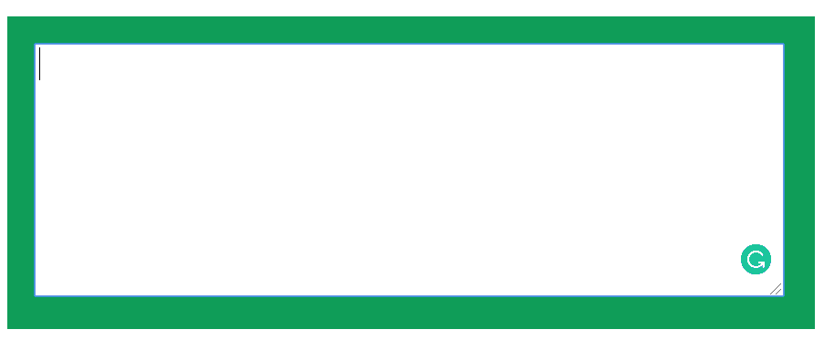

# 有填充时如何让 textarea 100%不溢出？

> 原文:[https://www . geeksforgeeks . org/how-make-textarea-100-有填充时不溢出/](https://www.geeksforgeeks.org/how-to-make-textarea-100-without-overflow-when-padding-is-present/)

如果我们给了一个包含<textarea>元素的 HTML 文档，并且它的父元素包含一些填充，那么如何使文本区域宽度达到 100%。textarea 包含。<br/>想法是用类名“wrapper”创建一个 div。在< div >元素中，我们创建了一个具有一定列数和行数的文本区域。在这种情况下，分别是 30 和 15。之后，我们将 width 属性设置为 100%，使 textarea 宽度为 100%。</textarea>

**HTML 代码:**HTML 代码包含一个<文本区>元素，保存行和列的值。

## 超文本标记语言

```htmlhtml
<!DOCTYPE html>
<html>

<head>
    <title>
        How to make 100% tetxarea
        without overflowing when
        padding is pressent?
    </title>
</head>

<body>
    <div class="wrapper">
        <textarea cols="30" rows="15"></textarea>
    </div>
</body>

</html>
```

**CSS 代码:**CSS 代码包含保存填充、边距和背景颜色属性的包装类。textarea 元素包含 width 属性。

## 半铸钢ˌ钢性铸铁(Cast Semi-Steel)

```htmlhtml
<style>
    .wrapper {
        padding: 20px;
        margin:15px 0;
        background-color: #0f9d58;
    }

    textarea {
        font-size:20px;
        width:100%;
    }
</style>
```

**完整代码:**在本节中，我们将结合以上两个部分，使< textarea >元素的宽度为 100%，在有填充时不会溢出。

## 超文本标记语言

```htmlhtml
<!DOCTYPE html>
<html>

<head>
    <title>
        How to make 100% tetxarea
        without overflowing when
        padding is pressent?
    </title>

    <style>
        .wrapper {
            padding: 20px;
            margin: 15px 0;
            background-color: #0f9d58;
        }

        textarea {
            font-size: 20px;
            width: 100%;
        }
    </style>
</head>

<body>
    <div class="wrapper">
        <textarea cols="30" rows="15"></textarea>
    </div>
</body>

</html>
```

**输出:**

