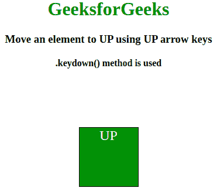
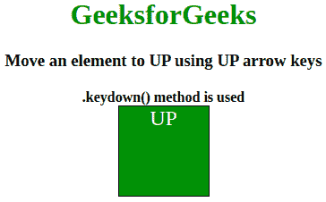
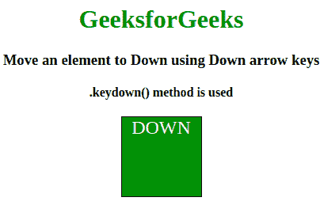
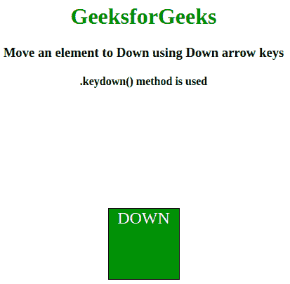
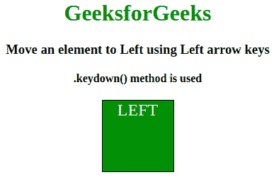
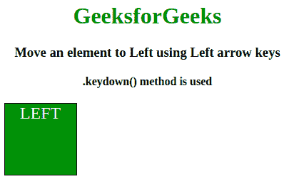
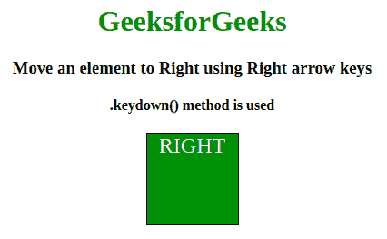
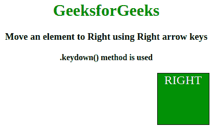

# 如何使用箭头键将元素向左、向右、向上和向下移动？

> 原文:[https://www . geesforgeks . org/如何使用箭头键将元素从左向右上下移动/](https://www.geeksforgeeks.org/how-to-move-an-element-to-left-right-up-and-down-using-arrow-keys/)

任务是使用 jquery 中的箭头键向左、向右、向上和向下移动一个元素，我们可以使用 jQuery [**keydown()方法**](https://www.geeksforgeeks.org/jquery-keydown-with-examples/) 以及**。动画()方法**。
每当用户按下键盘上的一个键时，**向下键()方法**触发向下键事件。
**语法:**

```
$(selector).keydown(function)
```

**进场:**

1.  **。keydown()方法**用于检查是否有任何按键被按下，并返回哪个按键被按下。
2.  检查哪个键被触发是由键码决定的。键码如下:
    *   左= 37
    *   向上= 38
    *   右= 39
    *   向下= 40
3.  根据按下的键，元件的移动通过**完成。动画()方法**

**示例 1:** 使用向上箭头键将元素向上移动。

```
<!DOCTYPE html>
<html>

<head>
    <title>
      Move an element to left, right,
      up and down using arrow keys
    </title>
    <script src=
"https://code.jquery.com/jquery-1.12.4.min.js">
    </script>
    <style type="text/css">
        .box {
            float: center;
            background: green;
            margin: 100px auto 0;
            width: 100px;
            height: 100px;
            color: white;
            font-size: 24px;
            border: 1px solid #000000;
            text-align: center;
            position: relative;
        }
    </style>
</head>

<body>
    <center>
        <h1 style="color:green;"> 
         GeeksforGeeks 
        </h1>
        <h3>
          Move an element to UP using UP arrow keys
        </h3>
        <h4>.keydown() method is used</h4>
        <div class="box">UP</div>
        <script type="text/javascript">
            $(document).keydown(function(e) {
                if (e.which == '38') { //up arrow key
                    $(".box").finish().animate({
                        top: "-=50"
                    });
                }
            });
        </script>
    </center>
</body>
</html>                    
```

**输出:**

*   之前按向上箭头键:
    [](https://media.geeksforgeeks.org/wp-content/uploads/20190917133632/Screenshot-from-2019-09-17-13-32-49.png)
*   按下向上箭头键后:
    [](https://media.geeksforgeeks.org/wp-content/uploads/20190917133634/Screenshot-from-2019-09-17-13-32-57.png)

**示例 2:** 使用向下箭头键将元素向下移动。

```
<!DOCTYPE html>
<html>

<head>
    <title>
      Move an element to left, right,
      up and down using arrow keys
    </title>
    <script src=
"https://code.jquery.com/jquery-1.12.4.min.js">
    </script>
    <style type="text/css">
        .box {
            float: center;
            background: green;
            margin: 10px auto 0;
            width: 100px;
            height: 100px;
            color: white;
            font-size: 24px;
            border: 1px solid #000000;
            text-align: center;
            position: relative;
        }
    </style>
</head>

<body>
    <center>
        <h1 style="color:green;"> 
          GeeksforGeeks 
        </h1>
        <h3>
          Move an element to Down using Down arrow keys
        </h3>
        <h4>.keydown() method is used</h4>
        <div class="box">DOWN</div>
        <script type="text/javascript">
            $(document).keydown(function(e) {
                if (e.which == '40') { //down arrow key
                    $(".box").finish().animate({
                        top: "+=50"
                    });
                }
            });
        </script>
    </center>
</body>

</html>                             
```

**输出:**

*   之前按下向下箭头键:
    [](https://media.geeksforgeeks.org/wp-content/uploads/20190917134102/Screenshot-from-2019-09-17-13-38-31.png)
*   按下向下箭头键后:
    [](https://media.geeksforgeeks.org/wp-content/uploads/20190917134103/Screenshot-from-2019-09-17-13-38-38.png)

**示例 3:** 使用左箭头键向左移动元素。

```
<!DOCTYPE html>
<html>

<head>
    <title>
      Move an element to left, right, 
      up and down using arrow keys
    </title>
    <script src=
"https://code.jquery.com/jquery-1.12.4.min.js">
    </script>
    <style type="text/css">
        .box {
            float: center;
            background: green;
            margin: 10px auto 0;
            width: 100px;
            height: 100px;
            color: white;
            font-size: 24px;
            border: 1px solid #000000;
            text-align: center;
            position: relative;
        }
    </style>
</head>

<body>
    <center>
        <h1 style="color:green;"> 
          GeeksforGeeks 
        </h1>
        <h3>
          Move an element to Left using Left arrow keys
        </h3>
        <h4>.keydown() method is used</h4>
        <div class="box">LEFT</div>
        <script type="text/javascript">
            $(document).keydown(function(e) {
                if (e.which == '37') { //left arrow key
                    $(".box").finish().animate({
                        left: "-=50"
                    });
                }
            });
        </script>
    </center>
</body>

</html>      
```

**输出:**

*   之前按左箭头键:
    [](https://media.geeksforgeeks.org/wp-content/uploads/20190917134831/Screenshot-from-2019-09-17-13-46-30.png)
*   按下左箭头键后:
    [](https://media.geeksforgeeks.org/wp-content/uploads/20190917134832/Screenshot-from-2019-09-17-13-46-41.png)

**示例 4:** 使用右箭头键向右移动元素。

```
<!DOCTYPE html>
<html>

<head>
    <title>
      Move an element to left, right, 
      up and down using arrow keys
    </title>
    <script src=
"https://code.jquery.com/jquery-1.12.4.min.js">
    </script>
    <style type="text/css">
        .box {
            float: center;
            background: green;
            margin: 10px auto 0;
            width: 100px;
            height: 100px;
            color: white;
            font-size: 24px;
            border: 1px solid #000000;
            text-align: center;
            position: relative;
        }
    </style>
</head>

<body>
    <center>
        <h1 style="color:green;"> 
          GeeksforGeeks 
        </h1>
        <h3>
          Move an element to Right using Right arrow keys
        </h3>
        <h4>.keydown() method is used</h4>
        <div class="box">RIGHT</div>
        <script type="text/javascript">
            $(document).keydown(function(e) {
                if (e.which == '39') { //Right arrow key
                    $(".box").finish().animate({
                        left: "+=50"
                    });
                }
            });
        </script>
    </center>
</body>

</html>       
```

**输出:**

*   之前按右箭头键:
    [](https://media.geeksforgeeks.org/wp-content/uploads/20190917135235/Screenshot-from-2019-09-17-13-50-27.png)
*   按下右箭头键后:
    [](https://media.geeksforgeeks.org/wp-content/uploads/20190917135237/Screenshot-from-2019-09-17-13-50-32.png)