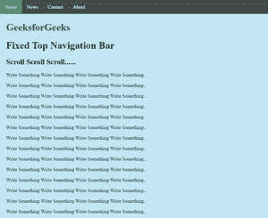
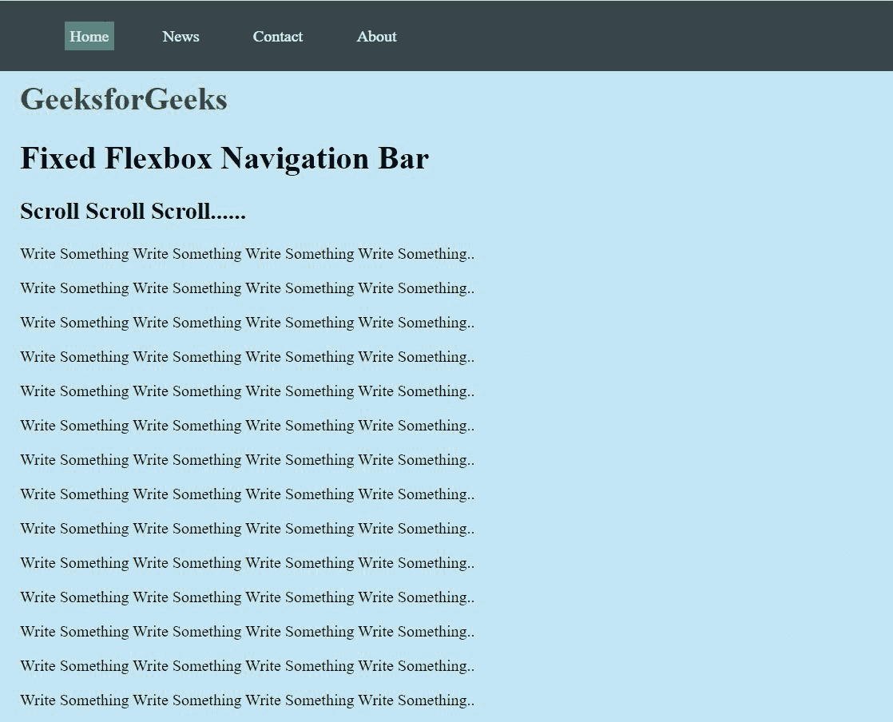
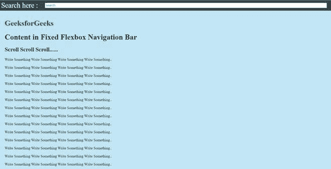

# 如何在固定的 flexbox 导航栏下放置内容？

> 原文:[https://www . geesforgeks . org/how-to-place-content-under-fixed-flex box-导航栏/](https://www.geeksforgeeks.org/how-to-place-content-under-fixed-flexbox-navigation-bar/)

**导航栏:** 用 CSS，可以把 HTML 菜单变成惊人的导航栏。导航栏只是链接列表。导航栏需要标准的 HTML 作为基础。通过使用< ul >和< li >组件，理想化是有意义的。

我们可以通过以下两种方法将内容放置在固定导航栏中:

*   **方法一:在 CSS** 中使用浮点数

    **语法:**

    ```htmlhtml
    float: none | left | right | initial | inherit;
    ```

    **属性值:**

    *   **无:**不会影响内容的位置(此为默认)。
    *   **左侧:**内容将浮动到其容器的左侧。
    *   **右侧:**内容将浮动到其容器的右侧。
    *   **初始值:**将该属性设置为默认值。
    *   **继承:**从其父组件获取该属性。

    **固定导航栏:** 我们可以加入 CSS，可以让导航栏保留在页面的底部顶部，确实当用户滚动页面时:

    **例:**

    ```htmlhtml
    <!DOCTYPE html>
    <html>
        <head>
            <style>
                body {
                    margin: 0;
                }
                ul {
                    list-style-type: none;
                    margin: 0;
                    padding: 0;
                    overflow: hidden;
                    background-color: rgba(0, 0, 0, 0.7);
                    position: fixed;
                    /* position property is used 
                       to fix navbar */
                    top: 0;
                    width: 100%;
                }
                li {
                    float: left;
                    /* when flexbox will be used 
                       then there will be no need
                       to write float properties 
                       of CSS*/
                }
                li a {
                    display: block;
                    color: white;
                    text-align: center;
                    padding: 14px 16px;
                    text-decoration: none;
                }
                li a:hover:not(.active) {
                    background-color: #111;
                }
                .active {
                    background-color: #4caf50;
                }
            </style>
        </head>
        <body>
            <ul>
                <li>
                    <a class="active" href="#home">Home</a>
                </li>
                <li><a href="#news">News</a></li>
                <li><a href="#contact">Contact</a></li>
                <li><a href="#about">About</a></li>
            </ul>
            <div style="padding: 20px;
                        margin-top: 30px;
                        background-color: 
                            rgba(135, 206, 235, 0.5);
                        height: 1500px;">
                <h1 style="color: green;">GeeksforGeeks</h1>
                <h1>Fixed Top Navigation Bar</h1>
                <h2>Scroll Scroll Scroll......</h2>
                <p>Write Something Write Something
                  Write Something Write Something..</p>
                <p>Write Something Write Something 
                  Write Something Write Something..</p>
                <p>Write Something Write Something 
                  Write Something Write Something..</p>
                <p>Write Something Write Something 
                  Write Something Write Something..</p>
                <p>Write Something Write Something 
                  Write Something Write Something..</p>
                <p>Write Something Write Something
                  Write Something Write Something..</p>
                <p>Write Something Write Something 
                  Write Something Write Something..</p>
                <p>Write Something Write Something 
                  Write Something Write Something..</p>
                <p>Write Something Write Something 
                  Write Something Write Something..</p>
                <p>Write Something Write Something
                  Write Something Write Something..</p>
                <p>Write Something Write Something 
                  Write Something Write Something..</p>
                <p>Write Something Write Something 
                  Write Something Write Something..</p>
                <p>Write Something Write Something
                  Write Something Write Something..</p>
                <p>Write Something Write Something 
                  Write Something Write Something..</p>
                <p>Write Something Write Something 
                  Write Something Write Something..</p>
                <p>Write Something Write Something 
                  Write Something Write Something..</p>
                <p>Write Something Write Something 
                  Write Something Write Something..</p>
                <p>Write Something Write Something 
                  Write Something Write Something..</p>
                <p>Write Something Write Something 
                  Write Something Write Something..</p>
                <p>Write Something Write Something 
                  Write Something Write Something..</p>
            </div>
        </body>
    </html>
    ```

    **输出:**

    

    **注:** **位置:绝对；**对内容忽略了 float 属性。

    *   **列表式:无；**用于排出子弹。导航栏不需要列表标记。
    *   设置**边距:0；**和**填充:0；**驱逐浏览器默认设置。
*   **方法二:在**CSS 中使用 Flexbox

    **Flexbox** Flexbox 可能是一款令人惊叹的布局设备。通过使用 flexbox，我们能够将内容设置为栏和更多栏。我们将很快浏览 flexbox 的属性。(您可以在代码中使用以下语法并使用它！)

    【flex 容器的 flexbox 属性:(属性:值；)

    *   **显示:**伸缩；
    *   **挠曲方向:**行|行-反转|列|列-反转；
    *   **折绕:**折绕|无折绕|折绕-反转；
    *   **挠曲流动:**柱包裹；
    *   **align-content:**flex-start | flex-end | center | space-round | space-interval | space-equally | start | end | left | right；
    *   **align-items:**stretch | flex-start | flex-end | center | start | end |基线|第一条基线|最后一条基线|自启动|自结束；
    *   **align-content:**flex-start | flex-end | center | space-interval | space-round | space-equally | stretch | start | end |基线|第一条基线|最后一条基线；

    **弹性项的弹性框属性:**(属性:值；)

    *   **顺序:**4；/*默认值为 0 */
    *   **屈曲生长:**2；/*默认 0 */
    *   **屈曲收缩:**5；/*默认 1 */
    *   **弹性基础:**自动；/*默认自动*/
    *   **flex:** 无；(这是伸缩性增长、伸缩性收缩和伸缩性基础组合的简写属性( **Ex。flex: 0 1 自动；**)默认)
    *   **align-self:** auto |居中|基线|屈曲-开始|屈曲-结束|拉伸；

    ** **注意**浮动、清晰和垂直对齐对伸缩项目没有影响。也禁止使用负数。

    **如何创建固定的 flexbox 导航栏？**T3】

    ```htmlhtml
    /* Modify the header(above we modified 
        ul and li instead of header)*/  
    header {
      display: flex; 
      /* using flexbox property for parent
         also known as inline-flex*/  
      justify-content: space-between;
      align-items: center;
      padding: 5px;
      position: fixed;
      overflow: hidden;
      background-color: rgba(0, 0, 0, 0.7);
      width: 100%;
    }

    ```

    在本例中**、**

    *   显示:flex 此外，将 flexbox 属性用于父级也称为内联 flex。
    *   证明内容:间隔；东西均匀地分散在线内；第一项在开始行，最后一项在结束行。但是在这个例子中，我们设计了标题标签，因此这种影响可能看不到。但我们设计 ul 标签的可能性很小，这种影响会被看到。
    *   顺序:1；arrange 属性控制它们在 flex holder 中显示的顺序。默认情况下，顺序为 0；

    **示例:**

    ```htmlhtml
    <!DOCTYPE html>
    <html>
        <head>
            <style>
                body {
                    margin: 0;
                }

                header {
                    display: flex;
                    /* Using flexbox property for parent
                       also known as inline-flex */
                    justify-content: space-between;
                    /* Items are evenly distributed in 
                       the line; firstitem is on the 
                       start line, last item on the 
                       end line*/
                    align-items: center;
                    padding: 5px;
                    position: fixed;
                    overflow: hidden;
                    background-color: rgba(0, 0, 0, 0.7);
                    width: 100%;
                }

                nav {
                    order: 1;
                }
                .nav_links {
                    list-style: none;
                }

                .nav_links li {
                    display: inline-block;
                    padding: 0px 20px;
                }

                .nav_links li a:hover {
                    color: rgb(255, 255, 255);
                }

                li a {
                    display: block;
                    color: white;
                    text-align: center;
                    padding: 5px 5px;
                    text-decoration: none;
                }
                li a:hover:not(.active) {
                    background-color: #111;
                }
                .active {
                    background-color: #4caf50;
                }
            </style>
        </head>
        <body>
            <header>
                <nav>
                    <ul class="nav_links">
                        <li><a class="active" 
                               href="#home">Home</a></li>
                        <li><a href="#news">News</a></li>
                        <li><a href="#contact">Contact</a></li>
                        <li><a href="#about">About</a></li>
                    </ul>
                </nav>
            </header>
            <div style="padding: 20px; 
                 background-color: rgba(135, 206, 235, 0.5);
                 height: 1500px;">
                <h1 style="color: green;">
                    <br />
                    GeeksforGeeks
                </h1>
                <h1>Fixed Flexbox Navigation Bar</h1>
                <h2>Scroll Scroll Scroll......</h2>
                <p>Write Something Write Something Write 
                  Something Write Something..</p>
                <p>Write Something Write Something Write 
                  Something Write Something..</p>
                <p>Write Something Write Something Write 
                  Something Write Something..</p>
                <p>Write Something Write Something Write
                  Something Write Something..</p>
                <p>Write Something Write Something Write 
                  Something Write Something..</p>
                <p>Write Something Write Something Write 
                  Something Write Something..</p>
                <p>Write Something Write Something Write 
                  Something Write Something..</p>
                <p>Write Something Write Something Write 
                  Something Write Something..</p>
                <p>Write Something Write Something Write 
                  Something Write Something..</p>
                <p>Write Something Write Something Write 
                  Something Write Something..</p>
                <p>Write Something Write Something Write 
                  Something Write Something..</p>
                <p>Write Something Write Something Write 
                  Something Write Something..</p>
                <p>Write Something Write Something Write 
                  Something Write Something..</p>
                <p>Write Something Write Something Write
                  Something Write Something..</p>
                <p>Write Something Write Something Write 
                  Something Write Something..</p>
                <p>Write Something Write Something Write 
                  Something Write Something..</p>
                <p>Write Something Write Something Write
                  Something Write Something..</p>
                <p>Write Something Write Something Write 
                  Something Write Something..</p>
                <p>Write Something Write Something Write 
                  Something Write Something..</p>
                <p>Write Something Write Something Write
                  Something Write Something..</p>
            </div>
        </body>
    </html>
    ```

    **输出:**

    

*   **如何在固定的 flexbox 导航栏下放置内容？**T3】

    **示例:**

    ```htmlhtml
    <!DOCTYPE html>
    <html>
        <head>
            <style>
                body {
                    margin: 0;
                }

                header {
                    justify-content: space-between;
                    /* Items are evenly distributed 
                       in the line; firstitem is on
                       the start line, last item on
                       the end line */
                    padding: 5px;
                    position: fixed;
                    overflow: hidden;
                    background-color: rgba(0, 0, 0, 0.7);
                    width: 100%;
                }

                .bar {
                    display: flex;
                   /* Use flexbox property for parent 
                      also known as inline-flex */
                    align-items: center;
                }
                .search {
                   /* Take up the rest of the 
                      remaining space */
                    flex: 1;
                }
                .search input {
                    width: 90%;
                }

                nav {
                    order: 1;
                }
            </style>
        </head>
        <body>
            <header>
                <nav>
                    <div class="bar">
                        <div class="username" 
                           style="color: rgb(255, 255, 255); 
                                  font-size: 30px;">
                        Search here :    
                        </div>
                        <div class="search">
                            <input type="search" 
                                   placeholder="search..." />
                        </div>
                    </div>
                </nav>
            </header>
            <div style="padding: 20px;
                        background-color: rgba(
                        135, 206, 235, 0.5); 
                        height: 1500px;">
                <h1 style="color: green;">
                    <br />
                    GeeksforGeeks
                </h1>
                <h1>Content in Fixed Flexbox
                  Navigation Bar</h1>

                <h2>Scroll Scroll Scroll......</h2>
                <p>Write Something Write Something Write
                  Something Write Something..</p>
                <p>Write Something Write Something Write
                  Something Write Something..</p>
                <p>Write Something Write Something Write
                  Something Write Something..</p>
                <p>Write Something Write Something Write
                  Something Write Something..</p>
                <p>Write Something Write Something Write
                  Something Write Something..</p>
                <p>Write Something Write Something Write
                  Something Write Something..</p>
                <p>Write Something Write Something Write
                  Something Write Something..</p>
                <p>Write Something Write Something Write
                  Something Write Something..</p>
                <p>Write Something Write Something Write
                  Something Write Something..</p>
                <p>Write Something Write Something Write
                  Something Write Something..</p>
                <p>Write Something Write Something Write
                  Something Write Something..</p>
                <p>Write Something Write Something Write
                  Something Write Something..</p>
                <p>Write Something Write Something Write
                  Something Write Something..</p>
                <p>Write Something Write Something Write
                  Something Write Something..</p>
                <p>Write Something Write Something Write
                  Something Write Something..</p>
                <p>Write Something Write Something Write
                  Something Write Something..</p>
                <p>Write Something Write Something Write
                  Something Write Something..</p>
                <p>Write Something Write Something Write 
                  Something Write Something..</p>
                <p>Write Something Write Something Write
                  Something Write Something..</p>
                <p>Write Something Write Something Write
                  Something Write Something..</p>
            </div>
        </body>
    </html>
    ```

    **输出:**

    