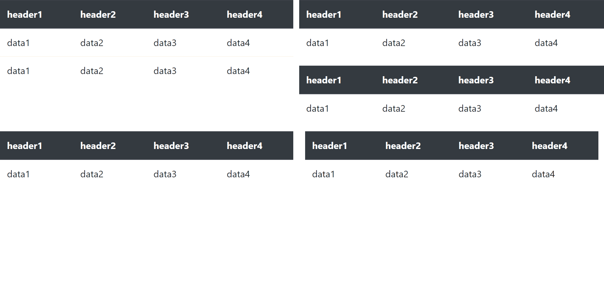
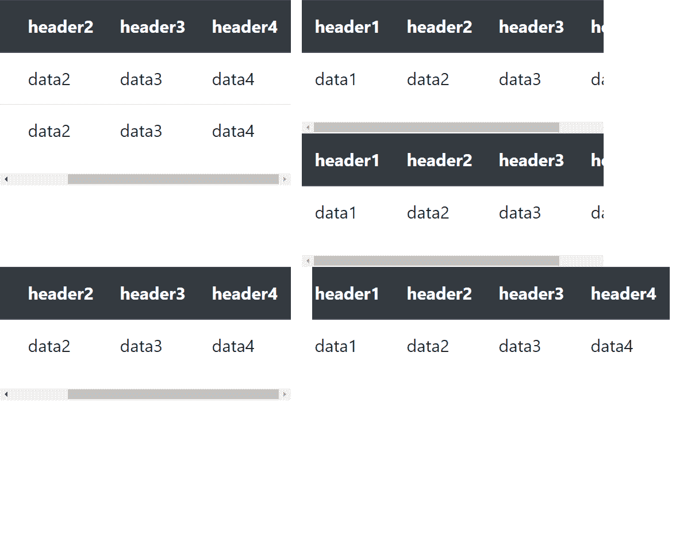
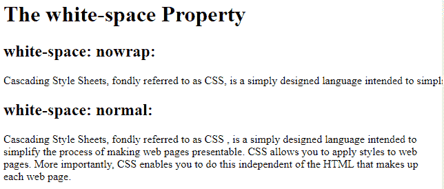

# 如何防止直列块草皮缠绕？

> 原文:[https://www . geeksforgeeks . org/如何防止内嵌块 div 被包装/](https://www.geeksforgeeks.org/how-to-prevent-inline-block-divs-from-wrapping/)

`**display: inline-block;**`是 CSS 中的一个布局属性，不在元素后添加换行符。因此，元素可以彼此相邻。`**display: inline;**`和`**display: inline-block;**`的主要区别在于，`**display: inline-block;**`还允许我们设置元素的宽度和高度。

我们可以通过添加合适的 Bootstrap 类来防止内联块 div 包装。让我们借助一个例子来理解这一点:

**示例 1:** 我们必须显示使用合适的引导行和列类布局的多个表。问题是，如果同一行中有多个表，那么 Bootstrap 会将该行包装起来，如果下一个表不适合内联，则将下一个表推到下一行(如果屏幕尺寸很小，就会出现这种情况)。但是我们希望这些表格对于所有屏幕尺寸都在同一行上(即，我们不希望内联块元素绕到下一行)。

**方法:**要做到这一点，我们必须为每个表编写表标签以及名为 table-responsible 的 Bootstrap 类。这个类使所有的表格都具有响应性，因此对于所有类型的屏幕(来自 xs-lg)它们都在同一个位置，如果屏幕尺寸小到适合表格，表格会自动获得一个水平滚动条，用户可以通过向右滚动来查看表格的额外内容。这也避免了表格的重叠，使页面看起来干净。

**语法:**

```htmlhtml
<div class="table-responsive">
```

**示例:**

```htmlhtml
<!DOCTYPE html>
<html lang="en">

<head>
    <meta charset="UTF-8">
    <meta name="viewport" content=
        "width=device-width, initial-scale=1.0">

    <link rel="stylesheet" href=
"https://maxcdn.bootstrapcdn.com/bootstrap/4.4.1/css/bootstrap.min.css">

    <title>
        Prevent inline-block 
        divs from wrapping
    </title>

    <style>
        div {
            display: inline-block;
        }
    </style>
</head>

<body>
    <div class="row">
        <div class="col-6">
            <div class="table-responsive">
                <table class="table table-stripped">

                    <!-- This is to make the table 
                        have same colors for 
                        alternate rows-->
                    <thead class="thead-dark">
                        <tr>
                            <th>header1</th>
                            <th>header2</th>
                            <th>header3</th>
                            <th>header4</th>
                        </tr>
                    </thead>
                    <tbody>
                        <tr>
                            <td>data1</td>
                            <td>data2</td>
                            <td>data3</td>
                            <td>data4</td>
                        </tr>
                        <tr>
                            <td>data1</td>
                            <td>data2</td>
                            <td>data3</td>
                            <td>data4</td>
                        </tr>
                    </tbody>
                </table>
            </div>
        </div>

        <div class="col-6">
            <div class="row">
                <div class="table-responsive">
                    <table class="table table-stripped">
                        <thead class="thead-dark">
                            <tr>
                                <th>header1</th>
                                <th>header2</th>
                                <th>header3</th>
                                <th>header4</th>
                            </tr>
                        </thead>
                        <tbody>
                            <tr>
                                <td>data1</td>
                                <td>data2</td>
                                <td>data3</td>
                                <td>data4</td>
                            </tr>
                        </tbody>
                    </table>
                </div>
            </div>
            <div class="row">
                <div class="table-responsive">
                    <table class="table table-stripped">
                        <thead class="thead-dark">
                            <tr>
                                <th>header1</th>
                                <th>header2</th>
                                <th>header3</th>
                                <th>header4</th>
                            </tr>
                        </thead>
                        <tbody>
                            <tr>
                                <td>data1</td>
                                <td>data2</td>
                                <td>data3</td>
                                <td>data4</td>
                            </tr>
                        </tbody>
                    </table>
                </div>
            </div>
        </div>

    </div>
    <div class="row">
        <div class="col-6">
            <div class="table-responsive">
                <table class="table table-stripped">
                    <thead class="thead-dark">
                        <tr>
                            <th>header1</th>
                            <th>header2</th>
                            <th>header3</th>
                            <th>header4</th>
                        </tr>
                    </thead>
                    <tbody>
                        <tr>
                            <td>data1</td>
                            <td>data2</td>
                            <td>data3</td>
                            <td>data4</td>
                        </tr>
                    </tbody>
                </table>
            </div>
        </div>
        <div class="col-6">
            <div class="table-responsive">
                <table class="table table-stripped">
                    <thead class="thead-dark">
                        <tr>
                            <th>header1</th>
                            <th>header2</th>
                            <th>header3</th>
                            <th>header4</th>
                        </tr>
                    </thead>
                    <tbody>
                        <tr>
                            <td>data1</td>
                            <td>data2</td>
                            <td>data3</td>
                            <td>data4</td>
                        </tr>
                    </tbody>
                </table>
            </div>
        </div>
    </div>
</body>

</html>
```

需要记住的一件重要事情是，响应式表格利用`**overflow-y: hidden**`，它可以剪辑掉表格底部或顶部边缘以外的任何内容。所以，如果你的桌子很大，可以超出屏幕底部，那么最好在<样式>标签内添加`**overflow-y: auto**`。

在上面的代码中，我们在<头>标签中使用了[https://maxcdn . bootstrapcdn . com/bootstrap/4 . 4 . 1/CSS/Bootstrap . min . CSS](https://maxcdn.bootstrapcdn.com/bootstrap/4.4.1/css/bootstrap.min.css)，以便能够使用 Bootstrap 类来使我们的生活变得轻松。请注意，我们还为每个表添加了“table table-responsive”类，以防止它换行。

**输出:**
**为正常屏幕尺寸:**


**对于小屏幕尺寸:**


这也可以用很少的 CSS 来完成。
**使用文本的示例:**如果我们在一个 div 块中有很多文本，并且我们希望文本即使在屏幕尺寸减小后也保持在同一行，那么我们可以添加一个名为**的 CSS 属性，并为其分配值 **nowrap** ，如下所示:**

**方法:**首先，我们取一个< div >标签，给它一个任意的名字来应用 CSS 属性。这里的两块草皮都填充了一些文字。我们将`**white-space: nowrap;**`属性应用于类“a”，即使屏幕尺寸很小，它也能保持文本行在同一行。

**语法:**

```htmlhtml
white-space: nowrap;
```

接下来，我们应用`**white-space: normal;**`，这是“空白”的默认值。这将根据屏幕的大小在多行上显示文本。

**语法:**

```htmlhtml
white-space: normal;
```

**示例:**

```htmlhtml
<!DOCTYPE html>
<html>

<head>
    <title>
        How to prevent inline-block 
        divs from wrapping ?
    </title>

    <style>
        .a {
            white-space: nowrap;
        }

        .b {
            white-space: normal;
        }
    </style>
</head>

<body>

    <h1>The white-space Property</h1>
    <h2>white-space: nowrap:</h2>

    <div class="a">
        Cascading Style Sheets, fondly
        referred to as CSS, is a simply 
        designed language intended to 
        simplify the process of making 
        web pages presentable. CSS 
        allows you to apply styles to 
        web pages. More importantly, 
        CSS enables you to do this
        independent of the HTML that 
        makes up each web page.
    </div>

    <h2>white-space: normal:</h2>

    <div class="b">
        Cascading Style Sheets, fondly 
        referred to as CSS, is a simply
        designed language intended to 
        simplify the process of making 
        web pages presentable. CSS 
        allows you to apply styles to 
        web pages. More importantly, 
        CSS enables you to do this
        independent of the HTML that 
        makes up each web page.
    </div>
</body>

</html>
```

**输出:**


如果您尝试在 IDE 中运行它，您可以注意到，即使屏幕尺寸很小，第一个有`**white-space: nowrap;**`的 div 块内的文本也不会绕到下一行。另一方面，如果第二个 div 标签中的文本无法放入同一行，则它会绕到下一行。请运行代码并使用它来更好地理解 nowrap 的用法。