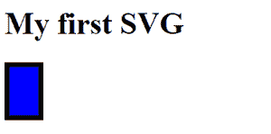

# 如何调整 SVG 图像的大小？

> 原文:[https://www.geeksforgeeks.org/how-to-resize-a-svg-image/](https://www.geeksforgeeks.org/how-to-resize-a-svg-image/)

调整 SVG 图像的大小不能简单地通过对 img 标签使用 CSS 高度和宽度属性来完成。要调整 SVG 图像的大小，请执行以下步骤:

**方法 1:**SVG 图像将 100%采用其可用的所有宽度和高度。要使图像具有所需的大小，请设置图像的 CSS 高度和宽度属性

**例 1:**

## 半铸钢ˌ钢性铸铁(Cast Semi-Steel)

```htmlhtml
<!DOCTYPE html> 
<html> 
<style>
   svg{
      height: 200px;
   }

</style>

<body> 
    <svg xmlns="http://www.w3.org/2000/svg">     
        <image href= 
"https://media.geeksforgeeks.org/wp-content/cdn-uploads/20190710102234/download3.png"
        /> 
    </svg> 
</body> 

</html>
```

**输出:**


**方法二:**直接修改**。svg** 文件并将宽度和高度设置为所需值。如果存在一个 SVG 图像，下面是 XML 文件的外观

```htmlhtml
<svg height="40px" width="60px" . . . . . . ></svg>
```

**例 2:**

## 超文本标记语言

```htmlhtml
<!DOCTYPE html>
<html>
    <body>
        <h1>My first SVG</h1>

        <svg width="40" height="60">
            <rect width="40" 
                  height="60" 
                  style=
"fill: rgb(0, 0, 255); stroke-width: 10; stroke: rgb(0, 0, 0);" />
        </svg>
    </body>
</html>
```

**输出:**

