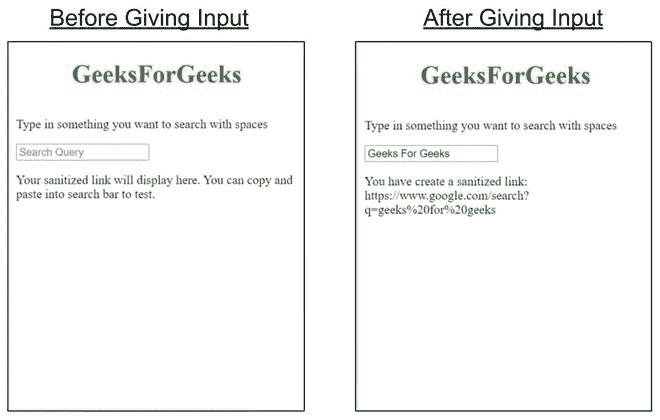

# 如何用 amp-bind-macro 调用将用户输入净化到 URL？

> 原文:[https://www . geesforgeks . org/how-to-sanitize-user-input-to-URL-with-amp-bind-macro-call/](https://www.geeksforgeeks.org/how-to-sanitize-user-input-to-url-with-an-amp-bind-macro-call/)


**简介:**有时候你可能想把你的输入传递给谷歌的搜索网址，这可以通过 amp-bind-macro 来实现。它可以用来动态创建一个净化的网址。通过简单地将输入转换成小写，并用 **'%20'** 替换空格，就可以得到一个经过净化的网址。

**设置:**要在我们的 amp 页面中使用 amp-bind-macro，我们必须在文档头部导入 **amp-bind** 脚本。

```html
<script async custom-element="amp-bind" src=
"https://cdn.ampproject.org/v0/amp-bind-0.1.js">
</script>
```

**示例:**

```html
<!DOCTYPE html>
<html amp>

<head>
    <title>GeeksForGeeks | amp-bind-macro</title>
    <meta charset="utf-8" />

    <script async 
        src="https://cdn.ampproject.org/v0.js">
    </script>

    <link rel="canonical" href=
"https://amp.dev/documentation/examples/components/amp-bind-macro/index.html"/>

    <meta name="viewport" content="width=device-width,
        minimum-scale=1, initial-scale=1" />

    <!-- Import the `amp-bind` component
        to use `amp-bind-macro`. -->
    <script async custom-element="amp-bind" 
src="https://cdn.ampproject.org/v0/amp-bind-0.1.js">
    </script>

    <style amp-boilerplate>
        body {
            -webkit-animation: -amp-start 8s 
                steps(1, end) 0s 1 normal both;

            -moz-animation: -amp-start 8s 
                steps(1, end) 0s 1 normal both;

            -ms-animation: -amp-start 8s
                steps(1, end) 0s 1 normal both;

            animation: -amp-start 8s
                steps(1, end) 0s 1 normal both;
        }

        @-webkit-keyframes -amp-start {
            from {
                visibility: hidden;
            }

            to {
                visibility: visible;
            }
        }

        @-moz-keyframes -amp-start {
            from {
                visibility: hidden;
            }

            to {
                visibility: visible;
            }
        }

        @-ms-keyframes -amp-start {
            from {
                visibility: hidden;
            }

            to {
                visibility: visible;
            }
        }

        @-o-keyframes -amp-start {
            from {
                visibility: hidden;
            }

            to {
                visibility: visible;
            }
        }

        @keyframes -amp-start {
            from {
                visibility: hidden;
            }

            to {
                visibility: visible;
            }
        }
    </style>

    <noscript>
        <style amp-boilerplate>
            body {
                -webkit-animation: none;
                -moz-animation: none;
                -ms-animation: none;
                animation: none;
            }
        </style>
    </noscript>

    <style amp-custom>
        h1 {
            color: forestgreen;
        }
    </style>
</head>

<body>
    <center>
        <h1>GeeksForGeeks</h1>
    </center>

    <!-- The `replaceSpace` expression defined
        in `amp-bind-macro` replaces spaces in
        user input with `s/ /%20/` and sets all
        letters to lowercase to match url format
        for Google search -->
    <div style="left: 0.5em; position: absolute;">
        <amp-bind-macro id="replaceSpace" 
            arguments="str" expression=
            "str.toLowerCase().split(' ').join('%20')">
        </amp-bind-macro>

        <p>
            Type in something you want 
            to search with spaces
        </p>

        <input type="text" placeholder="Search Query"
            on="input-throttled:AMP.setState(
                { argumentString: event.value })" />

        <p="'You have create a sanitized link:'
            ' https://www.google.com/search?q='
            'replaceSpace(argumentString)">
            Your sanitized link will display 
            here. You can copy and paste into
            search bar to test.
        </p>
    </div>
</body>

</html>
```

#### 输出:

