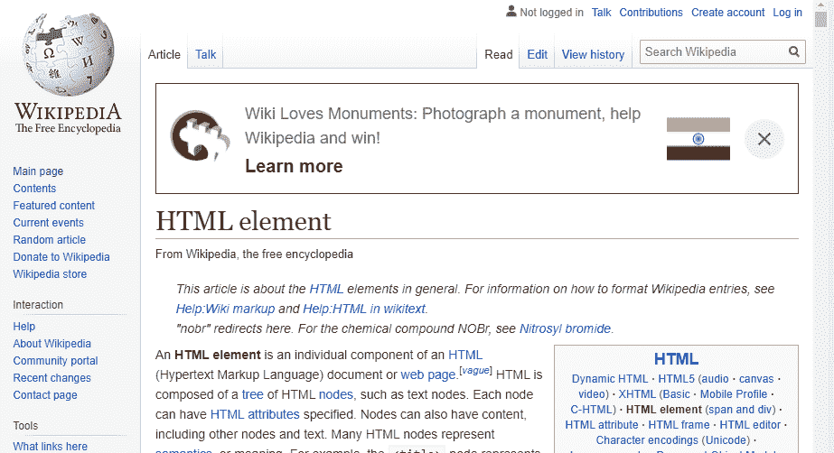

# 如何设置全屏 iframe？

> 原文:[https://www.geeksforgeeks.org/how-to-set-fullscreen-iframe/](https://www.geeksforgeeks.org/how-to-set-fullscreen-iframe/)

HTML 中的 iframe 代表内嵌框架。“iframe”标签在文档中定义了一个矩形区域，浏览器可以在其中显示单独的文档，包括滚动条和边框。内联框架用于在当前的 HTML 文档中嵌入另一个文档。对于全屏 Iframe，您必须覆盖整个视口。

**全屏 Iframe 的步骤:**

1.  将 html 正文、div、iframe 标签的页面浮动边距重置为 0px:

    ```html
    html 
    {
     overflow: auto;
    }

    html, body, div, iframe 
    {
     margin: 0px; 
     padding: 0px; 
     height: 100%; 
     border: none;
    }

    ```

2.  转换 CSS 中的 iframe 标签行为

    ```html
    iframe 
    {
     display: block; 
     width: 100%; 
     border: none; 
     overflow-y: auto; 
     overflow-x: hidden;
    }

    ```

3.  设置 iframe 属性以解决跨浏览器问题:

    ```html
    <iframe src="myurl.in"
        frameborder="0" 
        marginheight="0" 
        marginwidth="0" 
        width="100%" 
        height="100%" 
        scrolling="auto"></iframe >

    ```

**示例:**

```html
<!DOCTYPE html>
<html>

<head>
    <title>full screen iframe</title>
    <style type="text/css">
        html {
            overflow: auto;
        }

        html,
        body,
        div,
        iframe {
            margin: 0px;
            padding: 0px;
            height: 100%;
            border: none;
        }

        iframe {
            display: block;
            width: 100%;
            border: none;
            overflow-y: auto;
            overflow-x: hidden;
        }
    </style>
</head>

<body>
    <iframe src="https://en.wikipedia.org/wiki/HTML_element#Frames"
            frameborder="0" 
            marginheight="0" 
            marginwidth="0" 
            width="100%" 
            height="100%" 
            scrolling="auto">
  </iframe>

</body>

</html>
```

**输出:**


**示例 2:** 使用<框架集行=“100%，*>。

```html
<!DOCTYPE html>
<html>

<head>
    <title>full screen iframe</title>
</head>
<frameset rows="100%,*">
    <frame src=
"https://en.wikipedia.org/wiki/HTML_element#Frames">
        <noframes>

            <body>

            </body>
        </noframes>
</frameset>

</html>
```

**输出:**


HTML 是网页的基础，通过构建网站和网络应用程序用于网页开发。您可以通过以下 [HTML 教程](https://www.geeksforgeeks.org/html-tutorials/)和 [HTML 示例](https://www.geeksforgeeks.org/html-examples/)从头开始学习 HTML。