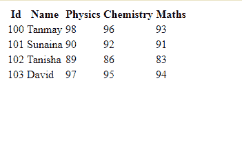
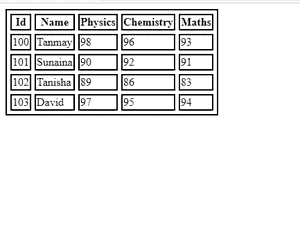
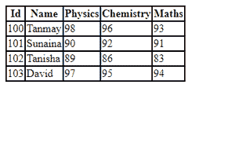

# 如何设置表格的折叠边框模型？

> 原文:[https://www . geeksforgeeks . org/如何为表格设置折叠边框模型/](https://www.geeksforgeeks.org/how-to-set-the-collapsing-borders-model-for-a-table/)

[CSS](https://www.geeksforgeeks.org/css-tutorials/) 描述了 HTML 元素应该如何显示。有各种各样的 CSS 属性可以为基本的 HTML 文档增添魔力。

本文的重点是为 HTML 的表格元素设置折叠边框模型。

HTML [表格](https://www.geeksforgeeks.org/html-tables/)允许我们使用行和列来排列数据。 *<表格>* 标签定义了一个 HTML 表格。每个表行都定义有一个[*<【tr】>*](https://www.geeksforgeeks.org/html-tr-tag/)标记。每个表头都定义有[*<第>*](https://www.geeksforgeeks.org/html-th-tag/) 标签。每个表格数据/单元格都用 [*< td >*](https://www.geeksforgeeks.org/html-td-tag/) 标记来定义。让我们看看如何构建一个表格，该表格可以表示四个学生在各自科目中的分数，并为其设置折叠边框，如下所示。

**示例 1:** 本示例描述了 HTML 表格的基本示例。

## 超文本标记语言

```htmlhtml
<!DOCTYPE html>
<html>

<head>
    <title>css collapse borders</title>
</head>

<body>
    <table>
        <tr>
            <th>Id</th>
            <th>Name</th>
            <th>Physics</th>
            <th>Chemistry</th>
            <th>Maths</th>
        </tr>
        <tr>
            <td>100</td>
            <td>Tanmay</td>
            <td>98</td>
            <td>96</td>
            <td>93</td>
        </tr>
        <tr>
            <td>101</td>
            <td>Sunaina</td>
            <td>90</td>
            <td>92</td>
            <td>91</td>
        </tr>
        <tr>
            <td>102</td>
            <td>Tanisha</td>
            <td>89</td>
            <td>86</td>
            <td>83</td>
        </tr>
        <tr>
            <td>103</td>
            <td>David</td>
            <td>97</td>
            <td>95</td>
            <td>94</td>
        </tr>
    </table>
</body>

</html>
```

**输出:**



HTML 表格

**示例 2:** 在本例中，我们将使用 [*CSS 边框属性*](https://www.geeksforgeeks.org/css-border-property/) 为其添加一些边框，如下例所示。

## 超文本标记语言

```htmlhtml
<!DOCTYPE html>
<html>

<head>
    <title>CSS border collapse</title>
    <style>
        table,
        tr,
        th,
        td {
            border: 2px solid black;
            border-spacing: 5px;
        }
    </style>
</head>

<body>
    <table>
        <tr>
            <th>Id</th>
            <th>Name</th>
            <th>Physics</th>
            <th>Chemistry</th>
            <th>Maths</th>
        </tr>
        <tr>
            <td>100</td>
            <td>Tanmay</td>
            <td>98</td>
            <td>96</td>
            <td>93</td>
        </tr>
        <tr>
            <td>101</td>
            <td>Sunaina</td>
            <td>90</td>
            <td>92</td>
            <td>91</td>
        </tr>
        <tr>
            <td>102</td>
            <td>Tanisha</td>
            <td>89</td>
            <td>86</td>
            <td>83</td>
        </tr>
        <tr>
            <td>103</td>
            <td>David</td>
            <td>97</td>
            <td>95</td>
            <td>94</td>
        </tr>
    </table>
</body>

</html>
```

**输出:**



带边框的 HTML 表格

将边框添加到表格中，我们得到如上所示的输出。但这可能不是所需的输出，因此让我们尝试使用[*边框-折叠*](https://www.geeksforgeeks.org/css-border-collapse-property/) 属性并将其值设置为*折叠*来折叠这些边框以获得更统一的输出，如下例所示。

**例 3:**

## 超文本标记语言

```htmlhtml
<!DOCTYPE html>
<html>

<head>
    <title>CSS border collapse</title>
    <style>
        table,
        tr,
        th,
        td {
            border: 2px solid black;
            border-collapse: collapse;
            border-spacing: 5px;
        }
    </style>
</head>

<body>
    <table>
        <tr>
            <th>Id</th>
            <th>Name</th>
            <th>Physics</th>
            <th>Chemistry</th>
            <th>Maths</th>
        </tr>
        <tr>
            <td>100</td>
            <td>Tanmay</td>
            <td>98</td>
            <td>96</td>
            <td>93</td>
        </tr>
        <tr>
            <td>101</td>
            <td>Sunaina</td>
            <td>90</td>
            <td>92</td>
            <td>91</td>
        </tr>
        <tr>
            <td>102</td>
            <td>Tanisha</td>
            <td>89</td>
            <td>86</td>
            <td>83</td>
        </tr>
        <tr>
            <td>103</td>
            <td>David</td>
            <td>97</td>
            <td>95</td>
            <td>94</td>
        </tr>
    </table>
</body>

</html>
```

**输出:**



带有折叠边框的表格

这是我们需要的输出，所以最后我们学习了如何设置表格的折叠边框。需要记住的一点是，当设置为折叠值时，[边框间距](https://www.geeksforgeeks.org/css-border-spacing-property/)属性对*边框折叠*属性没有影响。