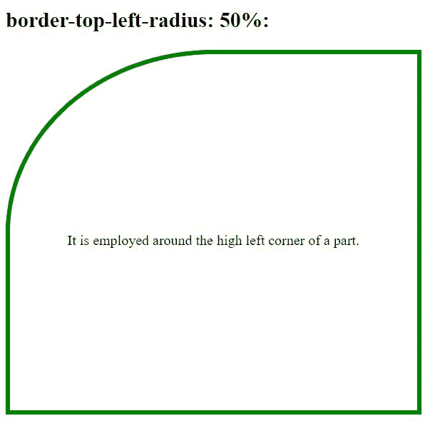

# 左上角的形状如何设置百分比？

> 原文:[https://www . geeksforgeeks . org/如何设置左上角的形状百分比/](https://www.geeksforgeeks.org/how-to-set-the-shape-of-the-top-left-corner-in-percentage/)

借助 **[边框-左上角-半径](https://www.geeksforgeeks.org/css-border-top-left-radius-property/)** 属性我们可以圆化左上角的形状。边框-左上角-半径属性用于零件的左上角。

该属性接受一个或两个值，这些值勾勒出 1 / 4 椭圆的半径，该椭圆定义了外部边框边缘的角的形状(见下图)。主要价值在于水平半径，其次是垂直半径。如果第二个价值被忽略了，它是从第一个开始的。如果任一长度为零，则角是方形的，而不是圆形的。

**语法:**

```
border-top-left-radius: length / % / initial / inherit;
```

水平半径的百分比取决于边框的尺寸，而垂直半径的百分比取决于边框的高度，负值不允许作为此属性的值。

**例 1:**

## 超文本标记语言

```
<!DOCTYPE html>
<html>
<head>
    <style>
    .gfg {
         border: 5px solid green;
         width:60%;
         text-align:center;
         height:400px;
         border-top-left-radius: 50%;
         background: url(
https://media.geeksforgeeks.org/wp-content/uploads/20190405121202/GfGLH.png);

    }
    </style>
</head>
<body>
    <div class="gfg"></div>
</body>
</html>                 
```

**输出:**


**例 2:**

## 超文本标记语言

```
<!DOCTYPE html>
<html>
   <head>
      <style> 
         #GFG{
         border: 5px solid green;
         width:60%;
         text-align:center;
         height:400px;
         border-top-left-radius: 50%;
         }
      </style>
   </head>
   <body>
      <h2>border-top-left-radius: 50%:</h2>
      <div id="GFG">
         <p style="margin-top:200px;">
          It is employed around the high left
          corner of a part.
         </p>
      </div>
   </body>
</html>
```

**Output:**
