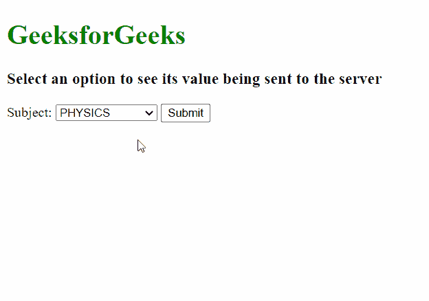

# 如何指定发送到服务器的值？

> 原文:[https://www . geesforgeks . org/如何指定要发送到服务器的值/](https://www.geeksforgeeks.org/how-to-specify-the-value-to-be-sent-to-a-server/)

在本文中，我们将看到如何指定选项的值，以便将该值发送到服务器。

[**值属性**](https://www.geeksforgeeks.org/html-value-attribute/) 可用于此目的。它在<选项>元素中指定要发送到服务器的值。浏览器将在下拉列表中显示<选项>的开始和结束标签之间的内容。但是，**值**属性中定义的值是提交表单时发送给服务器的值。

**语法:**

```html
<option value="value">
```

**示例:**

## 超文本标记语言

```html
<html>
<body>
  <h1 style="color: green">
    GeeksforGeeks
  </h1>
  <h3>
    Select an option to see its 
    value being sent to the server
  </h3>
  <form action="form.php">
    <label for="Subject">
      Subject:
    </label>
    <select id="subject" name="subject">
      <option value="phy">
        PHYSICS
      </option>
      <option value="chem">
        CHEMISTRY
      </option>
      <option value="bio">
        BIOLOGY
      </option>
      <option value="math">
        MATHEMATICS
      </option>
    </select>
    <input type="submit" value="Submit">
  </form>
</body>
</html>
```

**输出:**

