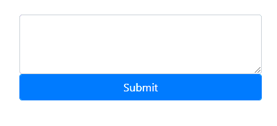
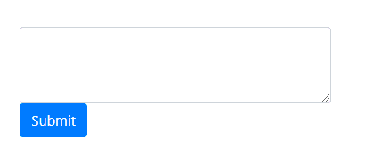
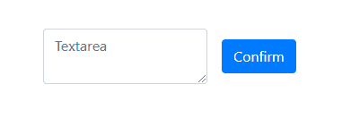

# 如何阻止提交按钮随 textarea 一起展开？

> 原文:[https://www . geeksforgeeks . org/如何停止-提交-按钮-从-扩展-与-textarea/](https://www.geeksforgeeks.org/how-to-stop-submit-button-from-expanding-along-with-textarea/)

下面是遇到的问题的一个例子。这里，按钮标签包括“表单控件”类。表单控件类对齐合并它的所有元素。按钮也不例外，因此会与 textarea 对齐或弯曲。

## 超文本标记语言

```
<!DOCTYPE html>
<html>
    <head>
        <!-- importing bootstrap cdn -->
        <link rel="stylesheet"
              href=
"https://stackpath.bootstrapcdn.com/bootstrap/4.4.1/css/bootstrap.min.css"
              integrity=
"sha384-Vkoo8x4CGsO3+Hhxv8T/Q5PaXtkKtu6ug5TOeNV6gBiFeWPGFN9MuhOf23Q9Ifjh"
              crossorigin="anonymous" />
    </head>
    <body>
        <div class="container mt-5">
            <div class="row">
                <div class="col-4">
                    <textarea class="form-control"
                              id=
                              "exampleFormControlTextarea1"
                              rows="3">
                  </textarea>
                    <button type="button"
                            class=
                            "form-control btn btn-primary">
                      Submit</button>
                </div>
            </div>
        </div>
    </body>
</html>
```

**输出**T2】



Bootstrap 4 是 web 开发人员用来创建动态和交互式用户界面的最流行的 CSS 框架之一。Bootstrap 4 捆绑了各种组件，可用于构建有吸引力的网站。其中一个组件是用于创建表单设计的表单控件。表单控件类具有预定义的 CSS 属性，这使得直接在代码中使用这些组件变得更加容易，而无需为单个组件重写 CSS 属性。但是，将窗体控件类用于 textarea 和 button 会导致按钮随文本区域一起展开。
**这些例子中使用的一些术语是:**

*   **容器:**容器类将里面的东西垫起来。它是一个响应固定宽度的容器。
*   **mt-5:**mt-5 是一个实用程序或助手类，用于将上边距设置为字体大小的 3 倍。
*   **形态控制:**。表单控件类被添加到所有文本输入、textarea 和 select 元素中。它具有保持表单元素间距和对齐的全局属性。
*   **形式-内联:** The。form-inline 类确保元素是内联的。
*   **btn:** 。btn 类应该与 Bootstrap 4 中的<按钮>标签一起使用。/li >

*   **btn-primary:** 。btn-primary 提供蓝色按钮。
*   **MB-2:**MB-2 是一个实用程序或助手类，用于将底部边距设置为 0.5rem，即字体大小的 0.5 倍。

**第一种方法:**
可以考虑以下方法来防止按钮随着文本区域扩展。首先导入引导 cdn。这允许使用的组件具有在引导样式表中定义的全局属性。接下来，形成容器并定义行和列。该列包含文本区域和按钮。在此示例中，按钮不包括窗体控件类。因此，按钮被放置在文本区域的下方。因此，即使文本区域随着文本一起扩展，按钮大小也保持不变。
**例:**

## 超文本标记语言

```
<!DOCTYPE html>
<html>
    <head>
        <!-- importing bootstrap cdn -->
        <link rel="stylesheet"
              href=
"https://stackpath.bootstrapcdn.com/bootstrap/4.4.1/css/bootstrap.min.css"
              integrity=
"sha384-Vkoo8x4CGsO3+Hhxv8T/Q5PaXtkKtu6ug5TOeNV6gBiFeWPGFN9MuhOf23Q9Ifjh"
              crossorigin="anonymous" />
    </head>
    <body>
        <!--container-->
        <div class="container mt-5">
            <!--row-->
            <div class="row">
                <!--column-->
                <div class="col-4">
                    <!--textarea-->
                    <textarea class="form-control"
                              id=
                              "exampleFormControlTextarea1"
                              rows="3">
                  </textarea>
                    <button type="button"
                            class="btn btn-primary">
                      Submit</button>
                </div>
                <!--column ends-->
            </div>
            <!--row ends-->
        </div>
        <!--container ends-->
    </body>
</html>
```

**输出**T2:



**第二种方法:**
在这种方法中，我们使用 form-inline 类，它确保文本区域和按钮沿着同一条线放置，但按钮大小不受扩展的文本区域的影响。首先导入引导 cdn。这允许使用的组件具有在引导样式表中定义的全局属性。接下来，形成容器并定义表单。该表单包含文本区域作为输入字段以及一个按钮。button 标记不包含窗体控件类，因此它不会随 textarea 一起伸缩。同样由于 inline 属性，按钮被放在 textarea 的右边。但是因为按钮独立于文本区域，所以即使文本区域在高度上增加，按钮的大小也保持不变。

**例:**

## 超文本标记语言

```
<!DOCTYPE html>
<html>
    <head>
        <!--importing bootstrap cdn-->
        <link rel="stylesheet"
              href=
"https://stackpath.bootstrapcdn.com/bootstrap/4.4.1/css/bootstrap.min.css"
              integrity=
"sha384-Vkoo8x4CGsO3+Hhxv8T/Q5PaXtkKtu6ug5TOeNV6gBiFeWPGFN9MuhOf23Q9Ifjh"
              crossorigin="anonymous" />
    </head>
    <body>
        <!--container-->
        <div class="container mt-5">
            <!--form-->
            <form class="form-inline">
                <div class="form-group mx-sm-3 mb-2">
                    <!--textarea-->
                    <textarea type="textarea"
                              class="form-control"
                              id="textarea"
                              placeholder="Textarea">
                  </textarea>
                </div>
                <button type="submit"
                        class="btn btn-primary mb-2">
                  Confirm</button>
            </form>
            <!--form ends-->
        </div>
        <!--container ends-->
    </body>
</html>
```

**输出**T2:

