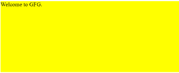
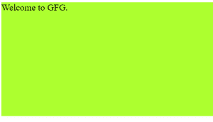

# 如何拉伸 div 以适合容器？

> 原文:[https://www . geeksforgeeks . org/如何拉伸 div 以适合容器/](https://www.geeksforgeeks.org/how-to-stretch-div-to-fit-the-container/)

容器内的子 div 可以取父 div 的全部宽度和高度。下面讨论使用 CSS tat 拉伸 div 以适应容器的两种方法:

**方法 1:** 第一种方法是简单地给子 div 分配 100%的宽度和 100%的高度，这样它将占用父 div 的所有可用空间。

考虑这个 HTML 进行演示:

## 超文本标记语言

```htmlhtml
<!DOCTYPE html>
<html lang="en">

<head>
    <style>
        .container {
            height: 400px;
            background-color: green;
        }

        .num1 {
            background-color: yellow;
            height: 100%;
            width: 100%;
        }
    </style>

</head>

<body>
    <div class="container">
        <div class="num1">
            Welcome to GFG.
        </div>
    </div>
</body>

</html>
```

**输出:**



**方法二:**我们可以将子容器的显示属性设为**表行**，将父容器的显示属性设为**表**，这样就可以从父 div 元素中获取所有可用的高度。为了覆盖所有的宽度，我们可以将父 div 的宽度设为 100%。

## 超文本标记语言

```htmlhtml
<!DOCTYPE html>
<html lang="en">

<head>
    <style>
        .container {
            height: 200px;
            background-color: green;
            display: table;
            width: 100%;
        }

        .num1 {
            background-color: greenyellow;
            display: table-row;
        }
    </style>
</head>

<body>
    <div class="container">
        <div class="num1">
            Welcome to GFG.
        </div>
    </div>
</body>

</html>
```

**输出:**

