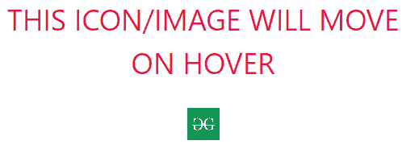

# 如何将鼠标悬停在图像或图标上进行翻译？

> 原文:[https://www . geesforgeks . org/如何通过将鼠标悬停在图片或图标上来翻译该图片或图标/](https://www.geeksforgeeks.org/how-to-translate-an-image-or-icon-by-hovering-over-it/)

图像翻译可以有效地为你的网站增加一个敏感的边缘。本文将有两个部分，第一部分将包含向网页添加图像/图标的结构，第二部分将包含使用 CSS 设计结构。

此外，为了给出关于这篇文章的想法，一旦鼠标指针在图像/图标上移动/悬停，图像/图标就被平移，即从它们的原始位置移动/移位，并且向上移动/移位，从而给出更具响应性的效果。平移只不过是将一个物体从原来的位置移动到一个新的位置。

**创建结构:**
在本节中，我们将借助 HTML 创建一个基本结构，并附上图标的链接，该链接将用于显示悬停时的翻译效果。

**HTML 代码:**

```html
<!DOCTYPE html>
<html>

<head>

    <title>How to translate an image
     or icon by hovering over it</title>
    <link rel="stylesheet" href=
"https://stackpath.bootstrapcdn.com/bootstrap/4.3.1/css/bootstrap.min.css">

</head>
<body>

<section id="social-media">
    <div class="container text-center">
        <p> THIS ICON/IMAGE WILL MOVE ON HOVER </p>
        <div class="social-icons">
                        <a href="https://www.geegsforgeeks.com">
                         
                        </a>                                         
        </div>
    </div>
</section>

</body>
</html>
```

**设计结构:**
在上一节中，我们创建了网页的基本结构。在这一节中，我们将在 CSS 的帮助下设计上面创建的结构。

**CSS 代码:**

```html
        <style>      
             /* section styling */
             #social-media
              {
                  padding: 100px 0;
              }

             /* styling the paragraph tag in the section */ 
             #social-media p
              {
                 font-size: 36px;
                 font-size: 600;
                 color: #E7113E;
                 margin-bottom: 30px;
              }
/* image styling - 
adjusting the width and height of any given image*/   
             .social-icons img
              {
                 width: 40px;
                 height: 40px;
                 transition: 0.5s
              }

            /* adding the hovering effect */ 
            .social-icons a:hover img
             {
                transform: translateY(-10px);
             }

        </style>
```

**最终解决方案:**
这是上面 2 节合并后的最终代码。它将显示当鼠标指针移动到图像/图标上或悬停在其上时图像/图标将如何平移。

```html
<!DOCTYPE html>
<html>

<head>

    <title>How to translate an image 
    or icon by hovering over it</title>
    <link rel="stylesheet" href=
"https://stackpath.bootstrapcdn.com/bootstrap/4.3.1/css/bootstrap.min.css">

        <style>      
             /* section styling */
             #social-media
              {
                  padding: 100px 0;
              }

             /* styling the paragraph tag in the section */ 
             #social-media p
              {
                 font-size: 36px;
                 font-size: 600;
                 color: #E7113E;
                 margin-bottom: 30px;
              }

/* image styling - 
adjusting the width and height of any given image*/   
             .social-icons img
              {
                 width: 40px;
                 height: 40px;
                 transition: 0.5s
              }

            /* adding the hovering effect */ 
            .social-icons a:hover img
             {
                transform: translateY(-10px);
             }

        </style>

</head>
<body>

<section id="social-media">
    <div class="container text-center">
        <p> THIS ICON/IMAGE WILL MOVE ON HOVER </p>
        <div class="social-icons">
                        <a href="https://www.geegsforgeeks.com">
                         
                        </a>                                         
        </div>
    </div>
</section>

</body>
</html>
```

**输出:**
