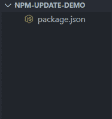

# 如何通过 NPM 卸载和更新任何依赖项？

> 原文:[https://www . geesforgeks . org/如何通过 npm 卸载和更新任何依赖项/](https://www.geeksforgeeks.org/how-to-uninstall-and-update-any-dependencies-through-npm/)

[NPM](https://www.geeksforgeeks.org/node-js-npm-node-package-manager/) (Node Package Manager)是 Node.js 的默认包管理器，它管理所有的包，并随着 Node.js 的安装而安装，当我们在命令行上使用 NPM 客户端将任何包安装到我们的项目中时，它就会安装在 node_modules 文件夹中，该包的版本等信息会反映在 package.json 文件中。

**对于项目依赖关系:**

*   我们可以使用**更新**命令来更新项目依赖关系:

    ```
    npm update
    ```

*   我们可以使用以下命令更新任何特定的项目依赖关系:

    ```
    npm update <packagename>
    ```

*   我们可以使用以下命令卸载项目依赖项:

    ```
    npm uninstall <package_name>
    ```

**对于全局依赖关系:**

*   我们可以使用带有-g 标志的 update 命令来更新全局依赖项。

    ```
    npm update -g
    ```

*   我们可以使用以下命令更新任何特定的全局依赖关系:

    ```
    npm update -g <package_name>
    ```

*   我们可以使用以下命令卸载全局依赖项:

    ```
    npm uninstall -g <package_name>
    ```

**项目设置:**

**第一步:** [如果你的机器中没有安装 Node.js，安装 Node.js](https://www.geeksforgeeks.org/installation-of-node-js-on-windows/) 。

**第 2 步:**为项目创建一个文件夹，并使用命令行中的以下命令用默认配置初始化一个新的 Node.js 项目。

```
npm init -y
```

**项目结构:**完成这些步骤后，您的项目文件夹应该包含一个 package.json 文件。



现在从这个例子开始，我们将在命令行上使用下面的命令安装两个名为 express 和粉笔的包的旧版本。

```
npm install express@4.15.4 chalk@2.3.1
```

要查看项目的过时包，可以运行以下命令。

```
npm outdated
```

当使用过时的命令时，我们会得到以下输出。在输出中，第一列是包的名称，第二列显示为我们的项目安装的版本。第三列表示想要的版本，也就是我们可以安全升级到的版本，而不需要任何中断的更改。第四列代表该软件包的最新版本。


现在，当我们使用 **npm update** 命令时，两个包都被更新到最新的安全版本，我们得到以下输出。由于通缉令和最新版本的快递是一样的，所以更新到了最新版本。我们唯一剩下的过时的依赖是粉笔。


现在当我们使用**卸载**命令卸载粉笔包时如下所示:


*T1 文件的内容如下:*

