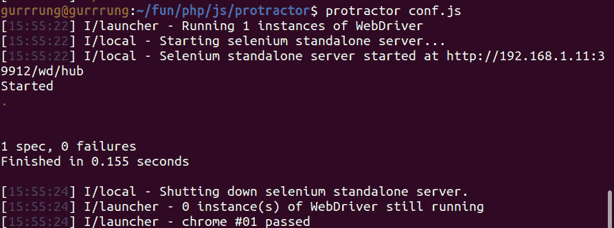

# 如何用量角器检查一个元素是否可见？

> 原文:[https://www . geeksforgeeks . org/如何使用量角器检查元素是否可见/](https://www.geeksforgeeks.org/how-to-use-protractor-to-check-if-an-element-is-visible/)

**量角器**是为 AngularJS 应用开发的端到端测试框架，然而，它也适用于非 Angular JS 应用。它像一个真正的用户一样，在一个真正的浏览器中运行与它交互的应用程序。在本文中，我们将使用量角器来检查一个元素是可见的还是隐藏的。

**先决条件:** [量角器](https://www.geeksforgeeks.org/angularjs-end-to-end-e2e-testing-protractor-installation-and-setup/)的安装和设置

**进场:**

*   我们将创建一个基本的测试程序，在其中我们将检查元素是否可见。
*   所有量角器测试都将有一个包含配置的文件，这将是启动测试的初始文件。

必须遵循的步骤是:

**第 1 步:**我们必须首先创建一个 **conf.js** 文件，该文件包含与量角器一起使用的配置。

## java 描述语言

```htmlhtml
exports.config = {
  // Define the capabilities to be passed
  // to the webdriver instance
  capabilities: {
    browserName: "chrome",
  },

  // Define the framework to be use
  framework: "jasmine",

  // Define the Spec patterns. This is relative
  // to the current working directory when
  // protractor is called
  specs: ["test.js"],

  // Define the options to be used with Jasmine
  jasmineNodeOpts: {
    defaultTimeoutInterval: 30000,
  },

  // Define the baseUrl for the file
  baseUrl: "file://" + __dirname + "/",

  onPrepare: function () {
    browser.resetUrl = "file://";
  },
};
```

**步骤 2:** 我们将创建一个名为**test.html**的 HTML 文件，其中将包含要测试的元素。

## 超文本标记语言

```htmlhtml
<!DOCTYPE html>
<html>
<body>
  <!-- The element to be tested -->
  <div id="hidden-div" 
       style="display: none;">
    Inner text
  </div>
</body>
</html>
```

**第三步:**我们将创建 **test.js** 文件。在这个文件中，我们将访问上面的 HTML 文件，然后检查元素是否隐藏。*浏览器*是由量角器创建的全局，用于浏览器级命令，如使用***browser . get()*******方法导航。*描述* 和 *it* 语法来自 Jasmine 框架，其中**描述**是对您的测试的描述，而 **it** 定义了测试的步骤。****

## ****java 描述语言****

```htmlhtml
**describe('Protractor Demo App', function () {
  it('should have a title', function () {

      // Disable waiting for Angular render update
      browser.waitForAngularEnabled(false)

      // Get the HTML file that has to be tested
      browser.get('test.html');

      // Test if the element is hidden
      let hiddenDiv = element(by.id('hidden-div'));

      // This test will pass only when
      // element is hidden
      expect(hiddenDiv.isDisplayed()).toBe(false);
  });
});**
```

******步骤 4:** 最后，我们将使用下面给出的命令运行配置文件。这将运行配置文件，测试将如下所示运行。****

```htmlhtml
**protractor conf.js**
```

******输出:******

********