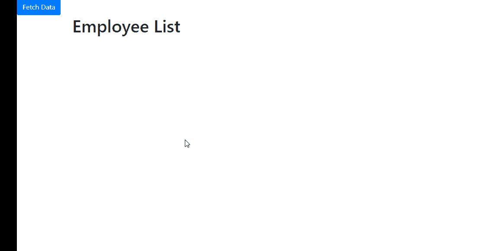

# 如何使用 AJAX 使用简单的 API？

> 原文:[https://www . geeksforgeeks . org/如何使用-简单-API-使用-ajax/](https://www.geeksforgeeks.org/how-to-use-simple-api-using-ajax/)

AJAX(异步 JavaScript 和 XML)是一组用来调用服务器获取一些数据的工具。在本文中，我们将看到如何使用 AJAX 实现一个简单的 API 调用。

**先决条件:**AJAX 及其功能的基础知识。你可以从这里[学到所有的基础知识。](https://www.geeksforgeeks.org/ajax-introduction/)

**什么是基本建筑？**
我们将从一个免费的应用编程接口从一个雇员对象中获取雇员的名字，并将其显示在一个列表中。网上有很多免费的 API。你可以用任何一个。

**HTML 代码:**我们有一个获取数据的按钮和一个空的无序列表，我们将在其中使用 JavaScript 动态添加我们的列表项。

```html
<!DOCTYPE html>
<html lang="en">

<head>
    <!-- Required meta tags -->
    <meta charset="utf-8" />
    <meta name="viewport" content="width=device-width,
        initial-scale=1, shrink-to-fit=no" />

    <!-- Bootstrap CSS -->
    <link rel="stylesheet" href=
"https://maxcdn.bootstrapcdn.com/bootstrap/4.0.0/css/bootstrap.min.css"
        integrity=
"sha384-Gn5384xqQ1aoWXA+058RXPxPg6fy4IWvTNh0E263XmFcJlSAwiGgFAW/dAiS6JXm"
        crossorigin="anonymous" />

    <title>
        How to use simple API using AJAX ?
    </title>
</head>

<body>
    <button type="button" id="fetchBtn"
        class="btn btn-primary">
        Fetch Data
    </button>

    <div class="container">
        <h1>Employee List</h1>
        <ul id="list"></ul>
    </div>

    <!-- Optional JavaScript -->
    <!-- jQuery first, then Popper.js,
         then Bootstrap JS -->
    <script src="Ajax.js"></script>
    <script src=
"https://code.jquery.com/jquery-3.2.1.slim.min.js"
        integrity=
"sha384-KJ3o2DKtIkvYIK3UENzmM7KCkRr/rE9/Qpg6aAZGJwFDMVNA/GpGFF93hXpG5KkN"
        crossorigin="anonymous">
    </script>

    <script src=
"https://cdnjs.cloudflare.com/ajax/libs/popper.js/1.12.9/umd/popper.min.js"
        integrity=
"sha384-ApNbgh9B+Y1QKtv3Rn7W3mgPxhU9K/ScQsAP7hUibX39j7fakFPskvXusvfa0b4Q"
        crossorigin="anonymous">
    </script>

    <script src=
"https://maxcdn.bootstrapcdn.com/bootstrap/4.0.0/js/bootstrap.min.js"
        integrity=
"sha384-JZR6Spejh4U02d8jOt6vLEHfe/JQGiRRSQQxSfFWpi1MquVdAyjUar5+76PVCmYl"
        crossorigin="anonymous">
    </script>
</body>

</html>
```

**AJAX 代码:**

*   **第一步:**第一步是获取按钮元素 *getElementById* 方法。
*   **步骤 2:** 第二步是给按钮添加一个 eventListener，并为其提供回叫功能。
*   **第三步:**使用*新的*关键字实例化一个 *XHR* 对象。
*   **第四步:**使用*打开*功能打开一个对象。它需要三个参数，第一个是类型(GET 或 POST)，第二个是 API 的 URL，最后一个是布尔值(true 表示异步调用，false 表示同步调用)。
*   **第五步:**现在我们使用 *onload* 功能显示数据。onload 函数在完成 API 调用后执行。我们将检查成功的状态。我们用 200 检查它，因为 200 是一个 HTTP 请求的成功代码。
*   **第 6 步:**现在，我们将使用解析将它转换成一个 JSON 对象，这样我们就可以轻松地从中获取数据。
*   **第 7 步:**在这一步中，我们将使用循环迭代对象中的所有项目，并使用 *innerhtml* 属性将其添加到列表中。
*   **Step 8:** Last step is to send the request using the *send()* function.

    下面是上述步骤的实现。为了使代码易于理解，我们还在每一行提供了注释。

    ```html
    <script>
        let fetchBtn = document.getElementById("fetchBtn");

        fetchBtn.addEventListener("click", buttonclickhandler);

        function buttonclickhandler() {

            // Instantiate an new XHR Object
            const xhr = new XMLHttpRequest();

            // Open an obejct (GET/POST, PATH,
            // ASYN-TRUE/FALSE)
            xhr.open("GET", 
    "http://dummy.restapiexample.com/api/v1/employees", true);

            // When response is ready
            xhr.onload = function () {
                if (this.status === 200) {

                    // Changing string data into JSON Object
                    obj = JSON.parse(this.responseText);

                    // Getting the ul element
                    let list = document.getElementById("list");
                    str = ""
                    for (key in obj.data) {
                        str += `<li>${obj.data[key].employee_name}</li>`;
                    }
                    list.innerHTML = str;
                }
                else {
                    console.log("File not found");
                }
            }

            // At last send the request
            xhr.send();
        }
    </script>
    ```

    **完整代码:**是以上两个代码段的组合。

    ```html
    <!DOCTYPE html>
    <html lang="en">

    <head>

        <!-- Required meta tags -->
        <meta charset="utf-8" />
        <meta name="viewport" content="width=device-width,
                initial-scale=1, shrink-to-fit=no" />

        <!-- Bootstrap CSS -->
        <link rel="stylesheet" href=
    "https://maxcdn.bootstrapcdn.com/bootstrap/4.0.0/css/bootstrap.min.css"
            integrity=
    "sha384-Gn5384xqQ1aoWXA+058RXPxPg6fy4IWvTNh0E263XmFcJlSAwiGgFAW/dAiS6JXm"
            crossorigin="anonymous" />

        <title>
            How to use simple API using AJAX ?
        </title>
    </head>

    <body>
        <button type="button" id="fetchBtn"
                class="btn btn-primary">
            Fetch Data
        </button>

        <div class="container">
            <h1>Employee List</h1>
            <ul id="list"></ul>
        </div>

        <!-- Optional JavaScript -->
        <!-- jQuery first, then Popper.js,
             then Bootstrap JS -->
        <script>
            let fetchBtn = document.getElementById("fetchBtn");

            fetchBtn.addEventListener("click", buttonclickhandler);

            function buttonclickhandler() {

                // Instantiate an new XHR Object
                const xhr = new XMLHttpRequest();

                // Open an obejct (GET/POST, PATH,
                // ASYN-TRUE/FALSE)
                xhr.open("GET", 
    "http://dummy.restapiexample.com/api/v1/employees", true);

                // When response is ready
                xhr.onload = function () {
                    if (this.status === 200) {

                        // Changing string data into JSON Object
                        obj = JSON.parse(this.responseText);

                        // Getting the ul element
                        let list = document.getElementById("list");
                        str = ""
                        for (key in obj.data) {
                            str += 
                            `<li>${obj.data[key].employee_name}</li>`;
                        }
                        list.innerHTML = str;
                    }
                    else {
                        console.log("File not found");
                    }
                }
                xhr.send();
            }
        </script>

        <script src="https://code.jquery.com/jquery-3.2.1.slim.min.js"
            integrity=
    "sha384-KJ3o2DKtIkvYIK3UENzmM7KCkRr/rE9/Qpg6aAZGJwFDMVNA/GpGFF93hXpG5KkN"
            crossorigin="anonymous">
        </script>

        <script src=
    "https://cdnjs.cloudflare.com/ajax/libs/popper.js/1.12.9/umd/popper.min.js"
            integrity=
    "sha384-ApNbgh9B+Y1QKtv3Rn7W3mgPxhU9K/ScQsAP7hUibX39j7fakFPskvXusvfa0b4Q"
            crossorigin="anonymous">
        </script>

        <script src=
    "https://maxcdn.bootstrapcdn.com/bootstrap/4.0.0/js/bootstrap.min.js"
            integrity=
    "sha384-JZR6Spejh4U02d8jOt6vLEHfe/JQGiRRSQQxSfFWpi1MquVdAyjUar5+76PVCmYl"
            crossorigin="anonymous">
        </script>
    </body>

    </html>
    ```

    **输出:**
    