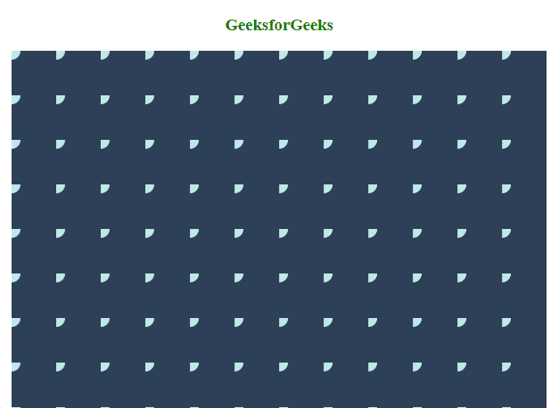
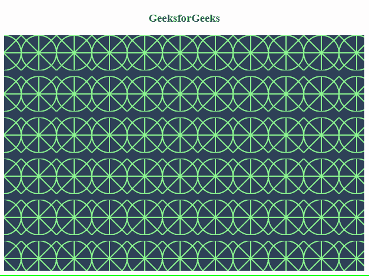

# 如何使用 SVG Patterns 作为背景？

> 原文:[https://www . geesforgeks . org/how-用法-SVG-patterns-as-the-background/](https://www.geeksforgeeks.org/how-to-use-svg-patterns-as-the-background/)

HTML 中的 SVG **模式**元素用于绘制不同的图形设计或模式。图案代表一个图形对象，用于以 x 和 y 坐标间隔重复重绘同一对象以覆盖一个区域。

**使用 SVG 模式作为背景的优势:**

1.  它易于在代码中实现，也易于维护。
2.  它们重量轻，易于使用，特别适合初学者。
3.  它们是可扩展的。
4.  它们可以使用 CSS 来创建动态网页。
5.  图案可以从矩形、圆形、多边形等基本图形对象生成为复杂形状。因此，它越来越受开发者的欢迎。

**SVG 模式的资源工具:**有许多工具或资源，人们可以从中生成不同的模式并在代码中使用它们。这些都很容易使用，可以用于制作所需的创意背景。

模式标签的一些重要属性如下:

**语法:**

> <pattern id="”id-defined-by-user”" x="”x-axis" co-ordinate="" y="”y-axis" width="”width-of-pattern”" height="”height-of-pattern”" patternunits="”units" to="" define="" and="" attributes="" xlink:href="”link" another="" pattern="" preserveaspectratio="”preserving" aspect="" ratio="" of="" original="" content=""></格局></pattern>

**示例 1:** 在本例中，重复图案以创建整个背景。在模式标签中，分配了一个 id，可以称为模式 id。这可能很有用，因为通过引用这个 id，这个模式可以很容易地在以后的代码中使用。

## 超文本标记语言

```htmlhtml
<!DOCTYPE html>
<html>

<head>
    <style>
        .patterns {
            background-color: #2e4057;
            margin: 1%;
            height: 100vh;
        }
    </style>
</head>

<body>
    <h3 style="color:green;text-align: center;">
        GeeksforGeeks
    </h3>
    <div class="patterns">
        <svg width="100%" height="100%">
            <!-- Definition for the SVG -->
            <defs>
                <!-- Design of the pattern -->
                <pattern id="b-design" x="0" y="0" 
                    width="50" height="50" 
                    patternUnits="userSpaceOnUse">
                    <circle fill="#bee9e7" 
                        cx="0" cy="0" r="10" />
                </pattern>
            </defs>
            <rect x="0" y="0" width="100%" 
                height="100%" fill="url(#b-design)" />
        </svg>
    </div>
</body>

</html>
```

**输出:**



**示例 2:** 在本例中，使用路径创建模式，该路径是使用其“id”属性指定的。定义图案后，将设置高度、宽度、填充颜色、背景颜色和其他参数。

## 超文本标记语言

```htmlhtml
<!DOCTYPE html>
<html>

<head>
    <style>
        .patterns {
            background-color: #2e4057;
            height: 100vh;
        }
    </style>
</head>

<body>
    <h3 style="color:green;text-align: center;">
        GeeksforGeeks
    </h3>
    <div class="patterns">
        <svg width="100%" height="100%">
            <defs>
                <!-- Define the pattern -->
                <pattern id="pie-design" x="0" y="0" 
                    width="60" height="70" 
                    patternUnits="userSpaceOnUse">

                    <!-- Use the path element 
                         for the design -->
                    <path fill="#8cf790" d=
            "M29 58.58l7.38-7.39A30.95 30.95 0 0
            1 29 37.84a30.95 30.95 0 0 1-7.38 13.36l7.37
            7.38zm1.4 1.41l.01.01h-2.84l-7.37-7.38A30.95
            30.95 0 0 1 6.84 60H0v-1.02a28.9 28.9 0 0 0
            18.79-7.78L0 32.41v-4.84L18.78 8.79A28.9
            28.9 0 0 0 0 1.02V0h6.84a30.95 30.95 0
            0 1 13.35 7.38L27.57 0h2.84l7.39 7.38A30.95
            30.95 0 0 1 51.16 0H60v27.58-.01V60h-8.84a30.95
            30.95 0 0 1-13.37-7.4L30.4 60zM29 1.41l-7.4
            7.38A30.95 30.95 0 0 1 29 22.16 30.95 30.95
            0 0 1 36.38 8.8L29 1.4zM58 1A28.9 28.9 0 0 0
            39.2 8.8L58 27.58V1.02zm-20.2 9.2A28.9 28.9
            0 0 0 30.02 29h26.56L37.8 10.21zM30.02
            31a28.9 28.9 0 0 0 7.77 18.79l18.79-18.79H30.02zm9.18
            20.2A28.9 28.9 0 0 0 58 59V32.4L39.2 
            51.19zm-19-1.4a28.9 28.9 0 0 0 7.78-18.8H1.41l18.8
            18.8zm7.78-20.8A28.9 28.9 0 0 0 20.2 10.2L1.41
            29h26.57z">
                    </path>
                </pattern>
            </defs>
            <rect x="0" y="0" width="100%" 
                height="100%" 
                fill="url(#pie-design)" />
        </svg>
    </div>
</body>

</html>
```

**输出:**

