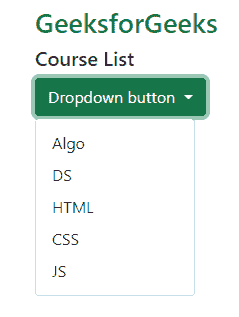
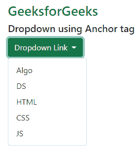
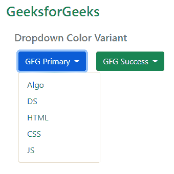
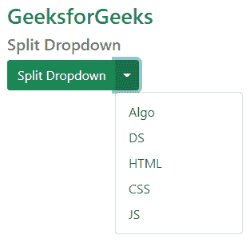
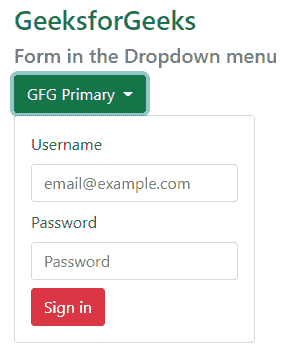
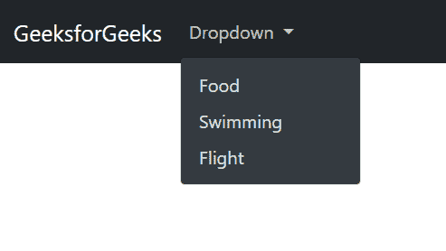

# 如何使用下拉插件？

> 原文:[https://www . geesforgeks . org/如何使用下拉插件/](https://www.geeksforgeeks.org/how-to-use-the-dropdown-plugin/)

在本文中，我们将了解 Bootstrap 的下拉插件。这些是可连接的上下文覆盖，用于附加一些链接、选项等列表。bootstrap Javascript 插件使它具有响应性和交互性，这些下拉菜单是通过点击而不是悬停在它上面来切换的。需要包含第三方 *popper.js* 库，使得视口检测和动态定位成为可能。下拉框必不可少的 CSS 和 Javascript 插件如下所示。

**进场:**

*   将子元素包装在. dropdown 类中。
*   我们可以使用一个按钮或者一个锚点标签来切换。为了进行切换，我们需要使用。dropdown-toggle 类，并将 data-bs-toggle="dropdown "元素添加到父类中。
*   要使下拉菜单项使用。下拉菜单类。使用。下拉列表-包含每个项目名称的项目类。

**步骤 1:** 在 HTML <头>部分包含 Bootstrap CSS 来加载样式表。

> <link href="”https://cdn.jsdelivr.net/npm/bootstrap@5.0.2/dist/css/bootstrap.min.css”" rel="”stylesheet”" integrity="”sha384-EVSTQN3/azprG1Anm3QDgpJLIm9Nao0Yz1ztcQTwFspd3yD65VohhpuuCOmLASjC”" crossorigin="”anonymous”/">

添加引导 JavaScript 插件和依赖项。

**步骤 2:** 我们可以直接复制官方引导文档中给出的引导入门模板。

**第三步:**在这一步中，我们将使用 bootstrap *下拉菜单*类，如下所述:

*   将子元素包装在 ***中。**下拉*类。
*   我们可以使用一个按钮或者一个锚点标签来切换。切换时，我们需要使用 ***。下拉-切换*** 类并将 ***数据-bs-切换=【下拉】*** 元素添加到父类中。
*   要制作下拉菜单，菜单项使用*。下拉菜单*类。使用 ***。下拉式项目**T5 类，每个项目名称。我们将利用上述方法&根据不同的情况进行下拉。我们一个一个来讨论。*

**通过按钮下拉菜单:**我们可以通过 ***中的任意一个按钮进行下拉。btn*** 类在标记上有一些变化，如添加 ***数据-bs-toggle=【下拉菜单】*** 和***aria-expanded =【false】***如下所示。切换时，我们需要使用 ***。下拉切换*** 。

**示例 1:** 该示例说明了在 Bootstrap 中使用下拉类，其中使用了 *data-bs-toggle* 类，该类的值被设置为下拉。

## 超文本标记语言

```
<!DOCTYPE html>
<html lang="en">

<head>

    <!-- Required meta tags -->
    <meta charset="utf-8" />
    <meta name="viewport" 
          content="width=device-width, 
                   initial-scale=1" />

    <!-- Bootstrap CSS -->
    <link href=
"https://cdn.jsdelivr.net/npm/bootstrap@5.0.2/dist/css/bootstrap.min.css" 
         rel="stylesheet" 
         integrity=
"sha384-EVSTQN3/azprG1Anm3QDgpJLIm9Nao0Yz1ztcQTwFspd3yD65VohhpuuCOmLASjC" 
         crossorigin="anonymous" /> 
</head>

<body>
    <h2 class="text-success">GeeksforGeeks</h2>
    <div class="dropdown">
        <h5>Course List</h5>
        <button class="btn btn-success dropdown-toggle" 
                type="button" 
                data-bs-toggle="dropdown" 
                aria-expanded="false"> Dropdown button 
       </button>
        <ul class="dropdown-menu">
            <li>
                <a class="dropdown-item" href="#">Algo</a>
            </li>
            <li>
                <a class="dropdown-item" href="#">DS</a>
            </li>
            <li>
                <a class="dropdown-item" href="#">HTML</a>
            </li>
            <li>
                <a class="dropdown-item" href="#">CSS</a>
            </li>
            <li>
                <a class="dropdown-item" href="#">JS</a>
            </li>
        </ul>
    </div>
    <script src=
"https://cdn.jsdelivr.net/npm/bootstrap@5.0.2/dist/js/bootstrap.bundle.min.js" 
            integrity=
"sha384-MrcW6ZMFYlzcLA8Nl+NtUVF0sA7MsXsP1UyJoMp4YLEuNSfAP+JcXn/tWtIaxVXM" 
           crossorigin="anonymous"></script>
</body>
</html>
```

**输出:**



**通过锚点< a > < /a >标签:**我们可以从任意 ***的锚点< a > < /a >标签进行下拉。btn*** 类在标记中有一些变化，比如添加 ***数据-bs-toggle=【下拉菜单】*** 和***aria-expanded =【false】***如下所示。为了进行切换，我们需要使用。 ***下拉-切换*** 。

**示例 2:** 该示例说明了如何使用锚点标签在引导程序中创建下拉菜单。

## 超文本标记语言

```
<!DOCTYPE html>
<html lang="en">
<head>
    <!-- Required meta tags -->
    <meta charset="utf-8" />
    <meta name="viewport" 
          content="width=device-width, 
                   initial-scale=1" />
    <!-- Bootstrap CSS -->
    <link href=
"https://cdn.jsdelivr.net/npm/bootstrap@5.0.2/dist/css/bootstrap.min.css" 
          rel="stylesheet" 
          integrity=
"sha384-EVSTQN3/azprG1Anm3QDgpJLIm9Nao0Yz1ztcQTwFspd3yD65VohhpuuCOmLASjC" 
          crossorigin="anonymous" /> 
</head>

<body>
    <h2 class="text-success">GeeksforGeeks</h2>
    <div class="dropdown">
        <h5>Dropdown using Anchor tag</h5> 
        <a class="btn btn-success dropdown-toggle" 
           href="#" 
           role="button" 
           data-bs-toggle="dropdown" 
           aria-expanded="false">
        Dropdown Link
      </a>
        <ul class="dropdown-menu">
            <li>
                <a class="dropdown-item" href="#">Algo</a>
            </li>
            <li>
                <a class="dropdown-item" href="#">DS</a>
            </li>
            <li>
                <a class="dropdown-item" href="#">HTML</a>
            </li>
            <li>
                <a class="dropdown-item" href="#">CSS</a>
            </li>
            <li>
                <a class="dropdown-item" href="#">JS</a>
            </li>
        </ul>
    </div>
    <script src=
"https://cdn.jsdelivr.net/npm/bootstrap@5.0.2/dist/js/bootstrap.bundle.min.js" 
            integrity=
"sha384-MrcW6ZMFYlzcLA8Nl+NtUVF0sA7MsXsP1UyJoMp4YLEuNSfAP+JcXn/tWtIaxVXM" 
            crossorigin="anonymous">
    </script>
</body>
</html>
```

**输出:**



**下拉菜单中的颜色变体:**我们可以通过使用 ***等按钮可用的引导类来制作各种颜色的下拉按钮。BTN-主**为蓝色，**。BTN-危险**为红色，**。BTN-二级*** 为灰色，等。

**示例 3:** 我们使用了 Bootstrap 中的按钮类来制作带有颜色变体的按钮。这里，这个例子说明了 Bootstrap 的主要&成功类。我们可以以类似的方式使用剩余的类。

## 超文本标记语言

```
<!DOCTYPE html>
<html lang="en">
<head>

    <!-- Required meta tags -->
    <meta charset="utf-8" />
    <meta name="viewport" 
          content="width=device-width, 
                   initial-scale=1" />

    <!-- Bootstrap CSS -->
    <link href=
"https://cdn.jsdelivr.net/npm/bootstrap@5.0.2/dist/css/bootstrap.min.css" 
          rel="stylesheet" 
          integrity=
"sha384-EVSTQN3/azprG1Anm3QDgpJLIm9Nao0Yz1ztcQTwFspd3yD65VohhpuuCOmLASjC" 
          crossorigin="anonymous" /> 
</head>

<body>
    <h2 class="text-success">GeeksforGeeks</h2>
    <div class="dropdown px-3 py-3">
        <h5 class="text-secondary">Dropdown Color Variant</h5>
        <button class="btn btn-primary dropdown-toggle mx-2 my-2" 
                type="button" 
                data-bs-toggle="dropdown" 
                aria-expanded="false"> GFG Primary
       </button>
        <ul class="dropdown-menu">
            <li>
                <a class="dropdown-item" href="#">Algo</a> 
            </li>
            <li>
                <a class="dropdown-item" href="#">DS</a> 
            </li>
            <li>
                <a class="dropdown-item" href="#">HTML</a> 
            </li>
            <li>
                <a class="dropdown-item" href="#">CSS</a> 
            </li>
            <li>
                <a class="dropdown-item" href="#">JS</a> 
            </li>
        </ul>
        <button class="btn btn-success dropdown-toggle mx-2 my-2" 
                type="button" 
                data-bs-toggle="dropdown" 
                aria-expanded="false"> GFG Success
        </button>
        <ul class="dropdown-menu">
            <li>
                <a class="dropdown-item" href="#">Algo</a> 
            </li>
            <li>
                <a class="dropdown-item" href="#">DS</a> 
            </li>
            <li>
                <a class="dropdown-item" href="#">HTML</a> 
            </li>
            <li>
                <a class="dropdown-item" href="#">CSS</a> 
            </li>
            <li>
                <a class="dropdown-item" href="#">JS</a> 
            </li>
        </ul>
    </div>
    <script src=
"https://cdn.jsdelivr.net/npm/bootstrap@5.0.2/dist/js/bootstrap.bundle.min.js" 
            integrity=
"sha384-MrcW6ZMFYlzcLA8Nl+NtUVF0sA7MsXsP1UyJoMp4YLEuNSfAP+JcXn/tWtIaxVXM" 
            crossorigin="anonymous">
    </script>
</body>
</html>
```

**输出:**



**用按钮拆分下拉列表:**我们可以通过添加一个带有“. ***下拉列表-切换-拆分*** 类的附加按钮来拆分按钮中的下拉列表，以便在下拉插入符号周围留出适当的空间。

**示例 4:** 此示例说明了引导中的拆分下拉按钮。

## 超文本标记语言

```
<!DOCTYPE html>
<html lang="en">
<head>

    <!-- Required meta tags -->
    <meta charset="utf-8" />
    <meta name="viewport" 
          content="width=device-width, 
                   initial-scale=1" />

    <!-- Bootstrap CSS -->
    <link href=
"https://cdn.jsdelivr.net/npm/bootstrap@5.0.2/dist/css/bootstrap.min.css" 
          rel="stylesheet" 
          integrity=
"sha384-EVSTQN3/azprG1Anm3QDgpJLIm9Nao0Yz1ztcQTwFspd3yD65VohhpuuCOmLASjC" 
          crossorigin="anonymous" /> 
</head>

<body>
    <h2 class="text-success">GeeksforGeeks</h2>
    <h5 class="text-secondary">Split Dropdown</h5>
    <div class="btn-group">
        <button type="button" 
                class="btn btn-success">Split Dropdown
        </button>
        <button type="button" 
                class="btn btn-success dropdown-toggle dropdown-toggle-split" 
                data-bs-toggle="dropdown" 
                aria-expanded="false">
        </button>
        <ul class="dropdown-menu">
            <li>
                <a class="dropdown-item" href="#">Algo</a>
            </li>
            <li>
                <a class="dropdown-item" href="#">DS</a>
            </li>
            <li>
                <a class="dropdown-item" href="#">HTML</a>
            </li>
            <li>
                <a class="dropdown-item" href="#">CSS</a>
            </li>
            <li>
                <a class="dropdown-item" href="#">JS</a>
            </li>
        </ul>
    </div>
    <script src=
"https://cdn.jsdelivr.net/npm/bootstrap@5.0.2/dist/js/bootstrap.bundle.min.js" 
            integrity=
"sha384-MrcW6ZMFYlzcLA8Nl+NtUVF0sA7MsXsP1UyJoMp4YLEuNSfAP+JcXn/tWtIaxVXM" 
            crossorigin="anonymous">
    </script>
</body>
</html>
```

**输出:**



**下拉菜单中的表单:**在以下示例中，我们通过将表单包装在*中，将表单放入下拉菜单中。**下拉菜单**类。*要了解更多关于[引导表](https://www.geeksforgeeks.org/bootstrap-4-forms/)的信息，请阅读引导表一文。同样，我们可以将任何东西放入 ***。下拉菜单*** 类使其出现在下拉菜单中。

**示例 5:** 该示例显示了 Bootstrap 中下拉菜单内的表单。

## 超文本标记语言

```
<!DOCTYPE html>
<html lang="en">
<head>

    <!-- Required meta tags -->
    <meta charset="utf-8" />
    <meta name="viewport" 
          content="width=device-width, 
                   initial-scale=1" />

    <!-- Bootstrap CSS -->
    <link href=
"https://cdn.jsdelivr.net/npm/bootstrap@5.0.2/dist/css/bootstrap.min.css" 
          rel="stylesheet" 
          integrity=
"sha384-EVSTQN3/azprG1Anm3QDgpJLIm9Nao0Yz1ztcQTwFspd3yD65VohhpuuCOmLASjC" 
          crossorigin="anonymous" />
</head>

<body>
    <h2 class="text-success">GeeksforGeeks</h2>
    <h5 class="text-secondary">Form in the Dropdown menu</h5>
    <div class="dropdown">
        <button class="btn btn-success dropdown-toggle" 
                type="button" 
                data-bs-toggle="dropdown" 
                aria-expanded="false"> GFG Primary
        </button>
        <div class="dropdown-menu">
            <form class="px-3 py-2">
                <div class="mb-2">
                    <label class="form-label"> Username </label>
                    <input type="email" 
                           class="form-control" 
                           placeholder="email@example.com" />
                </div>
                <div class="mb-2">
                    <label class="form-label"> Password </label>
                    <input type="password" 
                           class="form-control" 
                           placeholder="Password" />
                </div>
                <button type="submit" class="btn btn-danger"> Sign in
                </button>
            </form>
        </div>
    </div>
    <script src=
"https://cdn.jsdelivr.net/npm/bootstrap@5.0.2/dist/js/bootstrap.bundle.min.js" 
            integrity=
"sha384-MrcW6ZMFYlzcLA8Nl+NtUVF0sA7MsXsP1UyJoMp4YLEuNSfAP+JcXn/tWtIaxVXM" 
            crossorigin="anonymous">
    </script>
</body>
</html>
```

**输出:**



**带深色主题的导航栏中的下拉菜单:**我们绝对可以更改下拉菜单的主题，使其与导航栏背景相匹配。为此我们增加了一个 ***。下拉菜单-黑暗*** 类到现有的。 ***下拉菜单*** 。除此之外，不需要对下拉项目进行其他更改。

**示例 6:** 在本例中，我们在 Bootstrap 中的导航栏中制作了黑色主题下拉列表。

## 超文本标记语言

```
<!DOCTYPE html>
<html lang="en">
<head>

    <!-- Required meta tags -->
    <meta charset="utf-8" />
    <meta name="viewport" 
          content="width=device-width, 
                   initial-scale=1" />

    <!-- Bootstrap CSS -->
    <link href=
"https://cdn.jsdelivr.net/npm/bootstrap@5.0.2/dist/css/bootstrap.min.css" 
          rel="stylesheet" 
          integrity=
"sha384-EVSTQN3/azprG1Anm3QDgpJLIm9Nao0Yz1ztcQTwFspd3yD65VohhpuuCOmLASjC" 
          crossorigin="anonymous" />
    <title>GeeksforGeeks</title>
</head>

<body>
    <nav class="navbar navbar-expand-lg navbar-dark bg-dark">
        <div class="container-fluid"> 
            <a class="navbar-brand" 
               href="#">GeeksforGeeks</a>
            <button class="navbar-toggler" 
                    type="button" 
                    data-bs-toggle="collapse" 
                    aria-controls="navbarNavDarkDropdown" 
                    aria-expanded="false"> 
              <span class="navbar-toggler-icon"></span>
            </button>
            <div class="collapse navbar-collapse">
                <ul class="navbar-nav">
                    <li class="nav-item dropdown">
                        <a class="nav-link dropdown-toggle" 
                           href="#" 
                           role="button" 
                           data-bs-toggle="dropdown" 
                           aria-expanded="false">
                Dropdown
              </a>
                <ul class="dropdown-menu dropdown-menu-dark">
                    <li><a class="dropdown-item" href="#">Food</a> 
                    </li>
                    <li> <a class="dropdown-item" href="#">Swimming</a> 
                    </li>
                    <li> <a class="dropdown-item" href="#">Flight</a> 
                    </li>
                        </ul>
                    </li>
                </ul>
            </div>
        </div>
    </nav>
    <script src=
"https://cdn.jsdelivr.net/npm/bootstrap@5.0.2/dist/js/bootstrap.bundle.min.js" 
    integrity=
"sha384-MrcW6ZMFYlzcLA8Nl+NtUVF0sA7MsXsP1UyJoMp4YLEuNSfAP+JcXn/tWtIaxVXM" 
    crossorigin="anonymous">
    </script>
</body>
</html>
```

**输出:**

