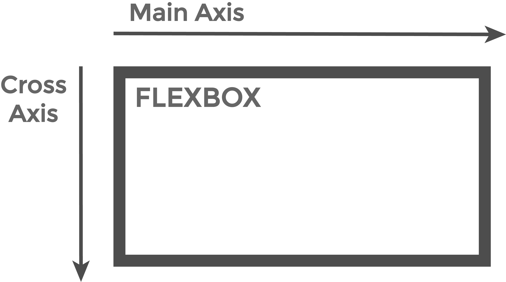

# 如何将 flexbox 垂直和水平对中？

> 原文:[https://www . geeksforgeeks . org/如何垂直和水平对齐-flexbox 到中心/](https://www.geeksforgeeks.org/how-to-vertically-and-horizontally-align-flexbox-to-center/)

我们已经知道，flexbox 是一个模型，而不仅仅是一个 CSS 属性。
下图为一个有两个轴的方框，一个是**主轴**(即横轴)**横轴**(即纵轴)。为了在水平方向和垂直方向上对准中间的弹性箱，我们需要在这两个轴上工作。



所以，首先我们需要记住这里的两个 CSS 属性，它们是:

*   **证明内容**
*   **对齐-项目**

第一个属性，即对齐内容，是在主轴上对齐任何 HTML 元素，主轴是水平轴。第二个属性是在横轴上对齐任何 HTML 元素，横轴是垂直轴。
因此，要将一个 HTML 元素水平和垂直对齐在屏幕的中心，我们必须将这两个属性的值都设置为“中心”。
**语法:**

```html
.gfg-box {
    display: flex;
    justify-content: center;
    align-items: center;
}
```

**例:**

## 超文本标记语言

```html
<!DOCTYPE html>
<html lang="en">

<head>
    <meta charset="UTF-8">
    <title>Flexbox</title>
    <style>
        html,
        body {
            margin: 0;
            padding: 0;
            height: 100%;
        }

        .gfg-box {
            display: flex;
            justify-content: center;
            align-items: center;
            height: 100%;
        }

        .box {
            padding: 8px 35px;
            font-size: 30px;
            color: green;
            border: 10px solid green;
        }
    </style>
</head>

<body>

    <div class="gfg-box">
        <div class="box">
            <h1>GeeksforGeeks</h1>
        </div>
    </div>

</body>

</html>
```

**输出:**


**注意:****【身高】**属性在**【HTML】****【身体】****【gfg-box】**中应该有**【100%】**的值。
要了解更多关于 flexbox 及其所有属性的信息，请参考本文。